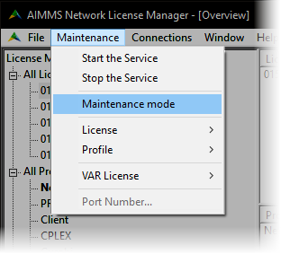
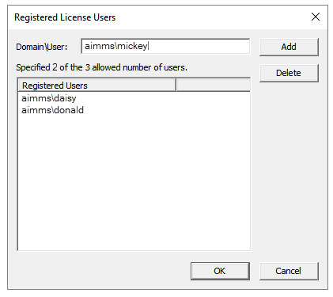

Named Users in License Manager
=====================================

.. meta::
   :description: How to register users to access the AIMMS license server.
   :keywords: license, network, user, name, register

Users can access an AIMMS Network License while connected to the network from any machine, 
if they are logged in with credentials that are registered in the AIMMS Network License Manager as Registered Users. 

An administrator can add new users by following the steps below.

1. In AIMMS Network License Manager, go to :menuselection:`Maintenance > Maintenance mode`.

|

2. Click to select your license in the License window, and go to :menuselection:`Maintenance > License > Registered Users`.

    .. image:: images/registered-users-menu.png
        :align: center    

    |

3. A :menuselection:`Registered License Users` dialog appears. Enter new user information and click :menuselection:`Add`.

|

The username should match the user's Windows or Linux username.

4. Go to :menuselection:`Maintenance > Maintenance mode` to exit :menuselection:`Maintenance mode`.
    
Your new user(s) can now connect to the license server. When connected, their details will appear in the :menuselection:`Client` section of the AIMMS Network License Manager.

    .. image:: images/client-section.png
        :align: center
        :scale: 60%

|

.. seealso::
    
    *  `AIMMS Network License Server <https://download.aimms.com/aimms/download/data/LicenseServer/AIMMS_net.pdf>`_ 
    *  `License Server Installation and Configuration <https://documentation.aimms.com/pro/license-server.html>`_ 

