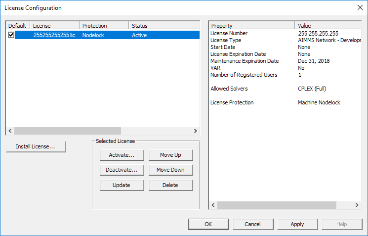
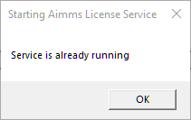

Install and Configure a Network License
============================================

.. meta::
   :description: How to set up an AIMMS Network License with the Network License Server.
   :keywords: license, network, install, setup

Installing the Network License Server
-------------------------------------

A network license is administrated by the Network License Server on a server computer.

1. Download the Network License Server from `AIMMS Downloads <https://www.aimms.com/support/downloads/#aimms-other-download>`_.

2. Run the ``AimmsLicenseServer...msi`` installation file and follow the prompts in the Installation Wizard.

Installing the Network License via License Manager
--------------------------------------------------

1. Run the AIMMS License Manager.

.. image:: images/license-mgr-icon.png
    :scale: 150 %
    :align: center

|

2. In AIMMS Network License Manager, go to :menuselection:`Maintenance > Maintenance mode`.

.. image:: images/maintenance-mode.png
    :scale: 100 %
    :align: center

|

3. Go to :menuselection:`Maintenance > License > License Configuration`.

.. image:: images/license-config.png
    :scale: 100 %
    :align: center

|

A :menuselection:`No License` dialog appears.

.. image:: images/no-license.png
    :scale: 100 %
    :align: center

|

4. Follow the License Install Wizard prompts to install your license.

    A. License Number - Enter your license number
    B. License Protection - Select activation code
    C. Activation Code - Enter your activation code
    D. Nodelock Protection - Machine Nodelock is recommended for this license type
    E. Communication Method - If you are connected to the internet, *Online* activation is the fastest and easiest method. If you do not have internet access, choose *Offline* activation and complete activation later.

.. note::

    If you choose *Offline* communication, a request file is generated. You must go to `AIMMS Offline License Activation <https://www.aimms.com/support/licensing/processing-request-files/>`_ and submit the request file to complete activation.

The license is now installed and appears in the Network License Manager.

|

Configuring License and Adding Users
------------------------------------

1. You can rename license profiles with nicknames. Single-click twice on the profile name to edit.

.. image:: images/rename-profile.png
    :scale: 100 %
    :align: center

|

2. Add users in :menuselection:`Maintenance > License > Registered Users`. For further instructions, read :doc:`../105/105-adding-named-user-licenses`.

|

3. Go to :menuselection:`Maintenance > Maintenance mode` to exit :menuselection:`Maintenance mode`. The service should start automatically. To double-check, go to :menuselection:`Maintenance > Start the Service`.

|

A dialog confirms "Service is already running."

.. note::

    If a message appears saying "Unable to Start the service," go to :menuselection:`Maintenance > Start the Service`.

Users can access an AIMMS Network License while connected to the network from any machine, if they are logged in with credentials that are registered in the AIMMS Network License Manager as Registered Users.

.. seealso::

    * :doc:`../105/105-adding-named-user-licenses`
    * :doc:`../106/106-install-network-license-client`
    * `Network License Server Manual <https://download.aimms.com/aimms/download/data/LicenseServer/AIMMS_net.pdf>`_ 
    * `License Server Installation and Configuration <https://documentation.aimms.com/pro/license-server.html>`_ 