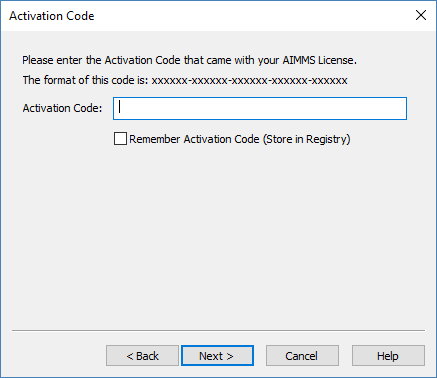
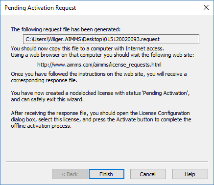
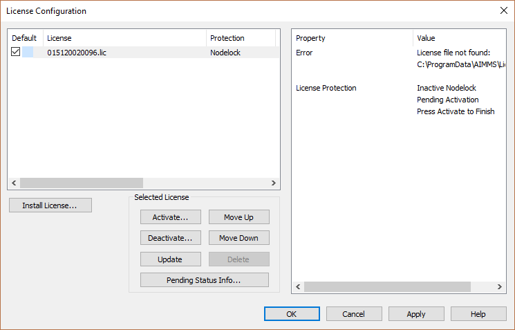

Activate Machine Nodelock Offline
====================================

When AIMMS cannot make a connection to the internet license server to activate a nodelock, you will get the option to activate a nodelock offline. 

To complete offline nodelock activation, follow these steps:

Create request file
-------------------

1. Start AIMMS, go to License Configuration, and click *Install License*. This will give you the following screen:

.. image:: images/Install_AIMMS_License.png

Select *Install a Single User AIMMS license* and click *Next*

2.  Enter the license number and click *Next*. 

.. image:: images/License_Number.png

In case AIMMS cannot determine that the license number you entered is a nodelock license, you will get an option  to choose between the protection of the license: nodelock or USB dongle. Select *nodelock*. 

3. Enter the activation code for your license number and click *Next*.  

4. Choose the *Machine Nodelock* option and click *Next*. 

.. image:: images/Nodelock_Protection.png

5. Choose the *Offline* option,

.. image:: images/Machine_Nodelock.png

and click *Browse* to select a location to save the license request file. Then click *Next*.

*Remember where you save the file, you will need it again!*

AIMMS generates a license request file to the specified location. Click *Finish*. 

Create response file
-----------------------

6. Open a web browser and go the `offline activation address <https://www.aimms.com/english/developers/licensing/processing-request-files/>`_. 

.. image:: images/License_Request_Processing.png

Click *Choose File* and browse for the license request file generated in the previous step. 

Enter the email address where you will receive the response file, and click *Process*. 

Please note that you can also download the generated response file from the website, after you click *Process*. 

.. image:: images/License_Requests.png

The response file is downloaded automatically, and sent to the email address you provided. 

Upload response file
-----------------------

7. Start AIMMS again and go to *License configuration*.

Select the license that you are activating and click *Activate*. 

8. Browse for the response file generated in step 6, and click *Next*.

.. image:: images/Finish_Offline_Activation.png

This should result in the following success message:

.. image:: images/Successful_Activation.png

The license is now activated and ready for use.