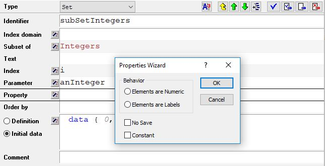
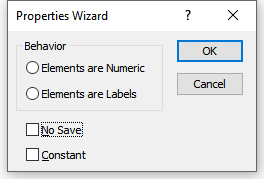

Handling of Integer Sets and Operators
====================================================

.. meta::
   :description: Discussion of how AIMMS handles of subsets of integers in an expression.
   :keywords: integer, set, subset, operator

.. .. note::

.. 	This article was originally posted to the AIMMS Tech Blog.

.. don't think this note is required in the how-to, eventually we'd have to remove them

Improving the compiler and execution engine in AIMMS is one of our ongoing projects. This is being done in a way that minimizes problems in existing AIMMS models (backward compatibility). During this process, we have noticed many issues in the existing code base that are not inline with our Language Reference. Subsets of integers is one topic of interest. 

Subsets of Integers
----------------------

Consider the below subset of Integers:: 

    Set subSetIntegers { 
       SubsetOf: Integers; 
       Parameter: P_anInteger; 
       InitialData: data { 0, 1, 4, 7, 8 }; 
    } 

And these two statements::

    P_anInteger := 1; 
    P_anInteger := P_anInteger + 3; 

Should the final value of ``P_anInteger`` be 4 or 8 ? 

    #. ``P_anInteger`` is an **element parameter** in the set ``subSetIntegers``. According to the Language Reference, the LHS is element valued so ``+`` in the RHS becomes a lead operator. So, ``P_anInteger + 3`` must return 8 because 8 is the 3rd element from 1 in the set ``subSetIntegers``. 
    #. However, the Language Reference also states that elements in a subset of integers are treated as integers (as if the element was surrounded by the ``Val()`` operator). So, with a current value of 1 - ``P_anInteger + 3`` must return 4. 

Which is the correct answer ? 

Another example
-------------------------------------------------

In the past, AIMMS has tried to be smart in these situations and applied either the lead or the numerical plus depending on the context of the expression in which the + operator appeared. Now look at these two statements::

    P_anInteger := 0;
    if P_anInteger then DialogMessage("It is true!") endif;

Will the dialog *It is true!* be shown or not? Again, if we refer to the Language Reference,  it states that the logical value of an element parameter is true if it is not empty. That is, if its current value is not the empty element.  Here ``P_anInteger``  has the value ``0``, so it should be true and the dialog is shown. But, I think that many of us would have expected that the dialog would not be shown in this situation.
 
Elements are Numeric or Labels
------------------------------------------------------------

To solve this dilemma, we introduced a new property that you can specify for each subset of integers in your model: 

If ``Elements are Numeric`` is chosen, then in every situation where the aforementioned dilemma occurs, the element expression is automatically surrounded by the ``Val()`` operator. So the statements in the example will be interpreted as::

    P_anInteger := val(P_anInteger) + 3;
    !returns 4
    
and

.. code-block:: aimms

    if val(P_anInteger) then DialogMessage("It is true!") endif;
    !returns FALSE

If ``Elements are Labels`` is specified, then the fact that an element can be treated as a numerical value will only apply when there is no ambiguity. In the first example this means that the + is interpreted as a lead, and in the second example the condition will be true::

    P_anInteger := P_anInteger + 3;
    !returns 8

and

.. code-block:: aimms

    if P_anInteger then DialogMessage("It is true!") endif;
    !returns TRUE

If neither of the two properties are set, then you will get a warning whenever the new compiler encounters an ambiguity. We recommended that you then make the proper selection when declaring a subset of ``Integers``. 

.. warning:: 

    If you ignore the warnings, your statement may behave differently in new AIMMS versions, because the coverage of the new compiler increases and a statement that was previously handled by the old compiler is now handled by the new compiler.

* `AIMMS The Language Reference <https://documentation.aimms.com/_downloads/AIMMS_ref.pdf>`_

 

