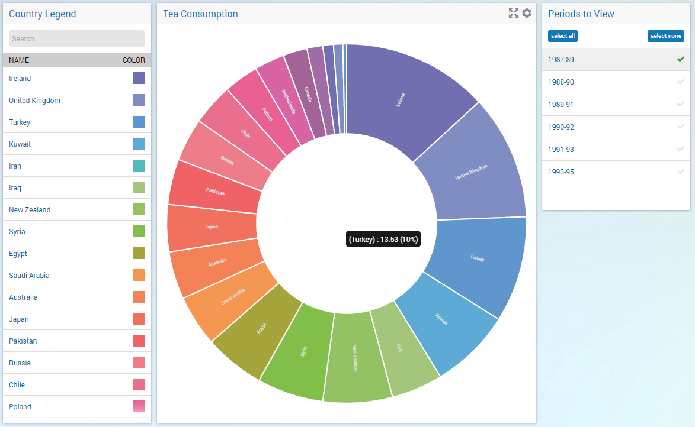
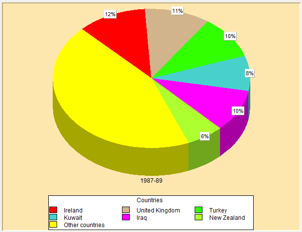
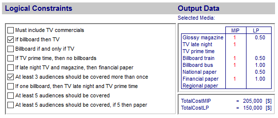

:orphan:

Overview: WebUI and WinUI
==========================

.. meta::
   :description: A comparison of user interface options for AIMMS applications.
   :keywords: webui, winui

.. note::

	This article is currently under construction.

WinUI vs. WebUI
-----------------

The WinUI is a Windows native GUI, while the WebUI works in a browser.

    Figure 1-A pie chart in the WebUI

Graphical presentation
----------------------

    Figure 2-The same pie chart in the WinUI

Repositioning of Widgets
------------------------

    Figure 3-Data presentation in WinUI

 

.. figure:: images/image004.png

    Figure 4- Data presentation in WebUI

Further examples
----------------

* `Diet problem <https://aimms.com/english/developers/resources/examples/modeling-book-examples/diet-problem>`_
* `Employee training <https://aimms.com/english/developers/resources/examples/modeling-book-examples/employee-training>`_
* `Farm planning <https://aimms.com/english/developers/resources/examples/modeling-book-examples/farm-planning>`_
* `Media selection problem <https://aimms.com/english/developers/resources/examples/modeling-book-examples/media-selection-problem>`_

