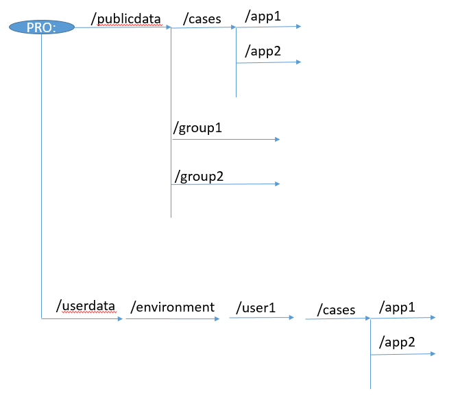
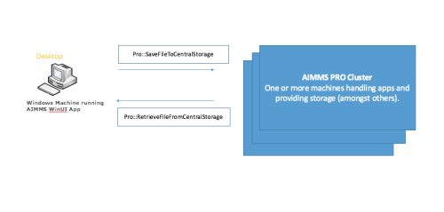
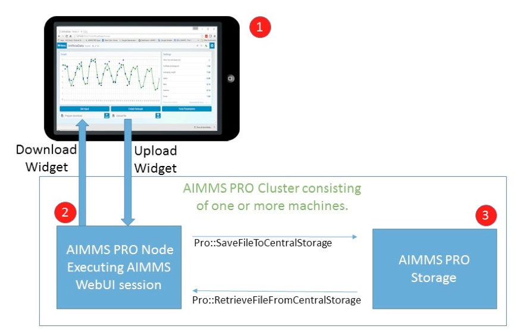

Upload and Download Files on AIMMS PRO
=======================================

.. meta::
   :description: Modeling for secure apps deployed on AIMMS PRO – Part 2: Uploading and Downloading files.
   :keywords: secure, upload, download

This article explains how you can upload and download files to and from AIMMS PRO Storage.

topic:: File Sharing Series

    This article is part of a series of three to enable AIMMS app developers to model file sharing securely. See also:

    * In :doc:`../120/120-pro-user-groups`, we covered AIMMS PRO User groups and how they can be used to authorize access to information within your AIMMS Apps. 
    * In :doc:`../115/115-Securing-File-Access` we'll find out how to securely arrange file sharing.

Overview of AIMMS PRO Storage
-------------------------------
AIMMS PRO Storage is a disk area managed by AIMMS PRO to share files within an AIMMS application and between AIMMS applications. This disk area is separate from the disk area in which AIMMS apps are actually executing. Among other things, it handles the cases created during various (solver) sessions, which are then shared between users of the same app.

.. topic:: Terminology

    Within AIMMS PRO storage, folders are referred to as *buckets* and files are referred to as *objects*. When you look at the AIMMS PRO API, as presented in the AIMMS PRO library, you will see the terms buckets and objects. In this article, I will use the terms folders and files.

AIMMS PRO storage has the following folder structure, and it is best practice to follow it:

In this structure, user specific data is stored in ``/userdata``, and the user is identified first by environment and then by name.

Data that is shared among users is stored in ``/PublicData``. Cases that are intended to be shared by all users are stored in ``/PublicData``, and organized per app. If data is to be shared per group, it is to be stored in ``/PublicData/groupname`` and there are no further restrictions.

Following this structure, the default access rights are predictable. So, all files created within a group folder get the access rights of that group folder, unless specified otherwise.

Uploading and downloading files
------------------------------------

To detail the building blocks for the exchanging files between an AIMMS app and its environment, we need to distinguish two situations:

* **For AIMMS WinUI apps**
    The client side of the AIMMS app runs on the client device itself. The app has direct access to the user files via the file and directory functions such as ``FileCopy`` and ``FileDelete``. See `AIMMS Function Reference, Chapter “File and Directory Functions” <https://download.aimms.com/aimms/download/manuals/AIMMS_func.pdf>`_.

* **For AIMMS WebUI apps**
    The app user interacts with the app via a Chrome Web browser, but the AIMMS app actually runs on a machine in the AIMMS PRO cluster. The AIMMS app has only direct access to the following files:

    *   Those files that were packed in the corresponding ``.aimmspack`` 

    *   Those files that have been explicitly uploaded from the client computer that runs the Chrome Browser 

    *   Those files that have been explicitly downloaded from AIMMS PRO storage 

In a way, the second situation can be viewed as an extension of the first situation. We will detail the first situation first.

Exchanging files for an AIMMS WinUI app
^^^^^^^^^^^^^^^^^^^^^^^^^^^^^^^^^^^^^^^^^^^^

For WinUI apps you can exchange files with the functions ``pro::SaveFileToCentralStroage`` and ``pro::RetrieveFileFromCentralStorage``. For example:

.. code-block:: aimms

    Pro::SaveFileToCentralStorage("c:\\Inputs\\data.txt", "pro:/PublicData/myapp/input/data.txt" );

This function will copy the file ``data.txt`` from the folder ``c:\inputs`` on the client Windows Desktop to the folder ``/PublicData/myapp/input`` in the AIMMS PRO storage. 

Note that ``Pro::SaveFileToCentralStorage`` requires the filename to be present in the second argument, and has a third optional argument to specify access rights for the file on the AIMMS PRO storage system.  By default, a file inherits the access rights of the parent folder.

It is a good practice to check if the file already exists in AIMMS PRO storage, so that you can warn the end-user when a file is about to be overwritten. You can do this with a self-defined procedure ``proFileExists`` as follows:

.. code-block:: aimms

    Procedure proFileExists {
        Arguments: (spStoragePath);
        Body: {
            pro::NormalizeStoragePath(spStoragePath);
            pro::SplitStoragePath(spStoragePath,spStorageBucketPath, spStorageFileWithoutPath);
            ret := pro::storage::GetObjectInfo(spStorageBucketPath,
                             spStorageFileWithoutPath, tmpLocalFileName,
                             tmpType, tmpNum, tmpAuth, tmpVersion );
            if ret = 0 or tmpNum <= 0 then
                return 0 ;
            endif ;
            return 1 ;
        }
        StringParameter spStoragePath {
            Property: Input;
        }
        StringParameter spStorageBucketPath;
        StringParameter spStorageFileWithoutPath;
        StringParameter tmpLocalFileName;
        StringParameter tmpType;
        Parameter tmpNum;
        StringParameter tmpAuth;
        Parameter tmpVersion;
        Parameter ret;
    }

There are also functions to create folders and to delete files and folders in the "Central Storage" section of the PRO API library ``AimmProLibrary``.

Exchanging files for an AIMMS WebUI app
^^^^^^^^^^^^^^^^^^^^^^^^^^^^^^^^^^^^^^^^^^

In AIMMS WebUI apps, the end-user interaction is done in a Chrome browser on one machine, while the Client Side execution of AIMMS procedures is done on another machine in the AIMMS PRO cluster.

The file communication architecture for a WebUI AIMMS application is shown in the diagram below.

#.   The Chrome Browser handles the interaction with the end-user. The Chrome browser can run on a device such as a smartphone, tablet, laptop, or desktop.

#.   The AIMMS Client session running on a node in the AIMMS PRO Cluster. This AIMMS Client Session handles the execution of the statements in the model.

#.   The AIMMS PRO storage, disk space available to exchange files.

The AIMMS WebUI provides the `Upload Widget <https://documentation.aimms.com/webui/upload-widget.html?highlight=upload#upload-widget>`_ to transfer files from your device to the folder in which the AIMMS client session runs. In addition, it provides the `Download Widget <https://documentation.aimms.com/webui/download-widget.html#download-widget>`_ to transfer files the other way around.

Example project
----------------
An example app that lets you upload a file and download the same: :download:`AIMMS project download <model/MovingUpAndDown.zip>` 

Related Topics
----------------

* **AIMMS How-To**: :doc:`../120/120-pro-user-groups`

* **AIMMS Documentation**: `WebUI <https://documentation.aimms.com/webui/index.html#webui>`_

* **AIMMS Documentation**: `AIMMS PRO <https://documentation.aimms.com/pro/index.html#pro-platform>`_

 