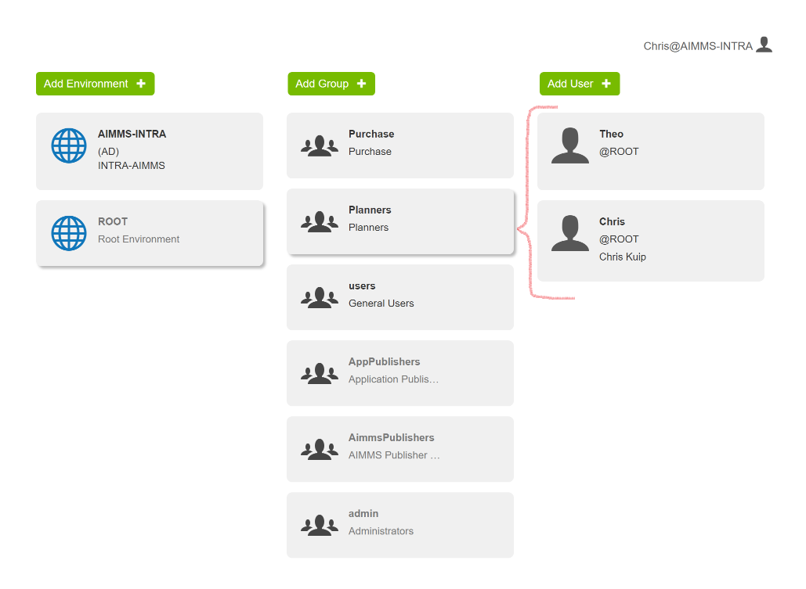

Create PRO User Groups
========================

.. meta::
   :description: Modeling for secure multi-user AIMMS Apps deployed on AIMMS PRO – Part 1: User Groups.
   :keywords: secure, upload, download

.. note::

	This article was originally posted to the AIMMS Tech Blog.

AIMMS PRO is a multi-user environment, designed to host several Apps used by several end-users. Information is shared by these users via these applications. Depending on the role of the app user in the organization, selected information may or may not be accessible. For instance, a planner may change the production plan, that plan can be inspected by management, but is not accessible to the HRM staff.

This blog post is the first post in a series of three to enable AIMMS app developers to model necessary file sharing in a secure manner. The topics of the three posts are:

#. Identify the user of the AIMMS PRO App and the AIMMS PRO groups they belong to 

#. Upload files to AIMMS PRO Storage and download files from AIMMS PRO Storage 

#. Grant access, via authorization strings, as appropriate to files in AIMMS PRO Storage 

In this first blog post of three we explore how you can authorize access to information within your AIMMS app by creating and managing user groups. Let us consider an example.

Granting Access to Data with User Groups
---------------------------------------------

Within the AIMMS PRO Portal, tab Users, the AIMMS PRO administrator can assign groups, as depicted in the picture below:

This picture is taken from my AIMMS PRO test environment. Besides the predefined groups Admin, AimmsPublishers, AppPublishers, and Users, there are two organization specific groups added to this environment: Planners and Purchase. I have selected the group Planners and made Theo and myself users of that group. If I want to make Theo a member of Purchase as well, I just drag Theo’s icon to the Purchase group.

A first method with which you can determine who accesses certain kinds of information is by selecting users when an AIMMS App is published. At that time, the access rights can be assigned per environment, per group or per user as illustrated below:

.. image:: images/RX-access-to-Flowshop-for-Planners.png

Here the FlowShop app may be run by a planner.

This method suffices in many cases. However, it is not sufficient when a single app is designed to be used by several people having various roles. Though there will be information that is accessible to all, there will also be information that is only accessible to selected people.

Granting Access to Data within your App
-----------------------------------------

This brings us to a second method of granting access, which is within the application itself.
The AIMMS PRO library allows an AIMMS App to identify the current user and identify the groups that user is in, namely via the procedure: ``pro::GetCurrentUserInfo``.

Let us continue our example. A planner may change the start and duration of production activities which are in the model represented by the parameters ``startProduction(a)`` and ``durationProduction(a)`` respectively.

For instance, using the declarations:

.. code-block:: aimms

    StringParameter pro_cur_env; 
    StringParameter pro_cur_user; 
    StringParameter pro_cur_Bucket; 
    Set pro_usr_groups { 
        Index: pug; 
    } 
    StringParameter pro_cur_GroupName { 
        IndexDomain: pug; 
    } 

The following call places the current user and his groups in the above declarations:

.. code-block:: aimms

    ! Identify the current app user.
    pro::GetCurrentUserInfo(pro_cur_env, pro_cur_user,
          pro_cur_Bucket, pro_usr_groups, pro_cur_GroupName);

Now we use this information to check whether the current user is a planner, and if so, make the production plan data visible and modifiable.

.. code-block:: aimms

    if exists( pug | pro_cur_GroupName( pug ) = "Planners" ) then 
        ! The current APP user is a member of 
        ! the AIMMS PRO user group Planners. 
        AllPublicIdentifiers += ! Make production plan data visible. 
           data { 'startProduction', 'durationProduction' } ; 
        CurrentInputs += ! Make production plan data modifiable. 
           data { 'startProduction', 'durationProduction' } ; 
    endif ; 

This example is rather specific for planners, but it is easy to generalize.

After executing this code, only if the app user who is a member of the group Planners, he will see data in the widgets referencing ``'startProduction'``, and ``'durationProduction'.``

Note that a user can be a member of multiple AIMMS PRO user groups; that is why the "+=" is used above – by executing code similar to the above for each potential user group the current app user belongs to, that user is granted data access to the union of identifiers that are specific to a user group.

In this blog post we have considered restricting information to an AIMMS app user based on the roles assigned to that app user via the AIMMS PRO user groups. In the upcoming blog post in this series, we are going to discuss the building blocks for exchanging files between AIMMS PRO storage on the one hand and the storage system directly available to the app user.

Reference:
-----------

*  `AIMMS PRO <https://documentation.aimms.com/pro/index.html#pro-platform>`_

.. include:: /includes/form.def
 