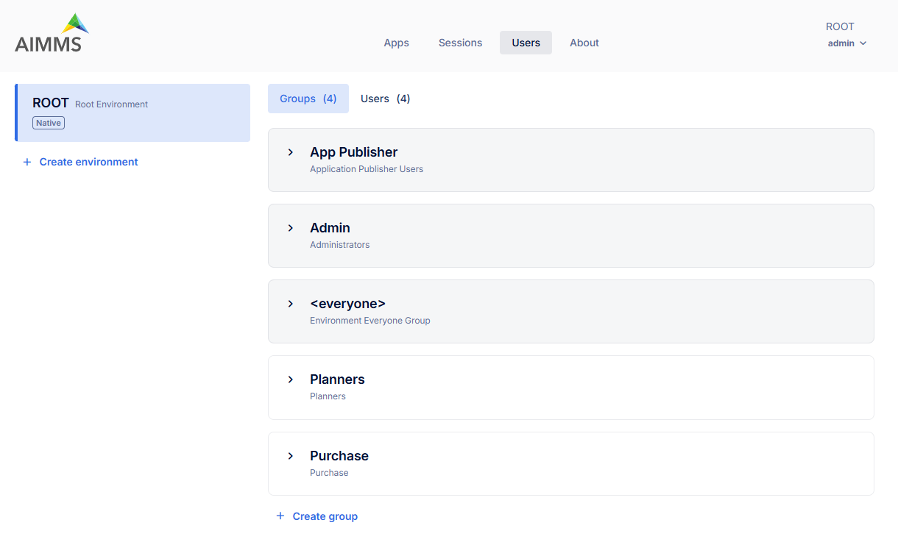
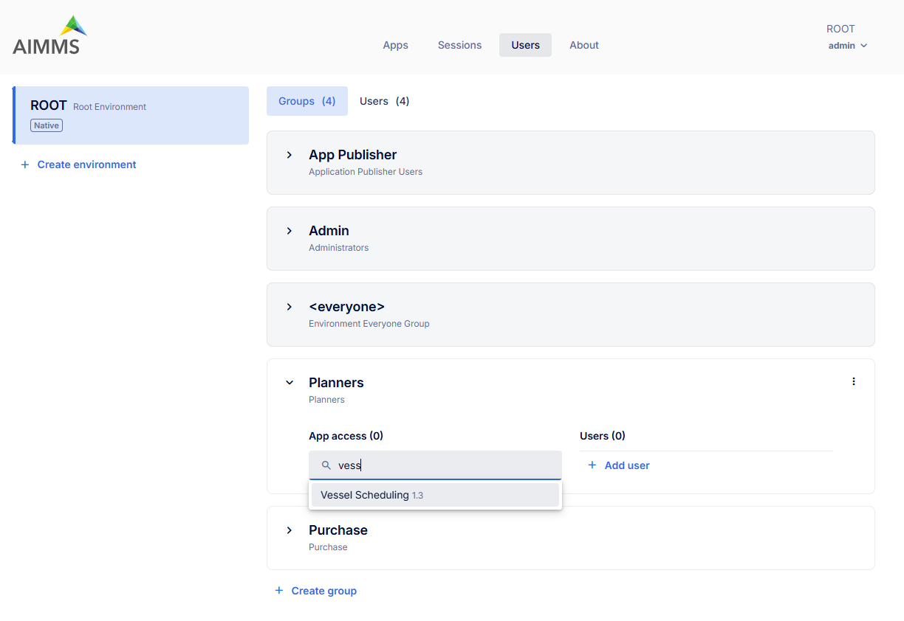
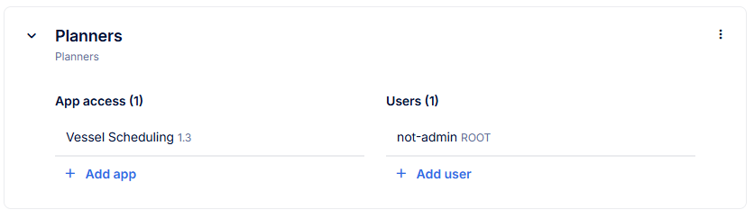
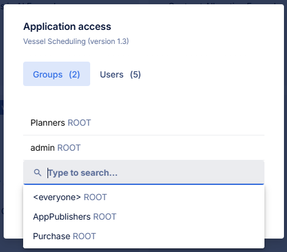

Create PRO User Groups for Role-Based Access
=============================================

.. meta::
    :description: Secure multi-user modeling for AIMMS Apps deployed on AIMMS Cloud using user groups for authorization.
    :keywords: secure, upload, download, role-based access control, user groups, AIMMS Cloud

In this article, we explore how you can authorize access to information within your AIMMS application by creating and managing **user groups**.

AIMMS Cloud is a multi-user environment, designed to host applications used by many end-users. Information is shared via these applications, and access needs to be controlled. 
Depending on an app user's role in the organization, specific information may or may not be accessible. For instance, a **Planner** may be able to modify the production schedule, which management can inspect, but which should be hidden from the HRM staff.

Let us consider an example of how to implement this role-based access control.

Granting Access to Apps and Environments
-----------------------------------------

Within the AIMMS Cloud, the administrator manages environments and users under the **Users** tab. 

|

Custom user groups, such as **Planners** and **Purchase**, can be created in addition to the predefined groups (**Admin**, **App Publisher**, and **<everyone>**). 
Users and applications are assigned to these groups, simply by searching under this group settings, as shown below:

|

Then,

|

When an application is assigned to a user group, all users in that group can access the application. You can also edit the app permissions per application, see:

|

Granting Granular Data Access within the App
--------------------------------------------

The second, more refined method is to implement role-based access **inside the AIMMS model**.
The **AimmsPROLibrary** provides the procedure **``pro::GetCurrentUserInfo``** to identify the current user and the groups they belong to.

Let's continue the example: a **Planner** needs the authority to change the production activities' start time and duration, represented by the parameters ``startProduction(a)`` and ``durationProduction(a)``.

We first declare the identifiers to hold the user's information:

.. code-block:: aimms

    StringParameter pro_cur_env; 
    StringParameter pro_cur_user; 
    StringParameter pro_cur_Bucket; 
    Set pro_usr_groups { 
        Index: pug; 
    } 
    StringParameter pro_cur_GroupName { 
        IndexDomain: pug; 
    } 

The following procedure call retrieves the current user's details and group memberships:

.. code-block:: aimms
    :linenos:

    ! Identify the current app user and their groups.
    pro::GetCurrentUserInfo(
            pro_cur_env, 
            pro_cur_user,
            pro_cur_Bucket, 
            pro_usr_groups, 
            pro_cur_GroupName);

We then use this information to conditionally enable data visibility and modification rights.

.. code-block:: aimms
    :linenos:

    if exists( pug | pro_cur_GroupName( pug ) = "Planners" ) then 
        ! The current APP user is a member of the AIMMS Cloud user group Planners. 
        AllPublicIdentifiers += ! Make production plan data visible. 
            data { 'startProduction', 'durationProduction' } ; 
        CurrentInputs += ! Make production plan data modifiable. 
            data { 'startProduction', 'durationProduction' } ; 
    endif ; 

This code ensures that only users who are members of the **Planners** group will have access to (see and modify) the data associated with ``'startProduction'`` and ``'durationProduction'`` in the WebUI widgets.

A user can be a member of multiple AIMMS Cloud user groups. The use of the ``+=`` operator above allows the code to be executed for each relevant group, 
granting the user access to the union of all identifiers specific to their roles.

This modeling technique allows you to restrict information based on the roles defined by AIMMS Cloud user groups, ensuring that your data remains secure and accessible only to authorized personnel.

.. seealso::

    * `AIMMS PRO Platform Documentation <https://documentation.aimms.com/pro/index.html#pro-platform>`_
    * `User Management in the AIMMS Portal <https://documentation.aimms.com/pro/user-man.html>`_