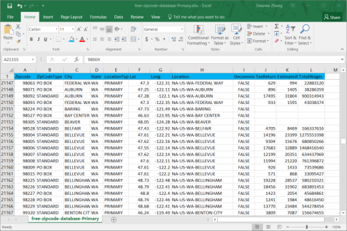

:orphan:

Exchanging Data with Excel Files
======================================

.. meta::
   :description: How to link spreadsheet data to an AIMMS project with the AIMMS Excel Library.
   :keywords: excel, library, axll

This is a follow up to :doc:`../85/85-using-axll-library`. The 'AIMMS Excel Library (AXLL)' lets you exchange data between AIMMS and Excel files (.xls and .xlsx) without having Excel installed on that computer. This is very useful when deploying applications using AIMMS PRO as it is typically installed on a terminal server where a copy of Microsoft Office is not available. 

In this article, we show you which functions available in ``axll::`` namespace to use depending on the format of the data in your Excel file. 

Reading your Excel File in AIMMS
---------------------------------

I needed some geographical information about the US for an application I was building. The information was easy to find online. I downloaded the file below, titled ``free-zipcode-database-Primary.xlsx``. It provided the zip code, State, Latitude and Longitude columns I needed.

Next, I created a procedure in my AIMMS project, called ``ReadFromExcel``. 
In the procedure, first I would like to have AIMMS point to the file so I can read it. Here is the code:

.. code-block:: aimms

    WorkBookName := "free-zipcode-database-Primary.xlsx";

    if axll::WorkBookIsOpen(WorkBookName) then
             axll::SelectWorkBook(WorkBookName);
    else
             axll::OpenWorkBook(WorkBookName);
    endif;

I used a String Parameter ``WorkBookName`` to take the file name. 
The code in the "if-else" statement is to avoid opening the workbook again if it is already opened. If it was already opened, I would just select it by calling ``axll::SelectWorkBook`` function; otherwise,I would open the file by the ``axll::OpenWorkBook`` function.

The next thing is to use ``axll::SelectSheet`` to set the sheet I am going to use.

.. code-block:: aimms

    axll::SelectSheet("free-zipcode-database-Primary");

    
Then I use ``axll::ReadSet`` function to read value for set ``sZipCode``.

.. code-block:: aimms

    axll::ReadSet(
        SetReference    : sZipCode,
        SetRange        : "A2:A42523",
        ExtendSuperSets : 1);

The first argument, ``SetReference``, is the set name. The second argument, ``SetRange``, is the range in Excel. The third argument, ``ExtendSuperSets``, is telling AIMMS to extend this set's super set when the elements read in this Excel are not part of the super set.

Adding Parameters
------------------

Next, I want to make sure I can read the following data in two dimensional parameters ``Coordinates(z,iLonLat)``, by using ``axll::ReadTable``.

.. code-block:: aimms

    axll::ReadTable(
        IdentifierReference : Coordinates,
        RowHeaderRange      : "A2:A42523",
        ColumnHeaderRange   : "F1:G1",
        DataRange           : "F2:G42523");

The first argument, ``IdentifierReference``, is the name of the parameter. The second argument, ``RowHeaderRange``, is the range for first index ``z``, which is represented as row range ``"A2:A42523"`` in Excel. The third argument, ``ColumnHeaderRange``, is the range for second index ``iLonLat``, which is represented as column range ``"F1:G1"`` in Excel. The forth argument, ``DataRange``, is the range for the actual data. 

In case you have an identifier with more dimensions, ``RowHeaderRange`` is the range where the starting indices reside, and ``ColumnHeaderRange``, is the range where the ending indices reside. For example, identifier ``MyValue(r1, r2, r3, r4,c1,c2,c3,c4)`` has 8 indices, and the data in Excel looks like this:

.. image:: images/Excel3-e1465306679329.png
        :scale: 150 %
        

Then the ``axll::ReadTable`` statement will be:

.. code-block:: aimms

    axll::ReadTable(
        IdentifierReference : MyValue,
        RowHeaderRange      : "A8:D18",
        ColumnHeaderRange   : "E4:K7",
        DataRange           : "E8:K18");
        
Continuing with the zip code example. I then use ``axll::ReadSet`` to read in data for set ``sState``.

.. code-block:: aimms

    axll::ReadSet(
        SetReference    : sStates,
        SetRange        : "D2:D42523",
        ExtendSuperSets : 1);

And ``axll::ReadList`` to read in data ``ZipCodeState(z)``, which holds the state name that each zip code belongs to.

.. code-block:: aimms

    axll::ReadList(
        IdentifierReference : ZipCodeState(z),
        RowHeaderRange      : "A2:A42523",
        DataRange           : "D2:D42523");
         
``axll::ReadList`` is designed for reading in data which is represented as lists in Excel. 
So it is only with RowHeaderRange. The following Excel Sheet is an example with ``"A8:D17"`` as ``RowHeaderRange`` and ``"E8:E17"`` as DataRange.

.. image:: images/Excel4-e1465308154550.png

At this point, everything I need to use in my model is in there, so I use ``axll::CloseWorkBook`` to close the workbook.

.. code-block:: aimms

    axll::CloseWorkBook(WorkBookName);
    
With the data I just imported from Excel, I can do further analyses. For example, I can calculate the distance between zip codes based on the latitude and longitude, and show it in AIMMS WebUI.

.. image:: images/Distance-e1465308283102.png

Similarly, you can use the ``AIMMSXLLibrary`` to write to Excel. You can see the comments in the library for further reference.

