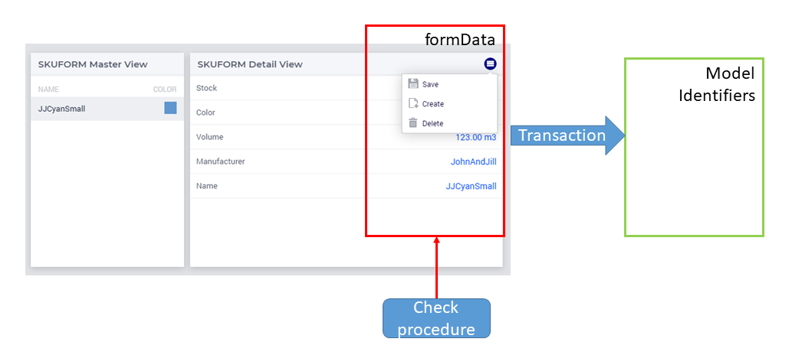
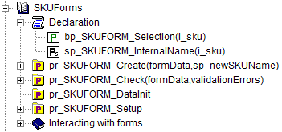
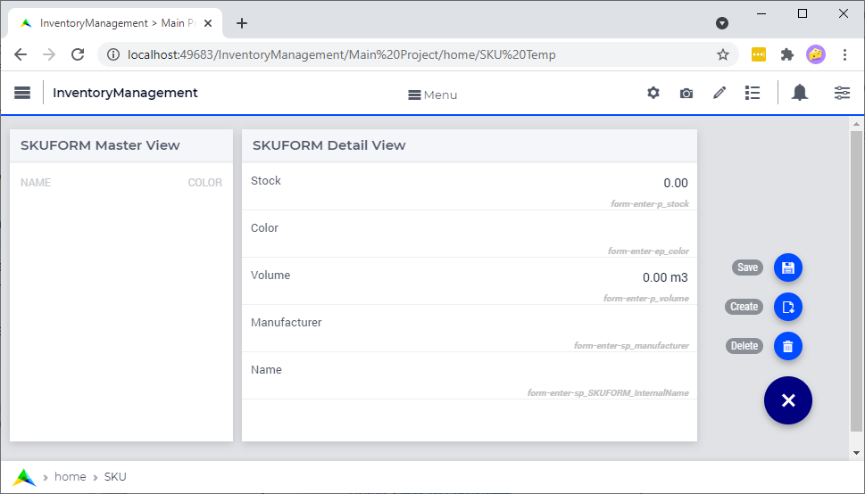
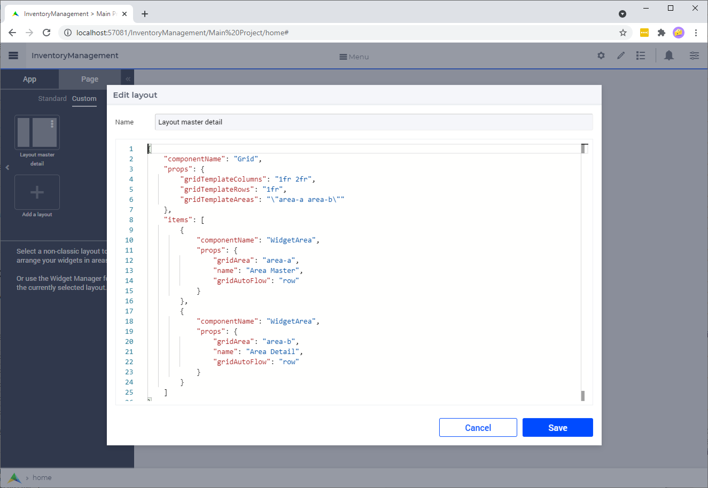
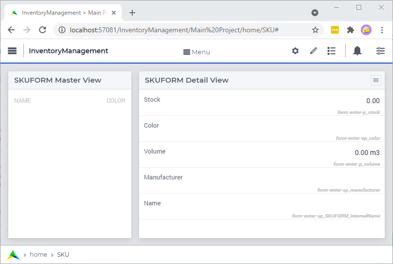

:orphan:

Create Forms in WebUI
========================

.. meta::
   :description: Creating user forms in WebUI to create, update, and delete data.
   :keywords: webform, form, webui

Use the AIMMS WebUI Forms framework to create modern-looking forms for data entry. 

Three basic actions are needed:

* Select the identifiers for which you want to provide data

* Write the code to perform checks

* Draw the form on the screen by selecting a few widgets

This makes the AIMMS WebUI Forms framework an efficient method to create forms from the model builder's perspective.

The AIMMS WebUI Forms framework follows `CRUD <https://en.wikipedia.org/wiki/Create,_read,_update_and_delete>`_ and thus provides your users the ability to:

*   **C** - create new data
*   **R** - read existing data
*   **U** - update existing data
*   **D** - delete invalid data

This image below illustrates a form in the AIMMS WebUI. 

New or modified data is entered (red rectangle), and once it passes the checks, it is copied to the actual model identifiers as if it were a single transaction. 

To properly implement such a form, several identifiers are needed. 
Each of them inherits some properties from the corresponding model identifier. 
In addition, AIMMS code is needed for checking and for copying/deleting. 

The AIMMS WebUI Forms framework minimizes effort for developers by creating the needed additional identifiers, and generating code for copying, deleting, and the repetitive part of checking. 

Let's use an example to show how to deploy this framework in order to create an advanced form. 
This example is part of an inventory management application, where data of a `Stock Keeping Unit <https://en.wikipedia.org/wiki/Stock_keeping_unit>`_ is entered and maintained.

#.  Identify the identifiers in the model storing the master data

#.  Create the declarations and procedures support the form

#.  Add procedure to create a new element

#.  Add procedure to check data for an element

#.  Link the callbacks to AIMMS WebUI Forms framework

#.  Draw the form on the WebUI canvas

#.  Add user-friendly labels to facilitate proper user entry

Identify the identifiers in the model storing the master data
-----------------------------------------------------------------

The targets of the form to be created are the model identifiers in which we want to store validated data. 
We continue by declaring such identifiers.  In our running example, stock keeping unit (SKU) data is maintained. 
In order to limit the size of the example, per SKU we only maintain the following properties:

* manufacturer (name),
* volume (liter),
* color (in color set), and
* stock (non-negative integer).

Thus we declare the corresponding model identifiers as follows:

.. code-block:: aimms
    :linenos:

    DeclarationSection Stock_Keeping_Units {
        Set s_stockKeepingUnit {
            Index: i_sku;
        }
        StringParameter sp_manufacturer {
            IndexDomain: i_sku;
        }
        Parameter p_volume {
            IndexDomain: i_sku;
            Unit: m3;
        }
        ElementParameter ep_color {
            IndexDomain: i_sku;
            Range: AllUsableColors;
        }
        Parameter p_stock {
            IndexDomain: i_sku;
            Range: {
                {0..inf}
            }
        }
    }

Create the declarations and procedures
----------------------------------------- 

We need the following extra declarations in order to work with the forms:

*   When we are editing existing data, we want to know for which element in the set ``s_stockKeepingUnit`` that is. 
    The WebUI forms uses a binary parameter for this. 
    In our example we will call this binary parameter ``bp_SKUFORM_Selection(i_sku)``.

*   Each SKU needs a unique identification before it can be added to the set. 
    This identification can simply be a unique number or a name.  
    In our example we use a name. 
    That is why we add an extra string parameter: ``sp_SKUFORM_InternalName(i_sku)``. 
    Actually, this is just another property, modeled here via a string parameter.

*   A procedure to create a new element in the set ``s_stockKeepingUnit``. 
    In our running example, this procedure will be ``pr_SKUFORM_Create``. 
    This is a callback procedure; it will be called by the AIMMS WebUI Forms framework.
    This procedure is detailed in section :ref:`create-a-new-element`.

*   A procedure that validates the newly entered or modified data. 
    In our running example, this will be ``pr_SKUFORM_Check``. 
    This is also a callback procedure; it will be called by the AIMMS WebUI Forms framework.
    This procedure is detailed in section :ref:`check-data-new-element`.

*   A procedure that links the above declarations and initializes a WebUI Form. 
    In our running example, this will be ``pr_SKUFORM_Setup``. 
    It needs to be called once by the application before the form is shown in the browser.
    This procedure is detailed in section :ref:`linking-callbacks-to-webui-lib`.

The above declarations are shown below, in the AIMMS model explorer:

Both callbacks have an argument named ``formData``. 
This argument communicates the strings entered by the application user. 
This argument is declared as follows:

.. code-block:: aimms
    :linenos:

    StringParameter formData {
        IndexDomain: webui::ffn;
        Property: Input;
    }

Here the index ``webui::ffn`` is an index in the set ``webui::AllFormFieldNames``. 
This index and set are available in the ``AimmsWebUI`` system library and will be linked to the model identifiers later on. 

The set ``webui::AllFormFieldNames`` is a subset of :aimms:set:`AllIdentifiers`, which allows us to link easily to the model identifiers at hand.

In the following three steps we will discuss the selected details of these three procedures.

.. _create-a-new-element:

Create a new element
---------------------- 

The procedure ``pr_SKUFORM_Create`` is expected to create a new element in the set for which the form is setup. 
In our running example that is ``s_stockKeepingUnit``. 
You can use element names different from the literal text entered by the user, but our example does not. 

This procedure has two arguments:

*   string parameter: ``formData(webui::ffn)``.
    This input argument passes the user entered input for each form field.

*   string parameter: ``sp_newSKUName``.
    This output argument is the name of the element created in the set ``s_stockKeepingUnit``.

Before this procedure is called, the name was already verified by a check procedure which we will discuss in the next section.

.. code-block:: aimms
    :linenos:

    SetElementAdd(s_stockKeepingUnit,ep_anSKU,
                 formData('sp_SKUFORM_InternalName'));
    sp_newSKUName := formData('sp_SKUFORM_InternalName');

Here, ``ep_anSKU`` is a local element parameter with range ``s_stockKeepingUnit``.

.. _check-data-new-element:

Check data for an element
---------------------------- 

The check procedure ``pr_SKUFORM_Check`` is called as soon as we save the data. 
It has two arguments, an input argument that contains the strings entered by the user, and an output argument that contains any corresponding error messages about these strings. 
The data is only accepted if there are no errors.

This procedure has two arguments:

*   string parameter: ``formData(webui::ffn)``.
    This input argument passes the user entered input for each form field.

*   string parameter: ``validationErrors``.
    This output argument contains, per field, the error messages (if any).

Selected checks of this procedure are discussed below.

To check the name entered, minimum length of 2, and specified at all:
^^^^^^^^^^^^^^^^^^^^^^^^^^^^^^^^^^^^^^^^^^^^^^^^^^^^^^^^^^^^^^^^^^^^^^

The first :any:`if` in the code below checks new element names. 

A new name does not exist; and this corresponds to an empty ``bp_SKUFORM_Selection``. 
The second ``if`` in the code below checks whether the name already exists.

.. code-block:: aimms
    :linenos:

    if (StringLength(formData('sp_SKUFORM_InternalName')) < 2) then
        validationErrors('sp_SKUFORM_InternalName') := webui::CreateValidationError("validation-error-min-length");
    endif;

    if (formData('sp_SKUFORM_InternalName') = "form-enter-InternalName" ) then
        validationErrors('sp_SKUFORM_InternalName') := webui::CreateValidationError("validation-error-required-field");
    endif;
    
Any errors are logged by the function ``webui::CreateValidationError``.

Check that the new name does not override an existing element:
^^^^^^^^^^^^^^^^^^^^^^^^^^^^^^^^^^^^^^^^^^^^^^^^^^^^^^^^^^^^^^^^

.. code-block:: aimms
    :linenos:

    if ( not exists[ i_sku | bp_SKUFORM_Selection(i_sku) ] ) then
        if ( StringToElement(s_stockKeepingUnit, formData('sp_SKUFORM_InternalName')) ) then
            validationErrors('sp_SKUFORM_InternalName') :=
                          webui::CreateValidationError("validation-error-name-already-exists");
        endif;
    endif;

Selected remarks about the above code:

*   On line 1: Check that we are creating a new element; there is no ``i_sku`` such that this ``i_sku`` is existing data being edited.

*   On line 2: :aimms:func:`StringToElement` returns the element in the set that is its first argument of the element with name that is its second argument. 
    It returns the empty element if no such element can be found.
    
If both conditions of line 1 and line 2 are true, then an existing element is re-created, which is not allowed.

Check data of SKU string property:
^^^^^^^^^^^^^^^^^^^^^^^^^^^^^^^^^^

Next we check that the manufacturer is specified and the length is at least 3.

.. code-block:: aimms
    :linenos:

    if (StringLength(formData('sp_manufacturer')) < 3) then
         validationErrors('sp_manufacturer') :=
               webui::CreateValidationError("validation-error-not-a-valid-manufacturer-name");
    endif;

Here we just enforce that the manufacturer name is at least three characters.

Check data of SKU integer property:
^^^^^^^^^^^^^^^^^^^^^^^^^^^^^^^^^^^^^

Lastly we check that the stock available is a non-negative integer:

.. code-block:: aimms
    :linenos:

    block
        p_loc_Stock := Val(formData('p_stock'));
        if ( ( p_loc_Stock < 0 ) or ( mod(p_loc_Stock,1) <> 0 ) ) then
            validationErrors('p_stock') :=
                webui::CreateValidationError("validation-error-not-a-valid-availability");
        endif;
    onerror ep_err do
        validationErrors('p_stock') :=
            webui::CreateValidationError("validation-error-not-a-valid-availability");
        errh::MarkAsHandled(err);
    endblock;

Note the use of error handling here, as the AIMMS intrinsic functions :any:`Val` and :any:`Mod` may throw an error upon invalid input.

More about error handling:
^^^^^^^^^^^^^^^^^^^^^^^^^^

*   `The AIMMS Academy course on Error Handling <https://academy.aimms.com/mod/page/view.php?id=742>`_.

*   `The AIMMS Language reference on Error Handling <https://documentation.aimms.com/language-reference/procedural-language-components/execution-statements/raising-and-handling-warnings-and-errors.html>`_.

*   `How to about Error Handling <https://how-to.aimms.com/C_Developer/Sub_Errors/index.html>`_.

The next step details the last procedure required for the form.

.. _linking-callbacks-to-webui-lib:

Linking callbacks to WebUI Forms framework
-------------------------------------------------------------------

In our running example, we use the procedure ``pr_SKUFORM_Setup`` as the procedure which links the model identifiers, 
``SKUFORM`` procedures and the actual form in WebUI together. 
This procedure is called at the end of the StartupProcedure in order to make sure it is called before the form is opened for the first time.

First we name the model identifiers that identify the fields in the form (here FormFields is a subset of :aimms:set:`AllIdentifiers`):

.. code-block:: aimms
    :linenos:

    FormFields := data {
        'sp_SKUFORM_InternalName',
        'sp_manufacturer',
        'p_volume',
        'ep_Color',
        'p_stock'};

Next we will actually link the fields:

.. code-block:: aimms
    :linenos:

    webui::SetupForm(
        formId              :  "SKUForm",
        selInMaster         :  'bp_SKUFORM_Selection',
        detailsIdentifiers  :  FormFields,
        validationHandler   :  'pr_SKUFORM_Check',
        updateEntryCallback :  'pr_SKUFORM_Create');

Draw the form on the WebUI canvas
---------------------------------------------

The widgets
^^^^^^^^^^^^

After starting the AIMMS WebUI we can create the two necessary widgets:

*   A legend widget, contents: ``bp_SKUFORM_Selection``

*   A scalar widget, contents: 

    *   ``webui_runtime::SKUForm_p_stock``, 
    *   ``webui_runtime::SKUForm_ep_color``, 
    *   ``webui_runtime::SKUForm_p_volume``, 
    *   ``webui_runtime::SKUForm_sp_manufacturer``, 
    *   ``webui_runtime::SKUForm_sp_SKUFORM_InternalName``.
    
A page menu for the actions
^^^^^^^^^^^^^^^^^^^^^^^^^^^^^^

*   Secondary page actions are used to link the FORM procedures to the widget using the string parameter ``sp_SKUFORM_WidgetActions`` 
    declared and defined as follows:

    .. code-block:: aimms
        :linenos:

        StringParameter sp_SKUFORM_WidgetActions {
            IndexDomain: (i_SKUFORM_WidgetActionNumber,webui::indexWidgetActionSpec);
            Definition: {
                { 
                    ( '1', 'displaytext' ) : "Save"                              ,  
                    ( '1', 'icon'        ) : "aimms-floppy-disk"                 ,
                    ( '1', 'procedure'   ) : "webui_runtime::SKUForm_SaveForm"   ,  
                    ( '1', 'state'       ) : "Active"                            ,

                    ( '2', 'displaytext' ) : "Create"                            ,
                    ( '2', 'icon'        ) : "aimms-file-plus"                   ,
                    ( '2', 'procedure'   ) : "webui_runtime::SKUForm_NewEntry"   ,  
                    ( '2', 'state'       ) : "Active"                            ,

                    ( '3', 'displaytext' ) : "Delete"                            ,  
                    ( '3', 'icon'        ) : "aimms-bin"                         ,
                    ( '3', 'procedure'   ) : "webui_runtime::SKUForm_DeleteEntry",  
                    ( '3', 'state'       ) : "Active"                             
                }
            }
        }

This will result in the following form:

.. figure:: images/4-Basic-widget-placing-temp.png

    4 Basic widget placing

We will try to make the names easier to understand in the next sub step.

Create user-friendly names
^^^^^^^^^^^^^^^^^^^^^^^^^^^^^^^^^^^^^^^^

Phrase adapting in the WebUI is achieved via translation files. 
In our running example we adapt using ``InventoryManagement\MainProject\WebUI\resources\languages\skuform-messages.properties``, 
with the following contents.

.. code-block:: none
    :linenos:

    webui_runtime::SKUForm_sp_SKUFORM_InternalName = Name
    webui_runtime::SKUForm_sp_manufacturer = Manufacturer
    webui_runtime::SKUForm_p_volume = Volume
    webui_runtime::SKUForm_ep_Color = Color
    webui_runtime::SKUForm_p_stock = Stock

    webui_runtime::form-enter-sp_SKUFORM_InternalName =
    webui_runtime::form-enter-sp_manufacturer =
    webui_runtime::form-enter-p_volume =
    webui_runtime::form-enter-ep_color =
    webui_runtime::form-enter-p_stock =

    no-bp_SKUFORM_Selection-selected =

    validation-error-min-length = A name must be at least two characters long.
    validation-error-name-already-exists = A person with this name already exists.
    validation-error-required-field = Required field.
    validation-error-not-a-valid-Volume = Not a valid volume.
    validation-error-not-a-valid-Stock = Not a valid stock.

With this phrase adapting, the form now looks as follows:

    4 Basic widget placing - translated names

Making the page resizable using grid layout
^^^^^^^^^^^^^^^^^^^^^^^^^^^^^^^^^^^^^^^^^^^^^^^^

Once we have created the widgets with the necessary information, we enhance the page by using the `grid layout feature of WebUI <https://documentation.aimms.com/webui/webui-grid-pages.html>`_.
The page has two columns, a relatively small one for the master data, and a wide one for entering the details.  
This is why we create the following layout:

Selected remarks about the grid layout here:

*   Line 4: we use two columns, the second one wider than the first.

*   Line 5: we do not split the information over multiple rows.

*   Line 6: the areas used are named internally as ``area-a``, and ``area-b``

*   Lines 13, and 22: the areas are named to the end-user ``Area Master``, and ``Area Detail``.

And with the widgets moved to the respective areas, we get the following resizable page:

