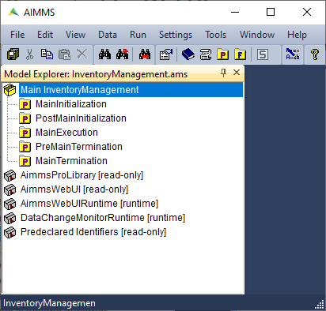
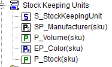
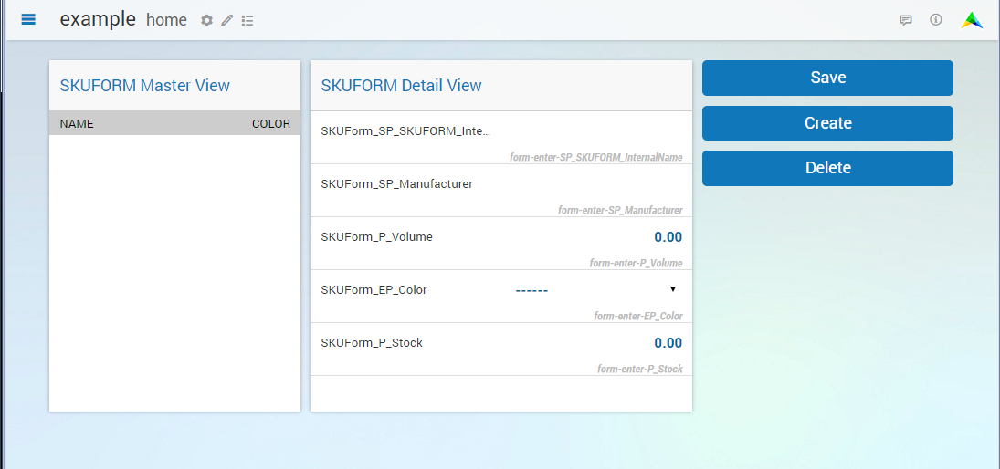
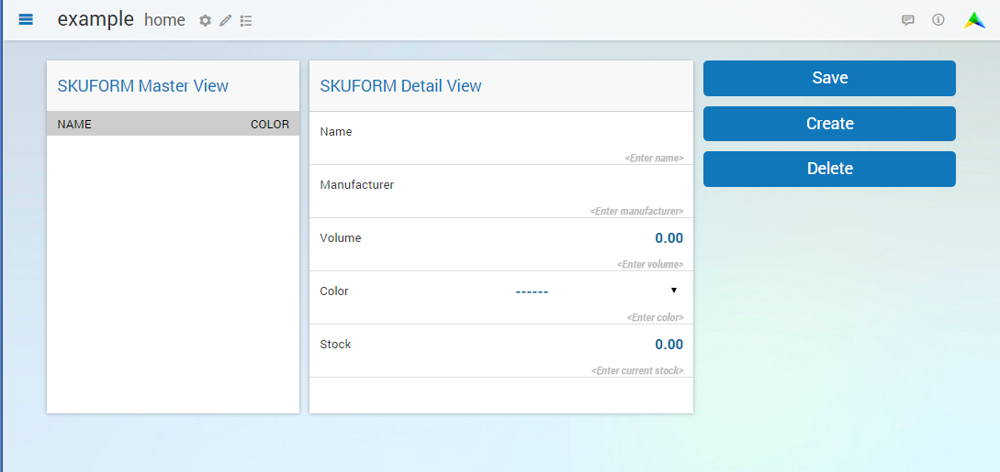

Create Forms in WebUI
========================

.. meta::
   :description: Creating user forms in WebUI to create, update, and delete data.
   :keywords: webform, form, webui

.. note::

	This article was originally posted to the AIMMS Tech Blog.

Use the AIMMS WebUI Forms framework to create modern-looking forms for data entry. 

Three basic actions are needed:

* Select the identifiers for which you want to provide data

* Write the code to perform checks

* Draw the form on the screen by selecting a few widgets

This makes the AIMMS WebUI Forms framework an efficient method to create forms from the model builder's perspective.

The AIMMS WebUI Forms framework follows `CRUD <https://en.wikipedia.org/wiki/Create,_read,_update_and_delete>`_) and thus provides your users the ability to:

* Create new data
* Read existing data
* Update existing data
* Delete invalid data

This image below illustrates a form in the AIMMS WebUI. 

.. image:: images/FormData-ModelIdentifiersExchange.png

New or modified data is entered (red rectangle), and once it passes the checks, it is copied to the actual model identifiers as if it were a single transaction. 

To properly implement such a form, several identifiers are needed. Each of them inherits some properties from the corresponding model identifier. In addition, AIMMS code is needed for checking and for copying/deleting. 

The AIMMS WebUI Forms framework minimizes effort for developers by creating the needed additional identifiers, and generating code for copying, deleting and the repetitive part of checking. 

Let's use an example to show how to deploy this framework in order to create an advanced form. This example is part of an inventory management application, where data of a `Stock Keeping Unit <http://en.wikipedia.org/wiki/Stock_keeping_unit>`_ is entered and maintained.

1. Prepare the project for WebUI
2. Create the declarations and procedures support the form
3. Add procedure to create a new element
4. Add procedure to check data for an element
5. Link the callbacks to AIMMS WebUI Forms framework
6. Draw the form on the WebUI canvas:
7. Add user-friendly labels to facilitate proper user entry

Prepare the project for WebUI
-----------------------------------------------------------------

In order to add forms to your application, you will need to prepare your application for the WebUI by adding the system libraries ``AimmsProLibrary`` and ``AimmsWebUI`` to your application. This can be done using the AIMMS Library manager. This action needs to be done only once per application.

    1 New project with system libraries

You may note the additional libraries. An application started with the ``AimmsWebUI`` system library, will also create the libraries ``AimmsWebUIRuntime`` and ``DataChangeMonitorRuntime``. These two libraries are created and maintained by the library ``AimmsWebUI``.

The targets of the form to be created are the model identifiers in which we want to store valid data. We continue by declaring such identifiers. In our running example, stock keeping unit (SKU) data is maintained. In order to limit the size of the example, per SKU we only maintain the following properties:

* manufacturer (name),
* volume (liter),
* color (in color set), and
* stock (non-negative integer).

Thus we declare the corresponding model identifiers as follows:

    2 sets and parameters for model

Create the declarations and procedures
-----------------------------------------------------------------------------------------------

We need the following extra declarations in order to work with the forms:

* When we are editing existing data, we want to know for which element that is. The WebUI forms uses a binary parameter for this. In our example we will call this binary parameter ``P_SKUFORM_Selection(sku)``.

* Each SKU needs a unique identification before it can be added to the set. This identification can simply be a unique (non-descriptive) number or a name. In our example we use a name. That is why we add an extra string parameter: ``SP_SKUFORM_InternalName(sku)``. Actually, this is just another property, modeled here via a string parameter.

* A procedure to create a new element. In our running example, this will be ``pr_SKUFORM_Create``. This is a callback procedure; it will be called by the AIMMS WebUI Forms framework.

* A procedure that validates the newly entered or modified data. In our running example, this will be ``pr_SKUFORM_Check``. This is also a callback procedure; it will be called by the AIMMS WebUI Forms framework.

* A procedure that links the above declarations and initializes a WebUI Form. In our running example, this will be ``pr_SKUFORM_Setup``. It needs to be called once by the application before the form is shown in the browser.

The above declarations are shown below, in the AIMMS model explorer:

.. figure:: images/3-Procedure-callback-declarations.png

    Procedure callback declarations

Both callbacks have an argument named ``formData``. This argument communicates the strings entered by the application user. This argument is declared as follows:

.. code-block:: aimms

    StringParameter formData {
        IndexDomain: webui::ffn;
        Property: Input;
    }

Here the index ``webui::ffn`` is an index in the set ``webui::AllFormFieldNames``. This index and set are available in the ``AimmsWebUI`` system library and will be linked to the model identifiers later on. 

The set ``webui::AllFormFieldNames`` is a subset of ``AllIdentifiers``, which allows us to link easily to the model identifiers at hand.

In the following three steps we will discuss the selected details of these three procedures.

Create a new element
---------------------------------------------

This procedure is expected to create a new element in the set for which the form is setup. In our running example that is ``S_StockKeepingUnit``. You can use element names different from the literal text entered by the user, but our example does not. Please note that, before this procedure is called, the name was already verified by the check procedure discussed in the next section.

.. code-block:: aimms

    SetElementAdd(S_StockKeepingUnit,anSKU,
                 formData('SP_SKUFORM_InternalName'));
    newSKUName := formData('SP_SKUFORM_InternalName');

Here, ``anSKU`` is a local element parameter with range ``S_StockKeepingUnit``.

Check data for an element
---------------------------------------------------

The check procedure is called as soon as we save the data. It has two arguments, an input argument that contains the strings entered by the user, and an output argument that contains any corresponding error messages about these strings. The data accepted only if there are no errors.

Selected checks of this procedure are presented below.

The first ``if`` in the code below checks new element names. A new name does not exist; and this corresponds to an empty ``P_SKUFORM_Selection``. The second ``if`` in the code below checks whether the name already exists.

.. code-block:: aimms

    if ( not exists[ i_SKU | P_SKUFORM_Selection(i_SKU) ] ) then
        if ( StringToElement(S_StockKeepingUnit, formData('SP_SKUFORM_InternalName')) ) then
            validationErrors('SP_SKUFORM_InternalName') :=
                          webui::CreateValidationError("validation-error-name-already-exists");
        endif;
    endif;

Any errors are logged by the function ``webui::CreateValidationError``.

Next we check that the manufacturer is specified and the length is at least 3.

.. code-block:: aimms

    if (StringLength(formData('SP_Manufacturer')) &lt; 3) then
         validationErrors('SP_Manufacturer') :=
               webui::CreateValidationError("validation-error-not-a-valid-manufacturer-name");
    endif;

Lastly we check that the stock available is a non-negative integer:

.. code-block:: aimms

    block
        p_loc_Stock := Val(formData('P_Stock'));
        if ( ( p_loc_Stock &lt; 0 ) or ( mod(p_loc_Stock,1)  0 ) ) then
            validationErrors('P_Stock') :=
             webui::CreateValidationError("validation-error-not-a-valid-availability");
        endif;
    onerror err do
        validationErrors('P_Stock') :=
            webui::CreateValidationError("validation-error-not-a-valid-availability");
        errh::MarkAsHandled(err);
    endblock;

Note the use of error handling here, as the AIMMS intrinsic functions ``Val`` and ``Mod`` may throw an error upon invalid input.

The next step details the last procedures required for the form.

Linking callbacks to WebUI Forms framework
-------------------------------------------------------------------

In our running example, we use the procedure ``pr_SKUFORM_Setup`` as the procedure which links the model identifiers, ``SKUFORM`` procedures and the actual form in WebUI together. This procedure is called at the end of the StartupProcedure in order to make sure it is called before the form is opened for the first time.

There are two steps in this procedure. In the first step we name the model identifiers that identify the fields in the form (here FormFields is a subset of ``AllIdentifiers``):

.. code-block:: aimms

    FormFields := data {
        'SP_SKUFORM_InternalName',
        'SP_Manufacturer',
        'P_Volume',
        'EP_Color',
        'P_Stock'};

In the second step, the actual linking is done:

.. code-block:: aimms

    webui::SetupForm(
        formId             :  "SKUForm",
        selInMaster        :  'P_SKUFORM_Selection',
        detailsIdentifiers :  FormFields,
        validationHandler  :  'pr_SKUFORM_Check',
        newEntryCallback   :  'pr_SKUFORM_Create');

Draw the form on the WebUI canvas
---------------------------------------------

After starting the AIMMS WebUI (AIMMS Menu – Tools – Start WebUI) and opening the browser page ``localhost:12001/example``, we can create the necessary widgets:

* A legend widget, contents: ``P_SKUFORM_Selection``

* A scalar widget, contents: ``webui_runtime::SKUForm_P_Stock``, ``webui_runtime::SKUForm_EP_Color``, ``webui_runtime::SKUForm_P_Volume``, ``webui_runtime::SKUForm_SP_Manufacturer``, ``webui_runtime::SKUForm_SP_SKUFORM_InternalName``

* Three button widgets linking to the procedures ``webui_runtime::SKUForm_SaveForm``, ``webui_runtime::SKUForm_NewEntry``, ``webui_runtime::SKUForm_DeleteEntry`` and name them ``Save``, ``Create``, and ``Delete`` respectively.

This will result in the following form:

    4 Basic widget placing

As the names in this form are a bit opaque to the average user, we will try to make them more appealing in the next step.

Create user-friendly names
-----------------------------------------------------------------------------

Phrase adapting in the WebUI is achieved via translation files. In our running example we adapt using ``InventoryManagement\WebUI\resources\languages\skuform-messages.properties``, with the following contents.

.. code-block:: none

    SKUForm_SP_SKUFORM_InternalName = Name
    SKUForm_SP_Manufacturer = Manufacturer
    SKUForm_P_Volume = Volume
    SKUForm_EP_Color = Color
    SKUForm_P_Stock = Stock

    form-enter-SP_SKUFORM_InternalName =
    form-enter-SP_Manufacturer =
    form-enter-P_Volume =
    form-enter-EP_Color =
    form-enter-P_Stock =

    no-P_SKUFORM_Selection-selected =

    validation-error-min-length = A name must be at least two characters long.
    validation-error-name-already-exists = A person with this name already exists.
    validation-error-required-field = Required field.
    validation-error-not-a-valid-Volume = Not a valid volume.
    validation-error-not-a-valid-Stock = Not a valid stock.

With this phrase adapting, the form now looks as follows:

    4 Basic widget placing - translated names

Example project
----------------------------

You can find this example in the AIMMS Example repository at `AIMMS Examples <https://github.com/aimms/examples/>`_

.. include:: /includes/form.def

