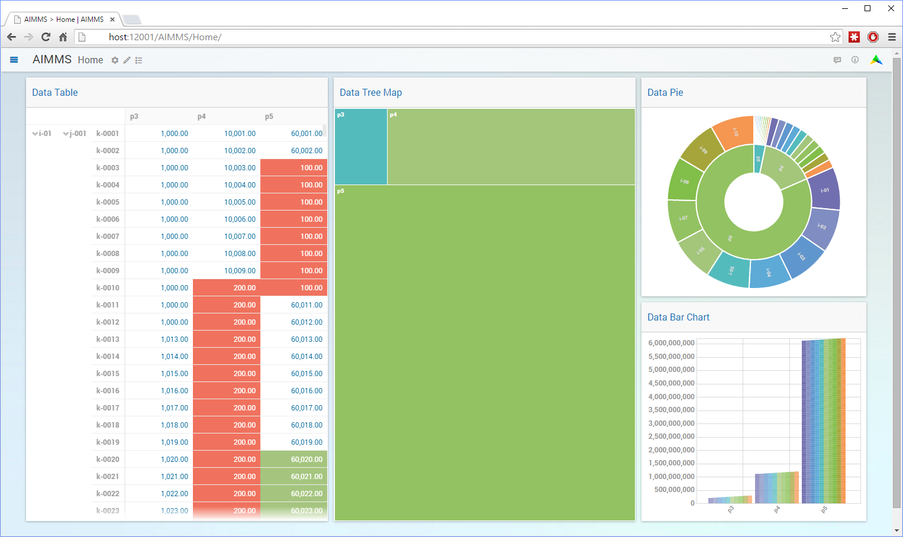
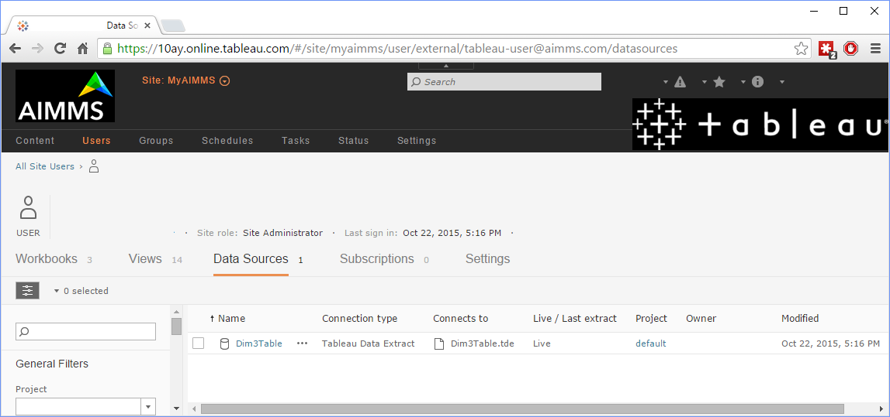
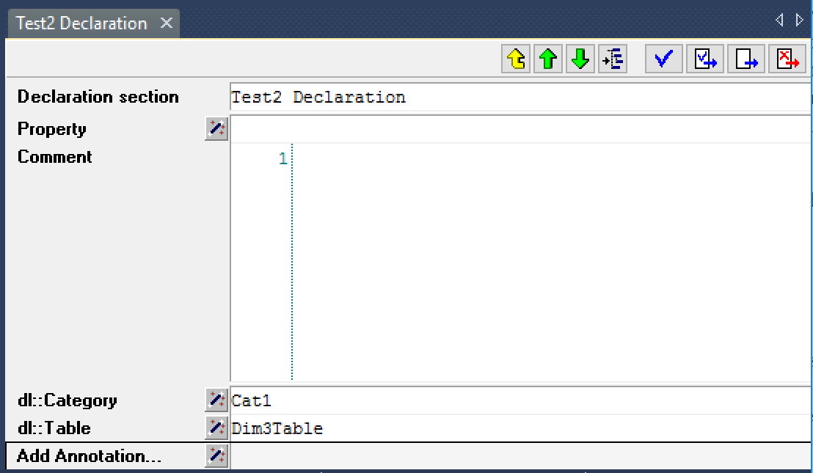
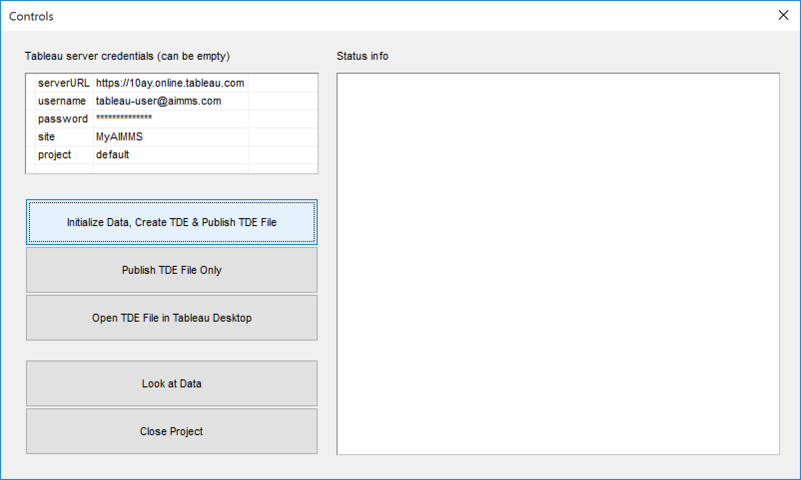
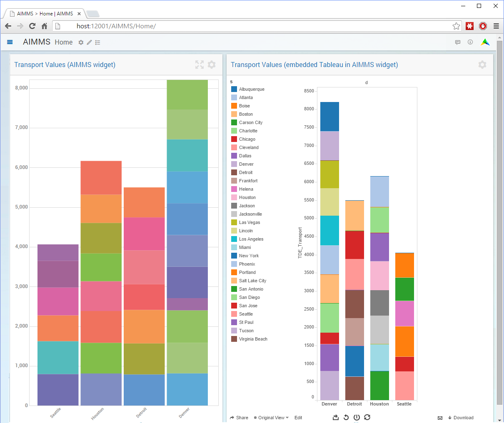


Link AIMMS with Tableau
===========================

.. meta::
   :description: How to automate Tableau integration with the AIMMS DataLink library.
   :keywords: tableau, datalink, link, integrate

.. warning::
	As of AIMMS 4.74 the Tableau Datalink Provider is deprecated. 

	Customers using the Tableau Datalink Provider can convert the data to a regular data txt representation (instead of creating TDE-files) and enable any update needs within the Tableau product itself. 

Although both the traditional AIMMS Windows UI and the new AIMMS WebUI offer excellent data visualization capabilities to view the data present *within* an AIMMS application, many of our customers have expressed the wish to be able to view and work with AIMMS data in Tableau (and other BI tools such as QlikView, or Spotfire). This allows a much wider audience within a company to track KPIs on dashboards based on the results from an AIMMS application, using a wider range of graphical capabilities to drill down into the data presented, and to cross analyze these results against data from various other corporate data sources.

     Data in Various AIMMS WebUI Views

Existing capabilities to export data to Tableau
-----------------------------------------------

As Tableau supports a great deal of data sources to retrieve their data from, and AIMMS offers data integration with data sources such as databases, Excel and CSV files, it is not hard to think of a multitude of ways to accomplish integration of AIMMS data within Tableau. However, all of these integration scenarios share the common characteristics that they are indirect, and can quickly become cumbersome. This can either be caused by the multitude of (automated or manual) steps necessary to get AIMMS data available in Tableau, or because IT needs to get involved to set up the intermediate databases and their associated access rights from which the BI tool can read the AIMMS results. An intermediate database to provide the linkage between AIMMS and Tableau may actually work very well for AIMMS applications that are well established and provide data in a more or less fixed format. In such a scenario, making AIMMS data available in Tableau  may become a completely automated process.

Flexible Tableau exports
-------------------------

However, *flexibility* is also a key concept for both AIMMS and Tableau . The major strength of modeling tools such as AIMMS is that one can model anything, and that existing models can be easily adapted to changing business constraints and conditions, and the ensuing model changes may provide completely new data. Tableau excels in cross analyzing *any* available data from various data sources. In such a rapidly changing reality, relying on intermediate databases managed by the corporate IT department to provide flexible linkage between AIMMS and Tableau sounds more like a contradiction in terms.

.. figure:: images/Tableau.Desktop.with_.AIMMS_.Data_.png

     The AIMMS-generated TDE File in Tableau Desktop

The DataLink library
---------------------

Thus, with ease-of-use and flexibility in mind, we have created an AIMMS DataLink library that provides fully automated, flexible linkage with Tableau, which you can include into your model whenever you feel the need to export the results from your model to Tableau. In fact, you can create native Tableau TDE-files right from AIMMS and either save them as is, or publish them - from within AIMMS – directly on your Tableau Server so the data becomes available for the organization through e.g. Tableau Server's worksheets and data views.

     The AIMMS-generated & published TDE File to Tableau Server

You can also imagine looking at the same data from within AIMMS while doing some further exploration in Tableau so you can combine the best of both world.

Working with the DataLink library
---------------------------------

The DataLink library is available from the library repository. This repository can be accessed via *AIMMS > File > LibraryManager*, and you can also find an `example project <https://download.aimms.com/aimms/download/data/Libraries/DataLinkExample.7z>`_ that demonstrates the use of the DataLink library. To see how the Tableau link works, let's take a look at the example project. I'll explain how to specify which identifiers in the model need to be written to a TDE file, how to actually generate a native Tableau TDE file, and how to upload a TDE file to a Tableau Server right from your model.

Annotations
^^^^^^^^^^^^

To indicate which identifiers in a model need to be exported to a TDE file, the DataLink library uses a feature in AIMMS called *annotations*. Annotations in AIMMS are generic string-valued key-value pairs, that can be associated with any node in the model tree in the AIMMS IDE, and can be set through the regular attribute form of a model node. If set on a section within the model, the annotation value will be inherited by all child nodes underneath that section. Any model library can define its own collection of annotation keys; they serve as *library-specific* properties that you can set for every identifier in a model. Thus, annotations allow any developer to *extend* the core functionality of AIMMS by creating *generic* libraries, with full support for specifying the properties necessary to use such a library within the model tree.

Use for Tableau link
^^^^^^^^^^^^^^^^^^^^

The DataLink library is an example of such a generic library: by adding it to a model, you extend the functionality of AIMMS with the capability to create and export TDE files generated from data in the model. Thus far, we have defined two annotation types for the DataLink library,

* ``dl::Table``
* ``dl::Category``

     DataLink annotations set on a declaration section

By specifying the ``dl::Table`` annotation for a specific identifier in a model, you indicate that you want to store the content of that identifier in the table with the name specified through the annotation, along with all other identifiers that hold the same ``dl::Table`` value.  All identifiers exported to the same TDE table should have the identical index domain. If a section in your model contains a set of identifiers with the same domain that all need to be exported to the same TDE file, you can simply set the ``dl::Table`` annotation on the section, after which the value will be inherited by all identifiers in that section. Identifiers for which the ``dl::Table annotation`` is not set will not be exported to a TDE file. Through the ``dl::Category annotation``, you can specify one or more categories of identifiers that you want to selectively export to a TDE file.

     Main window to Tableau example project

Creating a TDE file
^^^^^^^^^^^^^^^^^^^^

After you have selected which identifiers to export to which TDE files, you can actually create a TDE file by calling the procedure ``dl::TDEDataWrite`` contained in the DataLink library. It will export all identifiers for which the ``dl::Table`` annotation has been specified to their corresponding TDE files. Through the optional category argument you can limit the export to those identifiers for which the ``dl::Category`` annotation matches the category argument. Once the TDE file has been created you can open it using the Tableau desktop application. Alternatively, you can display it *within the AIMMS end-user UI* by opening it through the Document Viewer object.

Uploading a TDE file to a Tableau Server
^^^^^^^^^^^^^^^^^^^^^^^^^^^^^^^^^^^^^^^^

Once the TDE file has been created, you can subsequently upload to a Tableau Server through the procedure ``dl::UploadTDEToServer``. Through the arguments of this procedure you must provide the server info and credentials necessary to upload the file. After you have uploaded a TDE file to the Tableau Server you can view the data by logging onto the the Tableau Server via your browser and opening a workspace that is linked to the data in the uploaded file.

Embedding Tableau in the AIMMS Web UI
^^^^^^^^^^^^^^^^^^^^^^^^^^^^^^^^^^^^^^

     Example of an AIMMS WebUI with a Graph widget and a custom Embedded Tableau View widget

If you are using the AIMMS Web UI, you can also display the contents of a Tableau Server workspace in a frame widget within a page in your Web UI. Note the library procedures to create and upload TDE files can also be executed from within a server-side data or optimization session. In this way you can easily integrate the AIMMS Apps published on AIMMS PRO and Tableau browser interfaces, offering a unified experience and user interface to your end-users.

Support for other BI tools
---------------------------

In this blog post and library we have focused on connectivity between AIMMS and Tableau, so what about other BI tools such as QlikView or Spotfire? Well, the source of the DLL behind the DataLink library that performs the actual export to Tableau TDE files has been set up in such a manner, that the logic for collecting the data from AIMMS has been kept generic and completely independent from the underlying data source to which the data is to be exported. Thus, extending the DataLink library to support multiple BI tools is not a major task.

In fact, the interface to export to any data source is fairly straightforward, and consists of a mere five functions to be implemented:

* Creating a new (or opening an existing) data source

* Creating a new (or opening an existing) table within an open data source, based on structure information provided by the data collection layer

* Write records created by the data collection layer to an open table

* Closing an open table

* Closing an open data source

If you are interested in extending, or having the DataLink library extended to QlikView or Spotfire, please `drop us a line <https://community.aimms.com/>`_.

