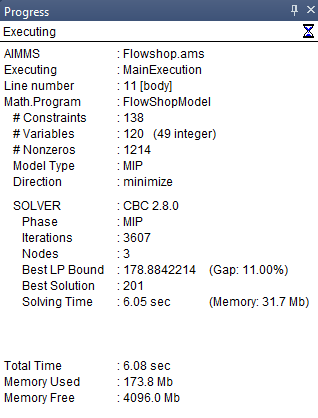

Change the Frequency of Progress Updates 
=========================================

.. meta::
   :description: How to change the frequency of updates to the progress window.
   :keywords: progress, update, solve

The progress window in AIMMS, accessible via ``CTRL-P``, provides real-time updates during compilation, execution, and solving processes. 
During tasks like solving MIP problems, AIMMS displays crucial information such as iteration and node counts, best bounds, and solutions within this window.

Historically, progress updates have been tied to the number of iterations used by the solver, with a default update frequency set to every 100 iterations. 
However, frequent updates can impact performance negatively, while infrequent updates might make AIMMS appear unresponsive, as these moments are when the solver briefly returns control to AIMMS for updates, interrupts handling, etc.

Relying solely on iteration-based updates has drawbacks. The rate of iterations per second varies greatly depending on the problem, solver, and algorithm used. 
While 100 iterations may suffice for smaller problems, larger ones may require more frequent updates. Additionally, certain solver phases, like preprocessing or calculating irreducible infeasible sets (IIS), 
may not alter the iteration count, thus no updates occur during these critical steps. Furthermore, some solvers, such as BARON and CP Optimizer, base progress on nodes or branches rather than iterations.

In AIMMS 4.6, progress updates will default to elapsed time instead of iterations. This change offers several advantages: it's universally supported by all solvers, 
operates independently of specific problems or solvers, and ensures consistent updates throughout different solver phases. The new setting, ``Progress Time Interval``, will replace the older ``Progress Solution`` option, 
which will be inactive by default but can still be used in conjunction with time-based updates.

It's important to note that even with these improvements, the frequency of progress updates can vary based on when the solver communicates updates to AIMMS.