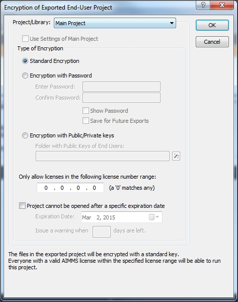

Encrypt Projects to Protect Intellectual Property
==================================================

.. meta::
   :description: How to encrypt your project in AIMMS 4 applications.
   :keywords: encrypt, intellectual, property, IP

Encryption is typically used to protect the intellectual property (IP) in your AIMMS model and libraries. AIMMS also allows you to restrict access to your application. 

.. Access to your application can also be restricted in both AIMMS 3 and AIMMS 4; though the methods differ between the two AIMMS versions.

.. In AIMMS 3, you had the option to encrypt your project in such a way that it was always stored encrypted, even during development. The benefit is that you could send everything you had to an end-user and you didn't have to worry about them getting access to the source. Alternatively, you could send them just one or two encrypted libraries. Of course, the disadvantage in AIMMS 3 is that you had no option to do code comparison and/or version control.

As of AIMMS 4, all project sources are text-based. This allows you to use version control software. However, explicit steps are needed to create encrypted code.

This blog posts illustrates how you can create an encrypted project out of the source. The steps required to create an encrypted library will be discussed here as well.

Manually Export to Aimmspack
----------------------------

The first option is by creating an Aimmspack file. As you have seen in an earlier :doc:`../151/151-version-control-aimmspack-backup`, 
Aimmspack files (in AIMMS 4) are always encrypted. You can create an Aimmspack via menu *File > Export End User Project*. Once you have selected that menu, you will be asked to specify a file name for the Aimmspack, followed by a dialog "Encryption of Exported End-User Project".

In this dialog, you can specify one of the following three types of encryption:

#. **Standard encryption:** results in an end-user version of your application that can be run by everybody.

#. **Password protected encryption:** results in an end-user version of your application that can be run by anyone who knows the password. When the application starts up, the user is prompted to enter the password.

#. **Key-based encryption:** results in an end-user version of your application that can only be run by users whose public key was present in the key folder that was specified during encryption. The users need to store their private key in the ``ApplicationKeys`` folder on their local system or, in case a license server is being used, on the system on which the license server is running. (An basic explanation of public and private keys can be found `here <https://technet.microsoft.com/en-us/library/cc962028.aspx>`_ under the heading Public Key Encryption.) The end-user can generate such a pair through the *Tools > License > Generate Public/Private Key Pair* menu. The public key can then be shared with the developer.

Next to the type of encryption, you can also specify the license number information or expiration date. (More information can be found in :doc:`miscellaneous/project-security/index`) The information that you specify here, will be stored as part of your project in the file ``..\\MainProject\\Settings\\EndUserEncryption.xml``.

After you click *OK* in this dialog, AIMMS will show a second dialog where you can specify which files AIMMS should exclude from the Aimmspack. This information is stored in the file ``..\\MainProject\\Tools\\ProjectExport.xml``. The information in these two files will be used, as default, the next time you create an Aimmspack.

Command Line Export
--------------------

The second option is using a command line argument to either generate an Aimmspack or a folder with encrypted source, via one or two of the following commands:

.. code-block:: none

    "c:\Program Files\AIMMS\AIMMS 4\Bin\Aimms.exe" "Example Project.aimms" --export-to "Example Project.aimmspack"
    "c:\Program Files\AIMMS\AIMMS 4\Bin\Aimms.exe" "Example Project.aimms" --export-to "Fully Encrypted" 

The first statement will generate an Aimmspack file with encrypted source. The second statement will generate a folder with encrypted source.

In case you generate the encrypted source via the command line option, AIMMS will use the settings of the files ``EndUserEncryption.xml`` and ``ProjectExport.xml``, as mentioned above. This means that if you want to change the default settings, you need to first manually create an Aimmspack and set the correct options.

Share Partly Encrypted model
-----------------------------

It is possible to create a project with some of the libraries encrypted, and the rest fully accessible, because you have the possibility to mix and match encrypted libraries. So, if you create a copy of the directory in which you develop your model, and you copy the encrypted libraries in there, you have created a project containing some encrypted library, but open otherwise.

For example, if you have a project with two libraries (Protected Library 1 and Protected Library 2) for which you want to protect the contents, the following commands will create a partially encrypted project:

.. code-block:: none

    "c:\Program Files\AIMMS\AIMMS 4\Bin\Aimms.exe" "Example Project\Example Project.aimms" --export-to "..\Fully Encrypted"
    rmdir /s/q "Partially Encrypted"
    xcopy "Example Project\*.*" "Partially Encrypted\*.*" /s
    xcopy "Fully Encrypted\Protected Library 1\*.*" "Partially Encrypted \Protected Library 1\*.*" /s /y
    xcopy "Fully Encrypted\Protected Library 2\*.*" "Partially Encrypted \Protected Library 2\*.*" /s /y 

The rest of the model will be accessible for everybody. More information can be found in :doc:`miscellaneous/project-security/index`.

