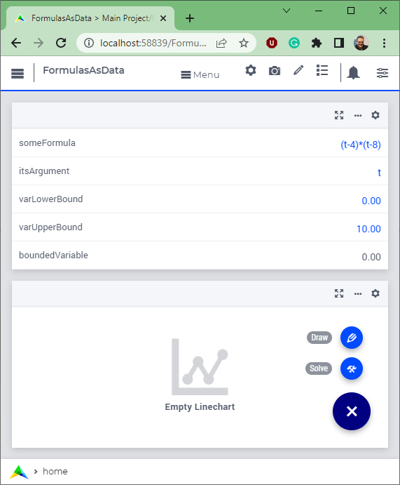

Use Formulas as Data
====================

.. meta::
   :description: How to enter formulas as data strings in AIMMS applications.
   :keywords: formula, string, asset, blend

      .. note::

	This article was originally posted to the AIMMS Tech Blog.

A mathematical formula is considered data within an application when it is read in as a string during the application's runtime, and subsequently used in the construction of selected assignments and constraints. The concept "Formulas as Data" can be applied to several optimization apps, for instance those that deal with "Blending on Specification" and "Asset Management." In these types of applications, the benefit of the end-users is that they do not have to share these formulas with anyone else, including the developers of the apps. For such apps, good formulas are expensive to develop and having good formulas provides a competitive edge to these end-users. In AIMMS, formulas can be used in the following way:

* String parameters - a formula is a sequence of characters, and such sequences can be stored and manipulated via string parameters. Such manipulation is executed at AIMMS run time.
* Macros - a formula is a mathematical expression and this expression is created during AIMMS compilation time.

The two identifier types, string parameter and macro, effective at different times as far as the AIMMS system is concerned, need to be combined in order to support the concept "Formulas as Data." How do we go about this?  This blog post highlights selected portions of an AIMMS application (code included at the end of this blog post) which creates a formula representing a one argument function, say ``f(x)``, at runtime. The application uses the formula in two ways:

#. It uses it in an assignment statement to compute the points needed to approach ``f`` by a curve, and

#. It uses it in a constraint, which is then solved to compute the equation ``f(x)=0``

Creating the formula
---------------------

Suppose we have the formula and its argument in the string parameters:

.. code-block:: aimms

     someFormula = "(t-4)*(t-8)"
     itsArgument = "t"
     
Then we want to create a macro holding the above as definition:

.. figure:: images/macroDef.png

    macro definition

We start by creating a runtime library, using prefix ``"fd"`` and a declaration section therein:

.. code-block:: aimms

     e_lib := me::CreateLibrary( "FormulaData", "fd" );
     e_declSec := me::Create( "declSec", 'declaration', e_lib );

Within the runtime declaration section, we create a macro as follows:

.. code-block:: aimms

     e_mac := me::Create( "myFormula", 'macro', e_declSec );
     ok := me::SetAttribute( e_mac, 'arguments', itsArgument );
     ok := me::SetAttribute( e_mac, 'definition', someFormula );

As you can see, the text of the argument and the formula is simply copied to the ``arguments`` and ``definition`` attributes respectively. Now that we have defined the macro ``myFormula``, we can use it. We will do so in two ways. First, we will create the points for a curve, then we will use it to solve the equation ``myFormula(x)=0`` **Using the formula to draw a curve** To create a curve that looks as follows:

    curve approximating formula
    

    
We need to:

#. Create a set of points: ``xPoints := data { ' 0.00', ' 1.67', ' 3.33', ' 5.00', ' 6.67', ' 8.33', '10.00' } ;`` Declare ``xp`` is an index in set ``xPoints``. 
   Construction details can be found in the procedure ``FillXPoints`` of the AIMMS application (copied in below).

#. Evaluate the macro for each point. We want to create a statement as follows:

    .. code-block:: aimms

        Y(xp) := myFormula( X(xp) );
        
    Because the macro needs to be available in compiled form, we can only refer to that macro from within the runtime library. Thus, we need to create a procedure at runtime with the sole purpose of implementing the above assignment statement:
    
    .. code-block:: aimms
    
        e_drawProc := me::Create( "drawProc", 'procedure', e_lib );
        ok := me::SetAttribute( e_drawProc, 'body',
                  "Y(xp) := myFormula( X(xp) );\\n" );

The procedure to create the curve is now as follows:

.. code-block:: aimms

    FillXPoints ;
     CreateRuntimeLib ;
     Apply( e_drawProc );

The ``"Draw"`` button will execute the above procedure and present the curve as mentioned at the beginning of this section. **Using the formula to solve an equation of the form ``f(x)=0``** A typical exercise with one argument functions is to solve an equation of the form: ``f(x)=0``. To solve such an equation, we first need to construct it. Again, as the formula is present in the runtime library, we also need to create the constraint in that runtime library. This is done in the following way:

.. code-block:: aimms

     e_eqn := me::Create( "myEqn", 'constraint', e_declSec );
     ok := me::SetAttribute( e_eqn, 'definition',
                  "myFormula( boundedVariable ) = 0" );

Here ``boundedVariable`` is declared in the main model. Because it is declared in the main model, we can refer to it in other portions of the model and on AIMMS pages. **The enclosed application** The enclosed AIMMS application starts with the following page:

    Formulas as Data startup

I invite you to play with this AIMMS application, changing the formula, argument and bounds. In addition, observe the curve and the result for ``boundedVariable`` after pressing the buttons labeled ``"Draw"`` and ``"Solve"``.  

:download:`AIMMS project download <downloads/FormulasAsData.zip>` 

Summary
-------

AIMMS combines three features: string parameters, macros, and Model Edit Functions to enable the concept of "Formulas as Data." A simple illustration of this powerful concept is provided by using the constructed formula in two manners: by approaching a function via the curve object and by solving a single equation model of the form ``f(x)=0``. 

Related posts
-------------

This article is part of the series on Model Edit Functions. Other articles in this series can be found here:

#. :doc:`../146/146-value-dynamic-identifier`

#. :doc:`../132/132-Repetive-Patterns-Model-Edit`

