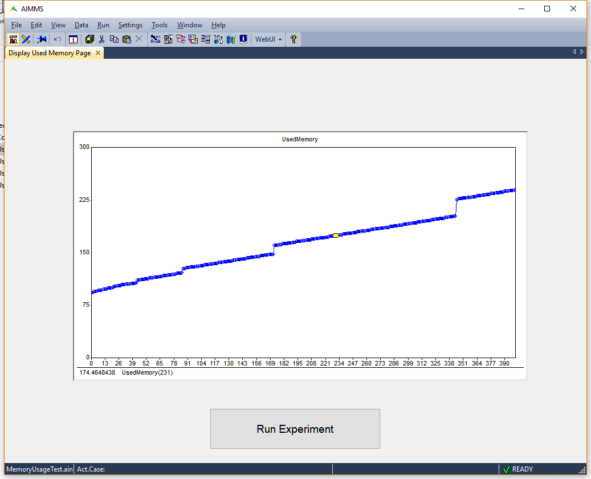

Monitoring Memory Usage and Leaks
=====================================

.. meta::
   :description: How to monitor and analyze your application for memory leaks
   :keywords: card, memory, logging memory usage, memory leaks

:doc:`../170/170-memory-in-use` discusses the different tools available in AIMMS to investigate the memory usage. This article discusses an approach to log the memory used while executing a procedure to identify any possible memory leaks.

To illustrate, a procedure is repeatedly executed and we sample the memory usage of the application after every n executions. The pattern for the memory monitor procedure is:

.. code-block:: none

   Register memory usage at first iMeasurePoint;

   for ( iMeasurePoint | except the first ) do
      repeat the procedure n times;
      Register memory usage at iMeasurePoint;
   endfor;

If the registered memory usage continues to increase, it indicates a memory leak. Memory leaks commonly occur when the cardinality of an identifier increases. Use the function ``Card`` to identify the identifier(s) that keep increasing their size. Another possible cause is that AIMMS only reclaims memory of strings and sets that are elements of indexed sets whenever AIMMS checks whether they are still in use. Such a memory reclaim process is also known as garbage collection in computer science literature. AIMMS will reclaim that memory at selected moments, but you can enforce this by executing the ``REBUILD`` statement. In the enclosed example, a small mathematical program is solved 10000 times, registering the occupied memory every 100 times. The resulting plot is shown below which indicates a memory leak. 

.. .. figure:: images/Used-memory.png

..     Memory used
    
The example project can be downloaded from the link below. The procedure of interest is ``SolveGMPFull``

:download:`AIMMS project download <downloads/MemoryUsageTest.zip>`  

Related Topics
--------------------

* :doc:` /170/170-memory-in-use`

.. include:: /includes/form.def

