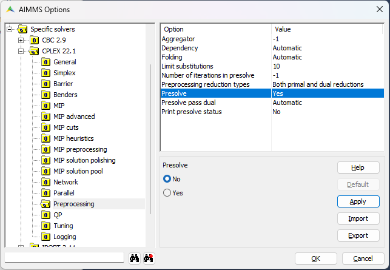

Debug Infeasible or Unbounded Results
==========================================

.. meta::
   :description: How to analyze infeasible or unbounded solver results with constraints and presolve tools.
   :keywords: infeasible, unbounded, debug, constraint, presolve

Despite your best efforts, checks, and double-checks, you may still get unexpected results from your model. When the solver concludes that your model is either infeasible or unbounded, AIMMS provides some tools that allow you investigate what is actually being sent to the solver (i.e. the complete generated problem) for debugging.

One common error message is:

.. code-block:: none

    Warning: After zero iterations the preprocessor of CPLEX 12.4 concluded that MathProgramName is infeasible or unbounded

where ``MathProgramName`` is the name of the mathematical program identifier in your model. Note that this error/warning is not specifically AIMMS 
related and has been discussed already also on the blogs of `disORiented blog of Bob Fourer <http://bob4er.blogspot.nl/2013/02/more-than-one-large-scale-solver-for.html>`_ 
and `Yet another math programming consultant blog of Erwin Kalvelagen <http://yetanothermathprogrammingconsultant.blogspot.nl/2012/04/model-is-infeasible-or-unbounded.html>`_. 
Furthermore, this status is not only returned by CPLEX, but also by GUROBI.

The first thing to find out is whether it is infeasible or unbounded. One way you can determine this is by adding a constraint on the objective that limits its value. 
If you solve the problem again with this constraint and now you get a feasible solution, it means that your original problem was unbounded. If it is still infeasible, 
it means your original problem was infeasible. Alternatively, you could also ensure you have bounds (i.e. by using the range attribute) for all variables 
in your model except the ``objective`` variable (which must have range free). This would not allow for an unbounded model anymore.

Another way to determine whether the problem is infeasible or unbounded is by setting the CPLEX solver option :menuselection:`Presolve` to the non-default value *No* via the project settings.

You can find this CPLEX option by opening the :menuselection:`Project Options > Specific Solvers > CPLEX Version > Preprocessing`. 
On the right side of the screen you can then select the different preprocessing related options of this CPLEX version and set the :menuselection:`Presolve` option to :menuselection:`No`.

When you know whether the problem is infeasible or unbounded, you can use this information to take a deeper look into your model to see where the cause is. 
A good start is to take a better look at the exact model that is sent to the solver. One way to view this is by using the Mathematical Program Inspector (MPI) 
that you can find in :menuselection:`Tools > Diagnostic Tools`.

Another way you can view the details of the model is by letting AIMMS generate a constraint listing into the listing file. 
You can do this by setting the project option :menuselection:`Constraint listing` under :menuselection:`Solvers General > Standard Reports > Constraints` to a value other than :menuselection:`Never`. 
By setting it to :menuselection:`At every solve` AIMMS will write a the complete constraint listing to the listing file with every solve.

There are some related options that you can set that influence the behavior, like choosing whether to print or not print the variables values and whether the constraint 
listing is printed before or after the solve (or both before and after). You can get a description of what each option exactly does by clicking on it and then click on the :menuselection:`Help` button.

Please remember that you can change the projects settings via the graphical user interface, but you can also use the ``block`` statement in AIMMS to temporary change the project settings. 

After you changed the constraint listing setting, you can view the constraint listing for your model after a solve by opening the AIMMS listing file. 
You can do this either via :menuselection:`File > Open > Listing File` or you can manually open the listing file (``.lis``) in the log subdirectory of your project.

For one generated constraint of the Transport Problem example of AIMMS, this constraint listing looks as follows:

.. code-block:: none

    MeetDemand(Apeldoorn) .. [ 1 | 10 | before ]

        + 1 * Transport(Eindhoven ,Apeldoorn         ) + 1 * Transport(Haarlem   ,Apeldoorn         )
        + 1 * Transport(Heerenveen,Apeldoorn         ) + 1 * Transport(Middelburg,Apeldoorn         )
        + 1 * Transport(Zutphen   ,Apeldoorn         ) >= 773 ; (lhs=0) ****

As you can see, this is the generated constraint for the customer ``Apeldoorn`` and the summation of everything that is transported to this customer must be ``>= 773`` (i.e. the demand).

Note that these tools (MPI and constraint listing) can help you see what is actually sent to the solver and for example find that variables or constraints are generated with a wrong index domain. 
This information can then be used to adapt your model in AIMMS again.

It could also be that the generated mathematical program is completely correct and that this problem is actually infeasible. In these cases you can use tools like the 
Infeasibility Finder of the solver or the IIS finder in the MPI to get more insights in what is causing the infeasibility for your problem.

