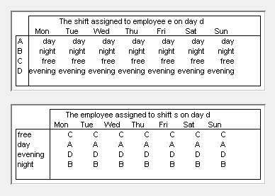
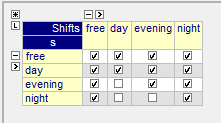
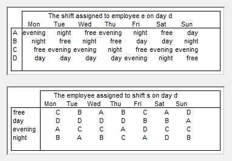
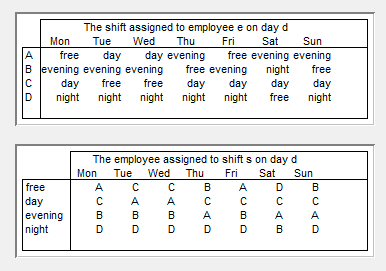

Optimize Shift Schedules
=========================

.. meta::
   :description: How to develop a shift scheduling application in AIMMS.
   :keywords: employee, roster, schedule, shift, staff

.. sidebar:: Stock Exchange Dry Board.

    .. image:: images/Stock-Exchange-Dry-Board-570618_77956939.jpg
        :scale: 35%

Solutions from rostering applications affect the daily life of the people rostered. Therefore, the application developers and planners iteratively improve the rostering applications and the quality of the solutions, often based on the feedback of those affected by the rosters created. The close link between the modeling language and GUI pages in AIMMS makes it easy to study the solutions and (re)formulate constraints.

In this article, we describe how to develop a small rostering application in AIMMS. This application is based on an assignment given in "Integrated methods for Optimization" by John N. Hooker, section 2.2.5. 

Description of the problem
----------------------------
The problem is to create a weekly roster for 4 nurses to help in a home for the elderly. A day has three shifts: day, evening, and night. Each shift is staffed by one nurse, so one nurse is free each day. We try to balance the free days per nurse, require at least 16 hours between shifts, and minimize the nurses per particular shift, and the number of changes in staffing per shift.

A roster can be viewed in two ways, for each day ``d``:

* which shift ``s`` is staffed by which employee: ``Employee( d, s ) -> Employees``

* which shift is assigned to each employee ``e``: ``Shift( d, e ) -> Shifts``

These variables have distinct values and are inverses of each other:

.. code-block:: aimms

    cp::AllDifferent(e,Shift(e,d))
    cp::AllDifferent(s,Employee(s,d))
    cp::Channel( s, Employee(s,d), e, Shift(e,d) )

Here the :any:`cp::Channel` constraint enforces that ``Employee`` and ``Shift`` are each other's inverse.

First solve
-----------
So let's solve this base model. The solution is presented in the following two tables containing the variables:

    Solution Base

Which nurse do you think is better off, the one not earning anything, or one of those not having a free day to spend the earnings?

Distributing free time, setting minimum free time
-------------------------------------------------
This is the first problem we have to resolve: to distribute free time evenly. We implement this by counting the free days per nurse, and ensure the result is stored in a bounded variable:

.. code-block:: aimms

    FreeDays(e) -> { 1 ..2 },
    cp::Count(d,Shift(e,d),'free','=',FreeDays(e))
    sum(e,FreeDays(e)) = card(Days)

Let's solve this and take again a look at the solution:

    Solution Free distributed

Inspecting the solution, we see that nurse C does the night shift on Wednesday and the evening shift on Thursday. There are only 8 hours between these two shifts. It is reasonable to require at least 16 hours between shifts; the free and day shifts can be followed by any shift, but the evening shift cannot be followed by a day shift and the night shift cannot be followed by an evening or day shift:

.. code-block:: aimms

    Constraint SuccessorShiftRestriction {
        IndexDomain: (e,d,s) | card( permittedNextShifts(s) ) < card(shifts);
        Definition: if Shift(e,d) = s then Shift(e,d++1) in permittedNextShifts( s ) endif;
        Comment: "For instance, it is not allowed to work a day shift right after a night shift.";
    }

                      
Here ``PermittedNextShifts`` is an Indexed Set with the following contents:

Note the use of the circular ``++`` operator here: ``d++1``, is the next day, with one exception: ``'last day'++1`` is the first day.

Let's solve this and see what the result is now:

    Applying successor shift restriction

Checking the result; indeed there are now at least 16 hours between two shifts for every nurse. However, the current roster comes across as rather messy. More to the point: three different nurses are staffing each of the working shifts. There is a lot of change of staffing the shifts and elderly people do not like these changes. For starters, would it be possible to limit the number of nurses staffing these shifts to two?

Limiting staffing changes
---------------------------
First, we introduce an element variable for each of the working shifts: ``ShiftValue(s,{1..2}) -> Employees``. For each day, the nurse staffing shift ``s`` should be equal to one of the values of ``ShiftValue``:

.. code-block:: aimms

    Employee(s,d) = ShiftValue(s,1) or Employee(s,d) = ShiftValue(s,2).

We are ready for the next iteration and then looking at the solution:

    Limited to two nurses per shift

Well, that solution certainly looks less messy than the previous one.

A staff change is a change of nurse from one day to the next for a particular shift; for instance on the evening shift there is a staff change from Thursday, nurse A, to Friday, nurse B. The current solution has 8 staff changes. Can we have less of those staff changes to make the solution come across even more placid?

We do this via the objective by counting the staff changes:

.. code-block:: aimms

    obj = sum( (as,d), Employee(as,d) <> Employee(as,d++1) )

and minimizing that.

With this objective we get the following solution:

.. figure:: images/Minimal-staff-changes.png

    Minimal staff changes

But... There's still a problem...

Optimizing solve time
-----------------------
The previous solves produced an answer instantaneously, but we now had to wait more than 5 seconds for the solution. We do not want to wait that long. It is possible to reduce the solve time again using the following two techniques.

The first technique is to reduce the symmetry. In our example, changing who is actually nurse A, B, C, or D does not matter. So we might as well fix the solution of the first day; this fixing will not really change the problem, just reduce the search space.

The second technique is to add redundant constraints. A redundant constraint is a constraint that can be derived from the other constraints and helps to reduce the search. In our example, the minimum found is 6. By observing that each working shift requires at least two nurses, there are at least two shift changes for the working shift, we can also derive the minimum is 6. Actually, you may want to point out to me that the two :any:`cp::AllDifferent` constraints given in the base model are also redundant.

Applying these two techniques, gives us instantaneous feedback again.

Example download
-----------------
If you would like to experiment with the model, the AIMMS project is provided here.
:download:`AIMMS project download <downloads/Employee-Rostering-Week2.zip>` 

