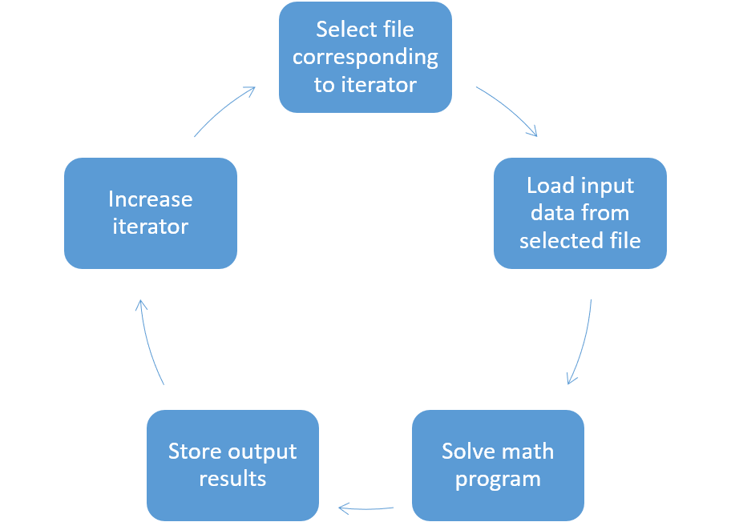

Solve in a Loop
==================

.. meta::
   :description: How to solve several instances of Excel inputs at once using a loop.
   :keywords: loop, solve, excel

This article provides an example of how to solve several instances of a problem at once, using a loop. 

If the input data is being loaded from an external source (like an Excel file), you should iterate through each external source, read in the data, solve the math program and store the output. The input data can also be loaded from an AIMMS case file or AIMMS identifiers with an index for the iteration. 

The structure of execution usually follows this format:

#. Define the collection of inputs
#. Process each input in a loop

The example project and Excel input files can be downloaded from the links below. 

:download:`AIMMS project download <downloads/MultiRunExcel.zip>` 

:download:`Excel inputs download <downloads/ExcelInputs.zip>` 

Logic of the iterative operation
-------------------------------------

The flow of a procedure to solve a math program multiple times is shown on the right. These operations can be done using any iterative operator like ``for`` or ``while``. The loop starts by selecting the first input file from the list of files to be iterated through. 

When using a ``while`` loop, you must initialize the iterator before the loop block is written. This is not necessary when using a ``for`` loop because it uses a set index in AIMMS.

   Logic of the iterative operation

In the example, we use a for loop:

.. code-block:: aimms

   for i_fn do
      sp_Workbook := sp_BatchExcelInputFolder + sp_InputFileNames(i_fn);
      pr_ExecuteSingleRun(sp_Workbook);
   endfor;

In the attached example, go to section ``Iterative Solve`` to find the procedure ``pr_ExecuteBatch``. This procedure contains some additional error handling statements to ensure the proper working of this example.

.. include:: /includes/form.def

