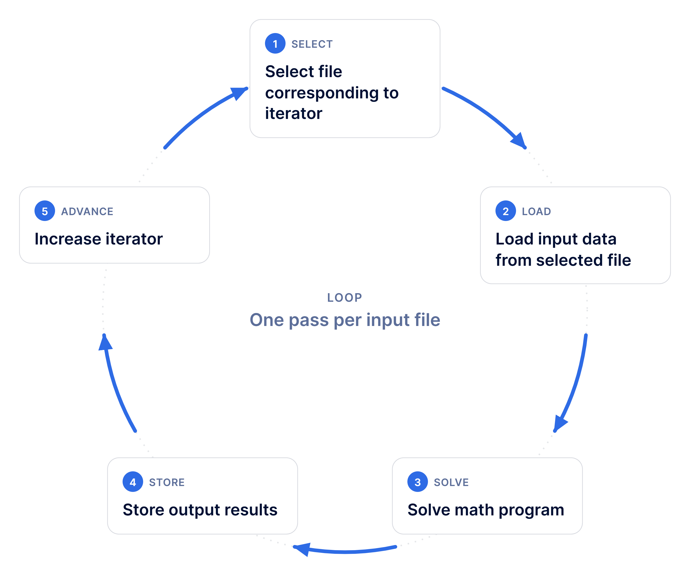

Solve in a Loop
==================

.. image:: https://img.shields.io/badge/Zip-white?style=for-the-badge&logo=github&labelColor=000081&color=1847c9
   :target: https://github.com/aimms/150-solve-in-loop/archive/refs/heads/main.zip

.. image:: https://img.shields.io/badge/Repository-white?style=for-the-badge&logo=github&labelColor=000081&color=1847c9
   :target: https://github.com/aimms/150-solve-in-loop

.. image:: https://img.shields.io/badge/AIMMS-26.4-white?style=for-the-badge&labelColor=009B00&color=00D400

.. image:: https://img.shields.io/badge/AimmsXLLibrary-26.1.1.1-white?style=for-the-badge&labelColor=009B00&color=00D400
    
.. meta::
   :description: Shows how to iteratively solve multiple problem instances from Excel input files using a for loop in AIMMS, reading data and storing results in each iteration.
   :keywords: solve loop, batch solve, Excel input, for loop, while loop, iterative solve, math program, AXLL library, case file

This article provides an example of how to solve several instances of a problem at once, using a loop. 

If the input data is being loaded from an external source (like an Excel file), you should iterate through each external source, read in the data, solve the math program and store the output. The input data can also be loaded from an AIMMS case file or AIMMS identifiers with an index for the iteration. 

The structure of execution usually follows this format:

#. Define the collection of inputs
#. Process each input in a loop

The example project is linked at the top of this article. The Excel input files come with it, in the
project's ``data`` folder, so it runs as soon as you open it.

Logic of the Iterative Operation
-------------------------------------

The flow of a procedure to solve a math program multiple times is shown below. These operations can be done using any iterative operator like :any:`for` or :any:`while`. The loop starts by selecting the first input file from the list of files to be iterated through. 

When using a :any:`while` loop, you must initialize the iterator before the loop block is written. This is not necessary when using a :any:`for` loop because it uses a set index in AIMMS.

   Logic of the iterative operation

In the example, we use a :any:`for` loop:

.. code-block:: aimms
   :linenos:

   for i_fn do !loop operation described in the article
      sp_Workbook := sp_BatchExcelInputFolder + sp_InputFileNames(i_fn);

      !read the workbook, solve, write the solution back
      pr_ExecuteSingleRun( sp_Workbook );
   endfor ;

In the example project, go to section ``Iterative Solve`` to find the procedure ``pr_ExecuteBatch``. This procedure contains some additional error handling statements to ensure the proper working of this example.

Running the Loop on AIMMS Cloud
---------------------------------

``pro::DelegateToServer`` does not delegate a single solve statement. Its unit of delegation is a
**procedure**, and by default that is the procedure the call sits in. That one fact decides how a batch
loop behaves on the cloud.

Delegating the Whole Loop
~~~~~~~~~~~~~~~~~~~~~~~~~~

Add the delegation as the first thing ``pr_ExecuteBatch`` does:

.. code-block:: aimms
   :linenos:

   if pro::GetPROEndPoint() then
       if pro::DelegateToServer(
             waitForCompletion   :  1,
             completionCallback  :  'pro::session::LoadResultsCallBack' )
       then
           return 1;
       endif;
   endif;

   ! the rest of pr_ExecuteBatch as it ships: fix the folder, list the
   ! workbooks, then loop over them

That procedure then runs **twice**, and the value ``pro::DelegateToServer`` returns is what tells the two
runs apart.

On the client, the call on line 2 saves the current state of the application as a case, sends it to the
Cloud together with the name of the procedure it sits in, and returns 1. The ``return 1`` on line 6
then ends the client run, so nothing below it executes locally.

On the Cloud, PRO loads that case and calls the same procedure again. This time ``pro::DelegateToServer``
returns 0, the ``if`` is false, and execution simply falls through into the rest of the procedure: the
folder, the list of workbooks, the loop, and every solve inside it.

That is why the call belongs at the top. Everything below it is what the Cloud will run.

The two remaining arguments control what the client does while it waits. Line 3 makes it block until the
Cloud has finished, and line 4 names the callback that loads the results back into the client session
once it has.

Line 1 is a separate question: whether there is a PRO to delegate to at all. ``pro::GetPROEndPoint``
returns the endpoint the session is connected to, so it is empty when the application runs standalone and
the loop simply runs where it is. Use this rather than ``ProjectDeveloperMode``, which reports whether
AIMMS is in developer mode and says nothing about PRO: an end user running a standalone application is not
in developer mode either, and would take the delegation branch with no Cloud to delegate to.

The Cloud walks the loop itself: one workbook after another, each solve after the previous one has
finished, all inside a single job. This is the answer to "solve consecutively on the cloud".

**An AIMMS PRO solver session can handle 0, 1 or more solve statements.** There is no rule that a session
corresponds to a solve, which is exactly why a whole loop fits comfortably inside one.

.. note::

   The example project does not include the AIMMS PRO library, so the block above is what you add in
   a project that does. Note also why the input folder is fixed to ``data`` inside the project rather than
   chosen from disk: a delegated session receives the project, and therefore the workbooks, while a folder
   picked on your own machine does not exist on the Cloud.

Submitting Each Solve as Its Own Job
~~~~~~~~~~~~~~~~~~~~~~~~~~~~~~~~~~~~~

The other shape is to delegate from inside ``pr_ExecuteSingleRun``, so each workbook is submitted
separately. The requests are then queued independently, and the Cloud starts each one as the resources it
needs become free.

That is a reasonable thing to want, and it is not as simple as moving the call. Someone has to decide when
all the sub jobs are done, collect what each produced, and report back to the client. Those intricacies are
worked through in :doc:`../535/535-waiting-for-sub-jobs-to-complete`.

.. seealso::

   * :doc:`../535/535-waiting-for-sub-jobs-to-complete`: the other shape of this problem, where one
     control job submits sub jobs and has to wait for all of them before reporting back.
   * :doc:`../261/261-solve-with-asynchronous-solver-sessions`: running several solves at the same time
     inside a single session, rather than spreading them over Cloud jobs.
   * :doc:`../310/310-investigate-behavior-pro-job`: where to look when a delegated job does not behave
     the way it did locally.
   * :doc:`../85/85-using-axll-library`: the AXLL library this example uses to read each workbook and
     write the solution back.
   * `Advanced Usage of pro::DelegateToServer <https://documentation.aimms.com/pro/pro-delegate-adv.html>`__:
     the remaining arguments, including ``inputCase`` for a batch whose runs share their input data.
