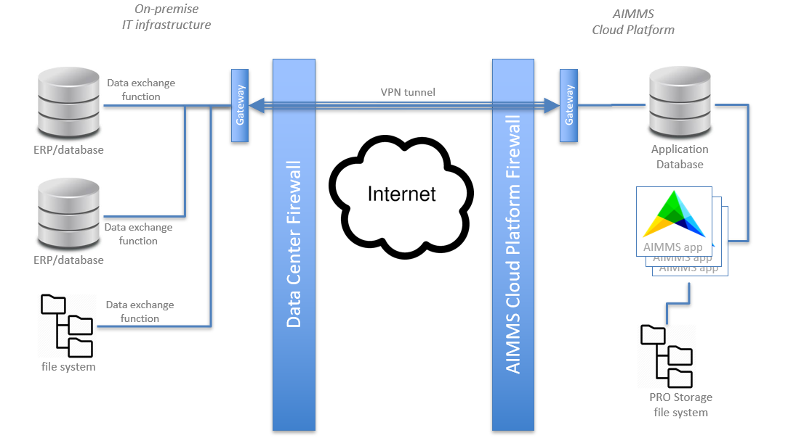
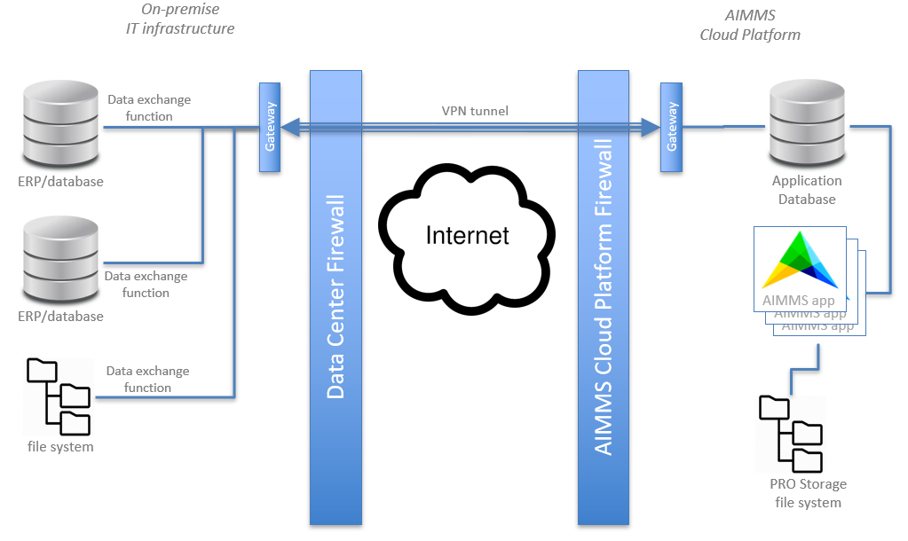
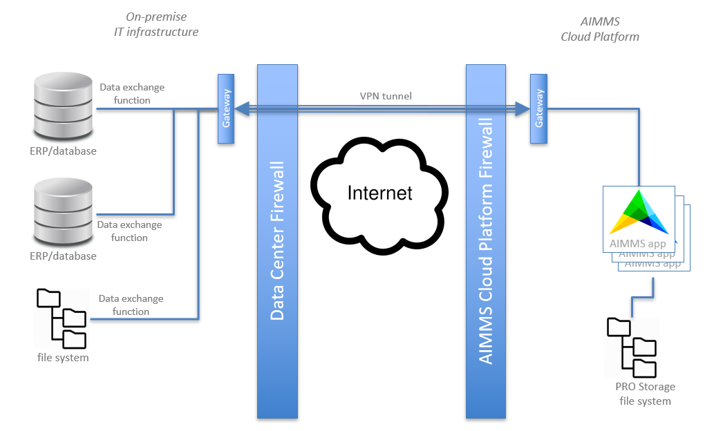
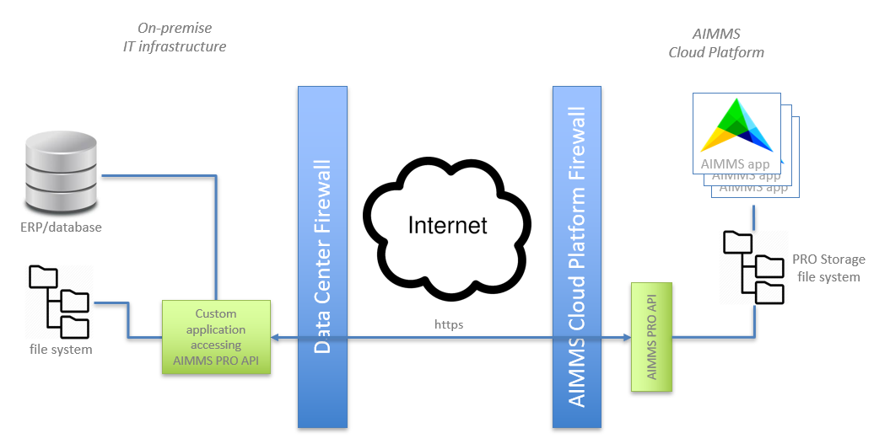
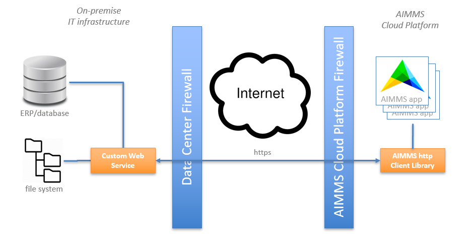
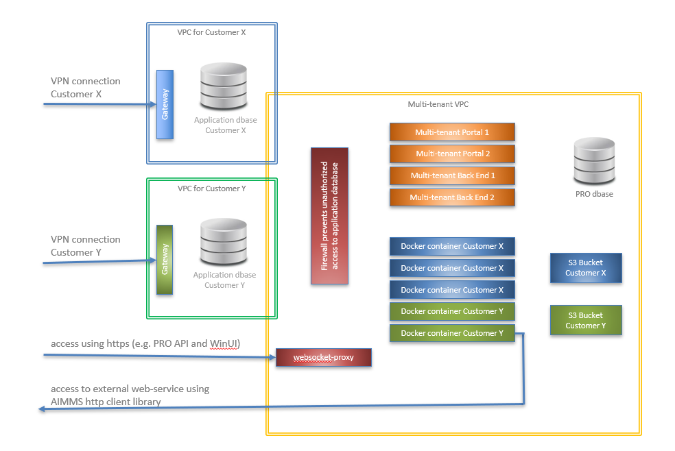
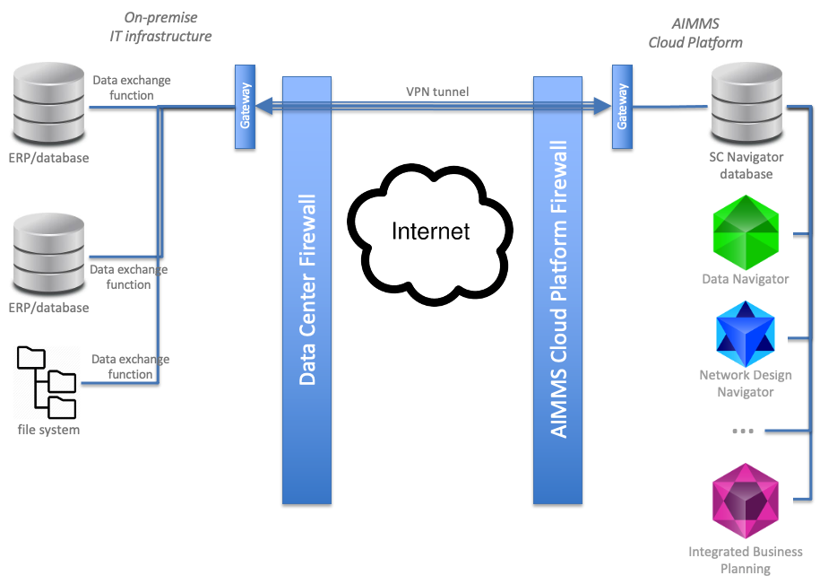

.. meta::
   :description: How to set up a framework for sending data via the AIMMS Cloud platform.
   :keywords: cloud, exchange, api, configure, network

Exchange data with the AIMMS Cloud Platform
===========================================

This document aims to introduce you to the options for exchanging data with the AIMMS Cloud Platform.

First step is to determine which scenario applies for you: 

+-----------------------+-----------------------------------------------------------------------------------------------------------------------------------------------------------------+-------------------------------------------------------------------+--------------------------------------------------------------------------------------------+-----------------------------+
| What?                 | On AIMMS Cloud Platform                                                                                                                                         | Elsewhere                                                         | Approach                                                                                   |  Option ID                  |
+=======================+=================================================================================================================================================================+===================================================================+============================================================================================+=============================+
| **SC Navigator apps** | SC Navigator (MySQL) application database provided by AIMMS that holds the data used and generated by the Navigator apps such as Network Design, S&OP and IBP.  | Information systems, on-premise or in the cloud (ERP, CRM, etc.)  | Read from and/or write to the SC Navigator (MySQL) application database via a VPN tunnel.  | :ref:`Option 1 <option1>`   |
|                       |                                                                                                                                                                 |                                                                   | Optionally use ETL to combine and/or split data from multiple other systems.               |                             |
+-----------------------+-----------------------------------------------------------------------------------------------------------------------------------------------------------------+-------------------------------------------------------------------+--------------------------------------------------------------------------------------------+-----------------------------+
| **My own apps**       | Application database (MySQL) provided by AIMMS that holds the data used and generated by my own AIMMS apps.                                                     | Information systems, on-premise or in the cloud (ERP, CRM, etc.)  | Read from and/or write to the (MySQL) application database via a VPN tunnel.               | :ref:`Option 2 <option2>`   |
|                       +-----------------------------------------------------------------------------------------------------------------------------------------------------------------+-------------------------------------------------------------------+--------------------------------------------------------------------------------------------+-----------------------------+
|                       | My own AIMMS apps                                                                                                                                               | Database, on-premise or in the cloud (ERP, CRM, etc.)             | Read from and/or write to remote database using AIMMS database commands, with or without VPN                     | :ref:`Option 3 <option3>`   |
|                       +-----------------------------------------------------------------------------------------------------------------------------------------------------------------+-------------------------------------------------------------------+--------------------------------------------------------------------------------------------+-----------------------------+
|                       | AIMMS PRO (file) Storage, which can be accessed from my own AIMMS apps                                                                                          | Information systems, on-premise or in the cloud (ERP, CRM, etc.)  | File transfer commands of PRO API.                                                         | :ref:`Option 4 <option4>`   |
|                       +-----------------------------------------------------------------------------------------------------------------------------------------------------------------+-------------------------------------------------------------------+--------------------------------------------------------------------------------------------+-----------------------------+
|                       | My own AIMMS apps                                                                                                                                               | Remote REST API web services                                      | AIMMS HTTP Client Library and AIMMS Data Exchange Library.                                 | :ref:`Option 5 <option5>`   |
+-----------------------+-----------------------------------------------------------------------------------------------------------------------------------------------------------------+-------------------------------------------------------------------+--------------------------------------------------------------------------------------------+-----------------------------+

.. _option1: 

Option 1 : via SC Navigator database
^^^^^^^^^^^^^^^^^^^^^^^^^^^^^^^^^^^^^^

This option is also described in `SC Navigator Documentation <https://scnavigator-manual.aimms.com/getting-started/exchange-data-with-scnav.html>`_. 
AIMMS will set-up the application database. Your IT team then needs to set up the VPN tunnel, as described `here <https://documentation.aimms.com/cloud/db-config.html#adding-a-vpn-connection>`__. Once that is in place you have access to the MySQL database. 
This SC Navigator application database has an EAV (Entity Attribute Value) structure, documentation for which is available from AIMMS Support (`Contact us <mailto:support@aimms.com>`__). 
You can now put in place the writes and reads to and from the SC Navigator application database from your information systems.  

Alternatively, AIMMS can provide this solution as a managed service where we build, monitor and maintain the integration. `Contact us <mailto:support@aimms.com>`__ if you want to learn more.  

.. _option2:

Option 2 : via an application database 
^^^^^^^^^^^^^^^^^^^^^^^^^^^^^^^^^^^^^^^^^^^^^^^^^^^^^^^^^^^

AIMMS will take the first steps to create the database. 
Your IT team then needs to complete the parametrization and VPN tunnel set-up, as described `here <https://documentation.aimms.com/cloud/db-config.html>`__. 
You can now put in place the writes and reads to and from the application database from your information systems. 

Alternatively, AIMMS can provide this solution as a managed service where we build, monitor and maintain the integration. `Contact us <mailto:support@aimms.com>`__ if you want to learn more.

|cloud-app-db|

*Figure 2 – Accessing the application database in the AIMMS Cloud Platform*

.. seealso::

   See https://dev.mysql.com/doc/index-connectors.html for details how to connect to MySQL databases.

All traffic takes place via a VPN tunnel that is initiated from the
on-premise environment, so there is no need to permit incoming
connections with associated security risks. This VPN (Virtual Private
Network) tunnel offers high information security because it creates a
virtual private connection by encapsulating and encrypting all data
packets.

More details of the relevant parts of the AIMMS Platform architecture
can be found in :ref:`deployment-exchange-data-more-details`.

.. _option3:

Option 3 : accessing a remote database
^^^^^^^^^^^^^^^^^^^^^^^^^^^^^^^^^^^^^^^^^^^^^^^^^^^^^^^^^^^^^^^

This case applies when you have a remote database, either in your own data center or elsewhere with a cloud provider. Please be aware that you might experience performance degradataion because of latency and/or bandwidth limitations, most noticable in apps that require a lot of database interaction when the user is interacting with the app. But in many cases we see this work well. 

Technically there currently are two options: with or without VPN. 

For the VPN route, AIMMS needs to add a load balancer to the VPC on the AIMMS Cloud Platform. 
Your IT team then needs to complete the parametrization and VPN tunnel set-up, as described `here <https://documentation.aimms.com/cloud/db-config.html#adding-a-vpn-connection>`__. 
You can then configure your network access such that the AIMMS apps in the AIMMS Cloud Platform can directly access the required database on your premises, 
in your datacenter or in the cloud. AIMMS database support functions in our modeling language can be found `here <https://documentation.aimms.com/functionreference/data-management/database-functions/>`__. 

|on-premise-db| 

*Figure 3 - Directly accessing a remote database from AIMMS apps*

The other route is without a VPN. This probably requires you to whitelist the IP-ranges of the AIMMS Cloud Platform in your firewalls. The AIMMS apps will issue commands to the remote database in the same way as when you are using a VPN connection to a remote database.

.. _option4:

Option 4 : via the AIMMS PRO file storage
^^^^^^^^^^^^^^^^^^^^^^^^^^^^^^^^^^^^^^^^^^^

No need for any initial set-up or configuration. 
Read more on AIMMS PRO Storage `here <https://how-to.aimms.com/Articles/117/117-Uploading-and-Downloading-files.html>`__. 
Programs can be created for writing and reading files to and from AIMMS PRO Storage using Java, C++ or C#. 
Documentation for the PRO API can be found `here <https://documentation.aimms.com/pro/api.html>`__. 

|pro-api|

*Figure 4 – Transferring files to AIMMS PRO Storage using the AIMMS PRO API*

In order to get data files from the on-premise systems to an AIMMS app
running on the AIMMS Cloud Platform, the on-premise custom application
will need to upload the appropriate file(s) to the appropriate folder in
the AIMMS PRO Storage. The developer of the AIMMS app will then use
AIMMS functions to read these data files into the app.

The PRO API shares information security measures with the AIMMS PRO
Portal such as lock-out on repeated logon failures, https encryption,
optional IP range filtering and security event logging. In addition, the
communications are secured by temporary tickets that can be seen as
security tokens.

.. _option5:

Option 5 : via a web service
^^^^^^^^^^^^^^^^^^^^^^^^^^^^^^^^^

AIMMS apps can be configured to retrieve data from external web services or post data to those web services. 
The AIMMS app will act as a client here, using the AIMMS HTTP Client Library that supports REST API: :doc:`../306/306-http-client-library-overview`. 
The AIMMS Data Exchange library can be used for format conversions between AIMMS Identifiers and various file formats: https://documentation.aimms.com/dataexchange/index.html.  

|web-service|

*Figure 5 – Using REST API calls to web services to exchange data with an AIMMS app*

Knowing the authentication and communication protocol of the bespoke web
service, the developer of the AIMMS app can use the AIMMS HTTPS Client
Library to add a procedure to the app that writes data to this web
services or retrieves data from that web service.

For this option the information security measures are completely in the
hands of the developers of the web service offered from the on-premise
platform.

Examples
^^^^^^^^^
Examples of how our customers have arranged their data exchange:

a.	Every 5 minutes a web-service is called to retrieve the latest data which is then immediately processed by the AIMMS app.
#.	From an on-premise database all new customer orders are written once a day to the cloud-based application database. 
#.	User can hit a button in the AIMMS app that triggers a data import from an on-premise database containing the production planning so that they are working on the latest data.
#.	An AIMMS application writes XML files to AIMMS PRO storage. An on-premise utility retrieves those files once every hour using the PRO API.

.. _deployment-exchange-data-more-details:

More details on AIMMS Cloud Platform architecture
^^^^^^^^^^^^^^^^^^^^^^^^^^^^^^^^^^^^^^^^^^^^^^^^^

The following diagram depicts the part of the
**AIMMS Cloud Platform** architecture relevant for exchanging data. The
application databases are placed in customer-specific VPCs that include
gateways to receive incoming VPN connections.

|more-details|

*Figure 6 – Simplified diagram showing the relevant parts of the AIMMS Cloud Platform architecture*

Related Topics
----------------
* **AIMMS Documentation:** `AIMMS Cloud Platform <https://documentation.aimms.com/cloud/>`_

