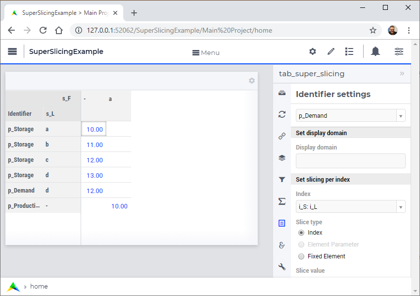
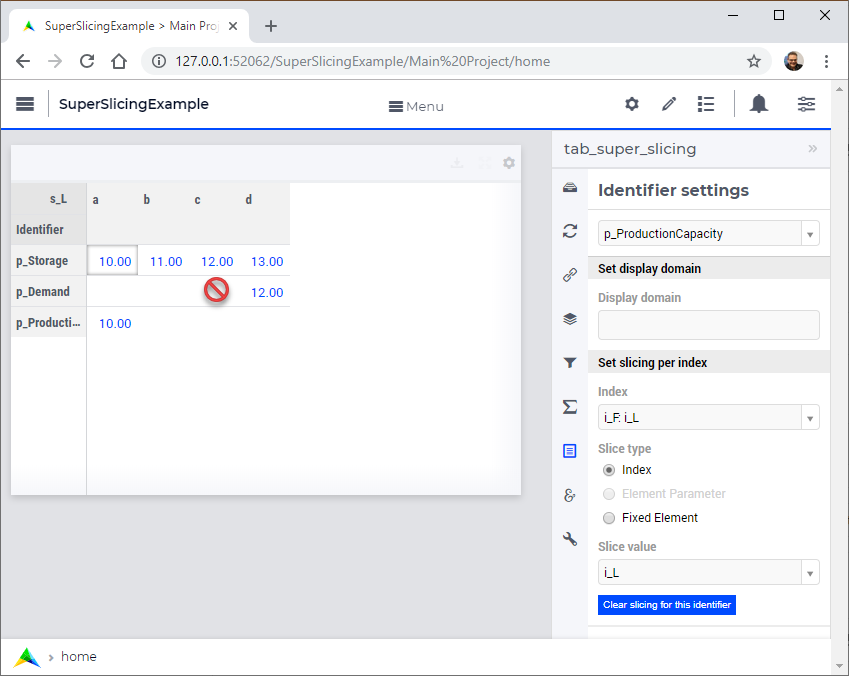

:orphan:

Super slicing
=============

.. meta::
   :description: Allowing identifiers declared over subsets to be presented in WebUI tables over 
   :keywords: subsets, master sets, table widgets, WebUI
   
AIMMS model identifiers, in particular the (decision) variables and constraints, but also parameters used in intermediate computations, are over declared over subsets, as the decision problem at hand typically only needs to/can be solved for a selection of the data. The design choice is here to declare identifiers with a minimal index domain such that they do not allow values outside what is expected.

The WebUI Table widget on the other hand expects the indices for the rows and for the columns to be the same for all identifiers displayed. AIMMS releases up to AIMMS 4.61 forced the model builder to reference only identifiers that are declared over sets that are the same or supersets of the ones used in the table widget. The design choice is here to declare identifiers with a maximal domain such that they can always be displayed in WebUI Table widgets. This is similar for other AIMMS data widgets such as the bar chart.

Super slicing, introduced in AIMMS 4.62, overcomes the friction between the design choices in the above two paragraphs. Let me explain via an example.

Consider a network where some nodes represent factories (set s_F, index i_F), some nodes represent distribution centers (set s_DC, index i_DC), and some nodes represent stores (set s_S, index i_S).  In such a network, all locations (s_L, i_L) can have storage, but only some locations have production capacity, and only some locations have demand.

Assume, we're working in the model, we'd prefer to declare the relevant parameters as follows:

.. code-block:: aimms
    :linenos:

    Set s_L {
        Index: i_L;
        InitialData: data { a, b, c, d };
    }
    Set s_F {
        SubsetOf: s_L;
        Index: i_F;
        Definition: data { a };
    }
    Set s_DC {
        SubsetOf: s_L;
        Index: i_DC;
        Definition: data { b, c };
    }
    Set s_S {
        SubsetOf: s_L;
        Index: i_S;
        Definition: data { d };
    }
    Parameter p_Lat {
        IndexDomain: i_L;
    }
    Parameter p_Lon {
        IndexDomain: i_L;
    }
    Parameter p_Storage {
        IndexDomain: i_L;
        InitialData: data { a : 10,  b : 11,  c : 12,  d : 13 };
    }
    Parameter p_ProductionCapacity {
        IndexDomain: i_F;
        InitialData: data { a : 10 };
    }
    Parameter p_Demand {
        IndexDomain: i_S;
        InitialData: data { d : 12 };
    }

The initial table widget specification:
    
    
.. image:: images/01InitialTableWidgetSpecification.PNG

after super slicing ``i_S`` to ``i_L`` via the display domain of ``p_Demand``:

after super slicing ``i_F`` to ``i_L`` via the display domain of ``p_ProductionCapacity``:

Note in the above, the cursor shows "forbidden" when hovering over the empty cells.
This is expected, as these cells correspond to elements outside the domain of the corresponding identifiers.

.. include:: /includes/form.def

