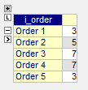

Model Category Mapping of Items
================================

.. meta::
   :description: How to model category mapping to define properties in AIMMS.
   :keywords: category, map, mapping, lookup

Very often, you will find yourselves having to define a certain property for an item based on its category. 
For example, Cost ($) of an item based on the size of that item (small, medium, or large). 
This is similar to using a ``lookup`` function in Excel to create a map from the size-cost table to the list of items. This article will show you how to model such a category mapping in AIMMS.

Please use the following project to follow this article:

   :download:`Category Modelling Example AIMMS Project <downloads/CategoryModelling.zip>`

Use Case
---------

A simple example case is if you have a list of different orders for an item (of three different sizes), you know the price per unit for each size and you want to calculate the cost of each order.

+-------------+-----------------+
| ``s_sizes`` | ``p_def_price`` |
+=============+=================+
| Small       |    3            |
+-------------+-----------------+
| Medium      |    5            |
+-------------+-----------------+
| Large       |    7            |
+-------------+-----------------+

The accurate mapping from the above table to the below table should be 3, 5, 7, 7, 3. 
How do you lookup the corresponding price for each ``s_orders`` according to the ``ep_def_orderSize``?

+--------------+----------------------+---------------------+
| ``s_orders`` | ``ep_def_orderSize`` | ``p_def_orderCost`` |
+==============+======================+=====================+
| Order 1      | Small                |                     |
+--------------+----------------------+---------------------+
| Order 2      | Medium               |                     |
+--------------+----------------------+---------------------+
| Order 3      | Large                |                     |
+--------------+----------------------+---------------------+
| Order 4      | Large                |                     |
+--------------+----------------------+---------------------+
| Order 5      | Small                |                     |
+--------------+----------------------+---------------------+

AIMMS Implementation
------------------------

One way to do this is to define ``ep_def_orderSize`` as an element parameter which lets us assign a set element to an indexed parameter. 

.. important::
   
   A parameter type identifier is used to store numerical values, an element parameter type identifier is used to store elements of a set, and a string parameter type identifier is used to store string values like the name suggests. Remember to use an element parameter even if your set contains numerical elements.

In the AIMMS project, you have sets ``s_sizes`` and ``s_orders`` with ``i_size`` and ``i_order`` as indices respectively. Price per size is stored in the indexed parameter ``p_def_price(s)``. 

Order size for each order is stored in an element parameter ``ep_def_orderSize(i_order)`` which has the attribute ``Range`` defined as as ``s_sizes``. 
The ``Range`` attribute is mandatory for an element parameter and it should be defined as the set which contains the elements to be stored in that element parameter. 

Option 1
~~~~~~~~~

Now, the cost of each order ``p_def_orderCost(i_order)`` can be calculated using the following definition:

.. code-block:: aimms

   Parameter p_def_orderCost_OPTION1 {
      IndexDomain: i_order;
      Definition: p_def_price(ep_def_orderSize(i_order));
   }

For each ``i_order``, the corresponding ``i_size`` is mapped using the element parameter ``ep_def_orderSize(i_order)``. For example, the evaluation of ``p_def_orderCost_OPTION1('Order 1')`` will be as follows:

.. code-block:: aimms
   :linenos:
   
   ! starting with
   p_def_price(ep_def_orderSize('Order 1'))
   
   ! will be
   p_def_price('Small')
   
   ! then
   3

Option 2
~~~~~~~~~

``p_def_orderCost(i_order)`` can also be computed by defining a binary parameter such as ``p_def_relationSizeOrder(i_size,i_order)``, see:

.. code-block:: aimms
   
   Parameter p_def_relationSizeOrder {
      IndexDomain: (i_size,i_order);
      Range: binary;
      Definition: 1 $ (ep_def_orderSize(i_order) = i_size);
   }

And since there is only one size per order, ``p_def_orderCost_OPTION2(i_order)`` can be defined as:

.. code-block:: aimms

   Parameter p_def_orderCost_OPTION2 {
      IndexDomain: i_order;
      Definition: {
         sum(i_size | 
                  p_def_relationSizeOrder(i_size, i_order),
               p_def_price(i_size))
      }
   }

Result
~~~~~~~~~

The resulting data page of the parameter ``p_def_orderCost_OPTION1(i_order)`` or ``p_def_orderCost_OPTION2(i_order)`` will look as below: 

