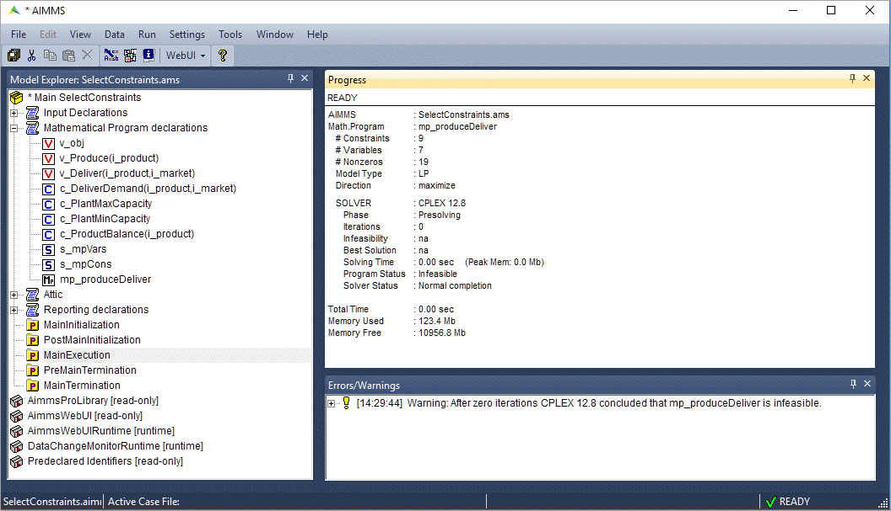
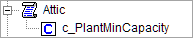
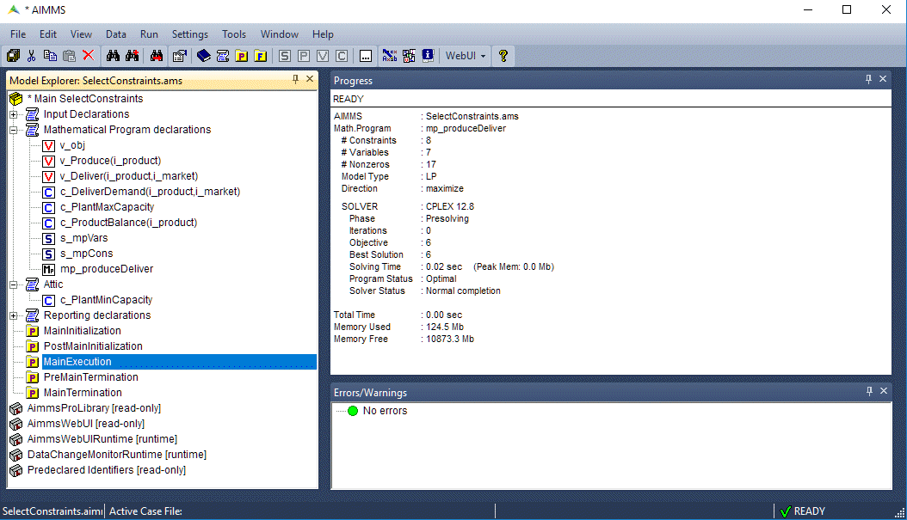

Select Constraints and Variables
================================

.. image:: https://img.shields.io/badge/Zip-white?style=for-the-badge&logo=github&labelColor=000081&color=1847c9
   :target: https://github.com/aimms/175-select-constraints-and-variables/archive/refs/heads/main.zip

.. image:: https://img.shields.io/badge/Repository-white?style=for-the-badge&logo=github&labelColor=000081&color=1847c9
   :target: https://github.com/aimms/175-select-constraints-and-variables

.. image:: https://img.shields.io/badge/AIMMS-26.4-white?style=for-the-badge&labelColor=009B00&color=00D400
   
.. meta::
   :description: Demonstrates how to select specific variables and constraints for a mathematical program declaration and how to analyze infeasibility in AIMMS.
   :keywords: mathematical program, AllConstraints, AllVariables, variable selection, constraint selection, infeasibility analysis, GMP, subset, goal programming

In this article we will explore how you can control the constraints or variables used in a math program. Then we'll show an example of how to use this method to analyze infeasibility of a mathematical program. 

A sample declaration of a math program is shown below. 

.. code-block:: aimms

   MathematicalProgram Sample_Math_Program {
      Objective: ObjFunc;
      Direction: minimize;
      Constraints: AllConstraints;
      Variables: AllVariables;
      Type: Automatic;
   }

* ``Objective`` specifies which variable is the objective function of the math program. 
* ``Direction`` specifies whether you want to minimize or maximize the objective function. 
* ``Constraints`` specifies which set of constraints should be considered. In this case, :aimms:set:`AllConstraints` will be considered.
* ``Variables`` specifies which set of variables should be considered. In this case, :aimms:set:`AllVariables` will be considered.
* ``Type`` specifies what kind of a problem the math program is, e.g., a linear program, an integer program, and so on. The default option ``Automatic`` suffices in most cases and is recommended. 

.. note::

   :aimms:set:`AllConstraints` and :aimms:set:`AllVariables` 
   are `model related predeclared identifier Sets <https://documentation.aimms.com/functionreference/predefined-identifiers/model-related-identifiers/index.html>`_, 
   containing all constraints and all variables defined in your model. 
    

You may have multiple mathematical program identifiers in the same project, subject to different sets of constraints and variables. 
For example, it can be used in a sequential goal programming problem where the solution of the first problem is provided as input to the second problem. 

Default Constraints and Variables
----------------------------------------

When you solve a mathematical program (or generate it via `the GMP functions <https://how-to.aimms.com/Articles/147/147-GMP-Intro.html>`_), AIMMS will use the values of the ``Constraints`` and ``Variables`` attributes of the mathematical program identifier to determine which symbolic variables and constraints should actually be considered in the model. 
The default values of ``Constraints`` and ``Variables`` attributes are the predefined sets :aimms:set:`AllConstraints` and :aimms:set:`AllVariables` respectively. :aimms:set:`AllConstraints` contains all the constraints declared in your AIMMS project and similarly, :aimms:set:`AllVariables` contains all the variables. 

Variables with Definition
^^^^^^^^^^^^^^^^^^^^^^^^^^

For variables with a definition, AIMMS will actually generate both the variable and an additional equality constraint. For example, if you have the variable ``X`` that has ``Y + Z`` in its definition attribute:

.. code-block:: aimms

   Variable X {
      Range: free;
      Definition: Y+Z;
   }

AIMMS will generate:

#. Variable ``X``

#. Equality constraint ``X_definition`` as ``X = Y + Z``

So, any variable with a definition (like ``X``) will appear in both the predeclared sets :aimms:set:`AllConstraints` and :aimms:set:`AllVariables`. 

Selecting Constraints or Variables
-----------------------------------------

To select the constraints to be applied in a math program, you can create a set as a subset of :aimms:set:`AllConstraints`  and use that set in the declaration of the math program instead of :aimms:set:`AllConstraints`. 

Likewise, you can create a subset of :aimms:set:`AllVariables` and use it in the declaration of the math program.

The example below shows two sets, ``ModelConstraints`` and ``ModelVariables``, used in the math program ``Sample_Math_Program``. 

.. code-block:: aimms

   Set ModelConstraints {
      SubsetOf: AllConstraints;
      Definition: AllConstraints*Section_or_Declaration_to_Optimize;
   }

   Set ModelVariables {
      SubsetOf: AllVariables;
      Definition: AllVariables*Section_or_Declaration_to_Optimize;
   }

   MathematicalProgram Sample_Math_Program {
      Objective: ObjFunc;
      Direction: maximize;
      Constraints: ModelConstraints;
      Variables: ModelVariables;
      Type: Automatic;
   }

You can either manually select the constraints and variables to be included in these subsets or use the definition, as shown above, to include all the constraints and variables present in a particular section or declaration section. 

Using a definition makes it easy to scale the project: any new constraint or variable added inside ``Section_or_Declaration_to_Optimize`` is automatically added to the subset and used in generating the math program. You do not need to select variables with a definition in both the subsets.

Where That Section Name Comes From
^^^^^^^^^^^^^^^^^^^^^^^^^^^^^^^^^^^

``Section_or_Declaration_to_Optimize`` above is not a set you declare. Every ``Section`` and
``DeclarationSection`` node you create in the Model Explorer is automatically available inside the model as
a subset of :aimms:set:`AllIdentifiers`, named after the node with spaces replaced by underscores, and
holding every identifier declared beneath it.

That is what makes the model tree itself the selection mechanism. Intersecting the implicit set with
:aimms:set:`AllConstraints` keeps only the constraints declared under that node, and intersecting with
:aimms:set:`AllVariables` keeps only the variables.

The example project linked at the top is built exactly this way. Its Model Explorer holds four declaration
sections:

.. code-block:: none
   :linenos:

   Input_Declarations
       s_Products, s_Markets, p_Demand, p_PlantMinCapacity, p_PlantMaxCapacity
   Mathematical_Program_declarations
       v_obj, v_Produce, v_Deliver
       c_DeliverDemand, c_PlantMaxCapacity, c_ProductBalance
       s_mpVars, s_mpCons, mp_produceDeliver
   Attic
       c_PlantMinCapacity
   Reporting_declarations
       s_AcceptableSolutionStates

and its two subsets name the second of them:

.. code-block:: aimms
   :linenos:

   Set s_mpVars {
      SubsetOf   : AllVariables;
      Definition : AllVariables * Mathematical_Program_declarations;
   }

   Set s_mpCons {
      SubsetOf   : AllConstraints;
      Definition : AllConstraints * Mathematical_Program_declarations;
   }

Read line 3 as "the variables among the identifiers declared under
``Mathematical_Program_declarations``". Nothing lists the three constraints by name, and nothing needs
updating when a fourth is added: declaring it inside that node is what puts it in the mathematical program.

Because both sets carry a ``Definition`` rather than an assignment, AIMMS recomputes them whenever the
model changes. Dragging a declaration from one node to another in the Model Explorer therefore changes
what the mathematical program contains, without touching the mathematical program declaration or any
procedure. That is precisely the move the Attic step below relies on.

Letting End Users Toggle Constraints from the UI
-------------------------------------------------

The section-based definition above is a development-time choice. To put the same selection in the hands of an
end user, drive the subset from a binary parameter over :aimms:set:`AllConstraints` instead of from a section:

.. code-block:: aimms

   Parameter p_selectConstraint {
      IndexDomain : IndexConstraints;
      Range       : binary;
   }

   Set ModelConstraints {
      SubsetOf   : AllConstraints;
      Definition : { IndexConstraints | p_selectConstraint(IndexConstraints) };
   }

Expose ``p_selectConstraint`` on a WebUI page as a set of toggles (one per constraint you want the user to
control) and the mathematical program's constraint set follows whatever they switch on, with no change to
the model or to the mathematical program declaration.

The same construction applied to :aimms:set:`AllVariables` toggles variables. Remember, per the section above,
that a variable carrying a ``Definition`` also appears in :aimms:set:`AllConstraints`, so switching such a
variable off may require toggling it in both places.

Analyzing Infeasibility of a Mathematical Program
--------------------------------------------------

The same method gives you a quick way to find out why a mathematical program is infeasible.

We will use the example project linked at the top of this article. Open it and follow the three steps
below.

#. Run ``MainExecution``. The Progress Window shows "Model infeasible" and there is a warning in the error/warning window.

#. Move the declaration of the constraint ``c_PlantMinCapacity`` to the declaration section "Attic" (that famous place where you put stuff you don't use, but don't want to throw away).

#. Run ``MainExecution`` again. The Progress Window now shows "Model feasible".

Under the hood, the set ``s_mpCons`` is recomputed removing the constraint ``c_PlantMinCapacity`` from the mathematical program.

.. seealso::

   * `AIMMS Documentation: Predeclared identifiers <https://documentation.aimms.com/functionreference/predefined-identifiers/index.html>`_

   * `AIMMS Documentation: Mathematical Programs <https://documentation.aimms.com/language-reference/optimization-modeling-components/solving-mathematical-programs/index.html>`_