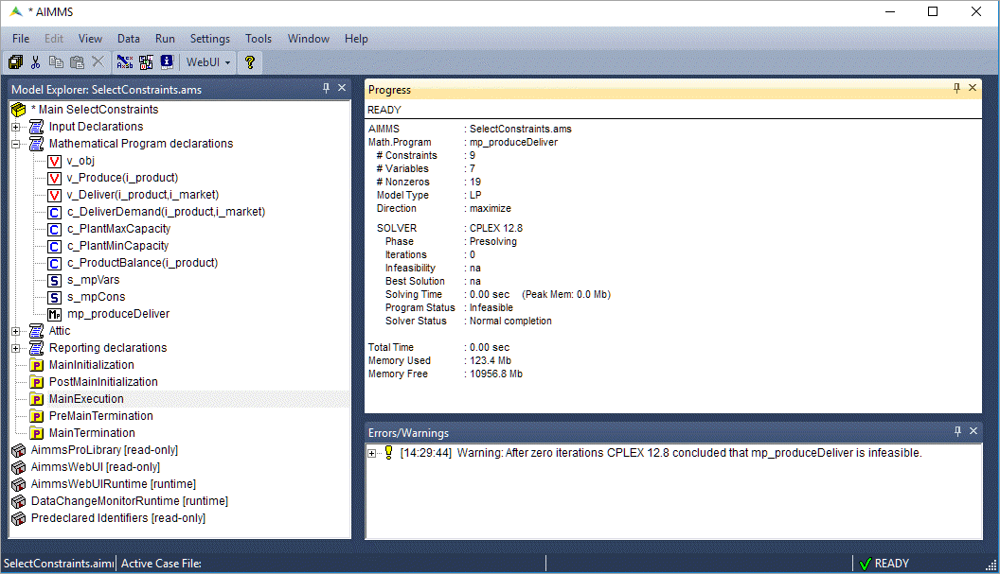
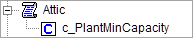
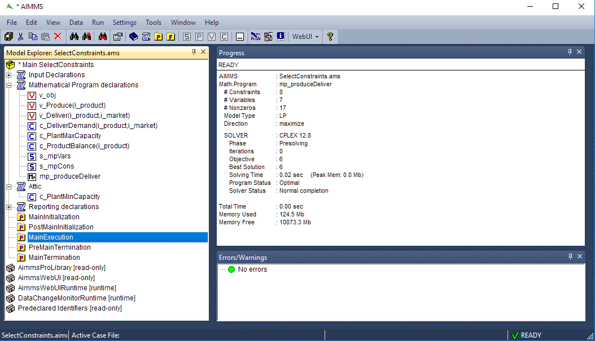

Select Constraints and Variables for a Math Program Declaration
=======================================================================

.. meta::
   :description: How to select specific variables and constraints for a mathematical program.
   :keywords: variables, constraints, mathematical program, AllConstraints, AllVariables, sequential goal programming

In this article we will explore how you can control the constraints or variables used in a math program. Then we'll show an example of how to use this method to analyze infeasibility of a mathematical program. 

A sample declaration of a math program is shown below. 

.. code-block:: aimms

   MathematicalProgram Sample_Math_Program {
      Objective: ObjFunc;
      Direction: minimize;
      Constraints: AllConstraints;
      Variables: AllVariables;
      Type: Automatic;
   }

* ``Objective`` specifies which variable is the objective function of the math program. 
* ``Direction`` specifies whether you want to minimize or maximize the objective function. 
* ``Constraints`` specifies which set of constraints should be considered. In this case, :aimms:set:`AllConstraints` will be considered.
* ``Variables`` specifies which set of variables should be considered. In this case, :aimms:set:`AllVariables` will be considered.
* ``Type`` specifies what kind of a problem the math program is, e.g., a linear program, an integer program, and so on. The default option ``Automatic`` suffices in most cases and is recommended. 

.. note::

    :aimms:set:`AllConstraints` and :aimms:set:`AllVariables` are `Model related predeclared identifier <https://documentation.aimms.com/functionreference/predefined-identifiers/model-related-identifiers/index.html>`_ Sets, containing all constraints and all variables defined in your model. 
    

You may have multiple mathematical program identifiers in the same project, subject to different sets of constraints and variables. 
For example, it can be used in a sequential goal programming problem where the solution of the first problem is provided as input to the second problem. 

Default Constraints and Variables
----------------------------------------

When you solve a mathematical program (or generate it via `the GMP functions <https://how-to.aimms.com/Articles/147/147-GMP-Intro.html>`_), AIMMS will use the values of the ``Constraints`` and ``Variables`` attributes of the mathematical program identifier to determine which symbolic variables and constraints should actually be considered in the model. 
The default values of ``Constraints`` and ``Variables`` attributes are the predefined sets :aimms:set:`AllConstraints` and :aimms:set:`AllVariables` respectively. :aimms:set:`AllConstraints` contains all the constraints declared in your AIMMS project and similarly, :aimms:set:`AllVariables` contains all the variables. 

Variables with definition
^^^^^^^^^^^^^^^^^^^^^^^^^^

For variables with a definition, AIMMS will actually generate both the variable and an additional equality constraint. For example, if you have the variable ``X`` that has ``Y + Z`` in its definition attribute:

.. code-block:: aimms

   Variable X {
      Range: free;
      Definition: Y+Z;
   }

AIMMS will generate:

#. Variable ``X``

#. Equality constraint ``X_definition`` as ``X = Y + Z``

So, any variable with a definition (like ``X``) will appear in both the predeclared sets :aimms:set:`AllConstraints` and :aimms:set:`AllVariables`. 

Selecting Constraints or Variables
-----------------------------------------

To select the constraints to be applied in a math program, you can create a set as a subset of :aimms:set:`AllConstraints`  and use that set in the declaration of the math program instead of :aimms:set:`AllConstraints`. 

Likewise, you can create a subset of :aimms:set:`AllVariables` and use it in the declaration of the math program.

The below below example shows two sets, ``ModelConstraints`` and ``ModelVariables``, used in the math program ``Sample_Math_Program``. 

.. code-block:: aimms

   Set ModelConstraints {
      SubsetOf: AllConstraints;
      Definition: AllConstraints*Section_or_Declaration_to_Optimize;
   }

   Set ModelVariables {
      SubsetOf: AllVariables;
      Definition: AllVariables*Section_or_Declaration_to_Optimize;
   }

   MathematicalProgram Sample_Math_Program {
      Objective: ObjFunc;
      Direction: maximize;
      Constraints: ModelConstraints;
      Variables: ModelVariables;
      Type: Automatic;
   }

You can either manually select the constraints and variables to be included in these subsets or use the definition, as shown above, to include all the constraints and variables present in a particular section or declaration section. 

Using a definition makes it easy to scale the project ⁠— any new constraint or variable added inside ``Section_or_Declaration_to_Optimize`` is automatically added to the subset and used in generating the math program. You do not need to select variables with a definition in both the subsets.

Analyzing infeasibility of a mathematical program
--------------------------------------------------

Using the above method can be used to a quick analysis on the infeasibility of a mathematical program.

We'll use an example project, which you can download from the link below:

* :download:`model/SelectConstraints.zip`.

#. Run ``MainExecution``. The Progress Window shows "Model infeasible" and there is a warning in the error/warning window.

#. Move the declaration of the constraint ``c_PlantMinCapacity`` to the declaration section "Attic" (that famous place where you put stuff you don't use, but don't want to throw away).

#. Run ``MainExecution`` again. The Progress Window now shows "Model feasible".

Under the hood, the set ``s_mpCons`` is recomputed removing the constraint ``c_PlantMinCapacity`` from the mathematical program.

Related Topics
----------------

* `AIMMS Documentation: Predeclared identifiers <https://download.aimms.com/aimms/download/manuals/AIMMS3FR_PredeclaredModel.pdf>`_

* `AIMMS Documentation: Mathematical Programs <https://download.aimms.com/aimms/download/manuals/AIMMS3LR_SolvingMathematicalPrograms.pdf>`_