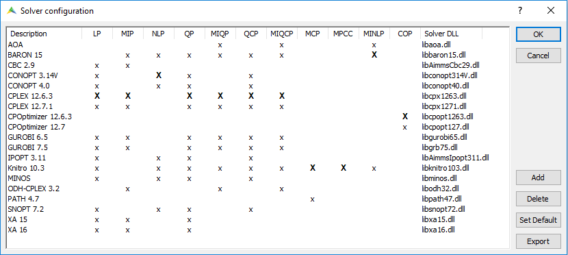

Change the Default Solvers Used
=============================================

.. meta::
   :description: How to change the default solver used for each type of mathematical program.
   :keywords: mathematics, solver, mathematical program, CPLEX, GUROBI

Depending on which solvers are allowed by your AIMMS license, you might have multiple solvers capable of solving a given type of mathematical program (e.g. LP, MIP). In this case, you can instruct AIMMS in a variety of ways which solver should be used to solve a problem of a specific type.

Solver Configuration
-----------------------

The trivial approach to change the default solver for each type of problem is to make use of the *Solver Configuration* tool. You can access this via *Menu > Settings > Solver Configuration*

The picture above shows an example screenshot, where CPLEX 12.6.3 is used as the default solver for problems of the type LP. By double-clicking on any of the X's in the LP column, you can make the corresponding solver the default for LP problems. Any changes you make to the default solvers via this configuration screen are persistent between your AIMMS sessions: if you close your AIMMS application and start it again, the same default settings are used.

.. Note::

    In AIMMS Cloud, only the most recent versions of the supported solvers are available by default. 
    For example, in the above screenshot - `CPLEX 12.6.3` is not available out of the box for use on AIMMS Cloud as `CPLEX 12.7.1` is available. 
    
    To use an older version of the solver (like `CPLEX 12.6.3`), you need to ``Export`` the Solver configuration which will create a ``solvers.slv`` file in your project root directory. 
    Make sure to include this file in the ``.aimmspack`` export and you will be able to use previous versions of the solvers as well. 

    See also: :doc:`../274/274-using-project-local-solver-configuration`. 

Setting Default Solvers in a Procedure
-------------------------------------------

Alternatively, you can modify the default solvers programmatically in an AIMMS procedure. You can do so by modifying the contents of the predefined AIMMS element parameter :any:`CurrentSolver`. This element parameter is indexed over the ``IndexMathematicalProgrammingTypes`` and has the range :any:`AllSolvers`. This means that for each mathematical program type, you can select one solver.

Changes made to this element parameter are not persistent, meaning you will loose any changes you made to it after closing AIMMS if you do not store it yourself.

.. warning::
    
   The data of :any:`CurrentSolver` is not stored when saving a case. This might have an impact on your communication with AIMMS PRO On-Premise or AIMMS Cloud.

To change the default solver for LP problems to GUROBI 8.0 for all subsequent solve statements, you can use the following code in a procedure::

   if StringToElement(AllSolvers, "GUROBI 8.0") then
      CurrentSolver('LP') := StringToElement(AllSolvers, "GUROBI 8.0") ; 
   else
      raise error "Solver GUROBI 8.0 is not present" ;
   endif ; 

The if block in the above code changes the solver to GUROBI 8.0 only if it is available on your computer. The function :any:`StringToElement` will return 1 if GUROBI 8.0 is present in the set :any:`AllSolvers` and 0 otherwise. By using a conditional statement to set the solver, you can avoid a compilation error in case the project is opened on a computer without GUROBi 8.0. 

Overriding Default Solvers in a Procedure
----------------------------------------------

The data of :any:`CurrentSolver` is applied to the default solver for each problem type. You can also override these defaults for each separate ``solve`` statement using the ``where`` keyword as shown below.

.. code-block:: aimms 

   !Solve TransportModel Math Program with the solver CPLEX 12.2 regardless
   !of what the default solver for this problem type is.
   solve TransportModel where solver:='CPLEX 12.2' ;

