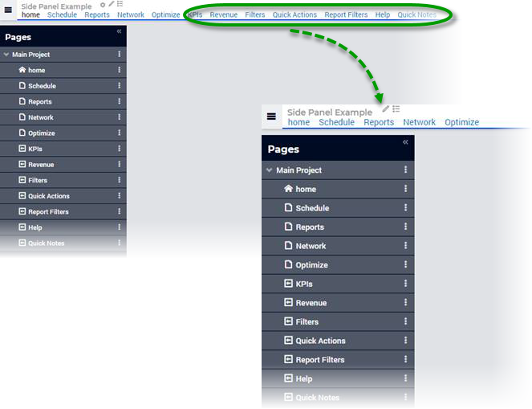
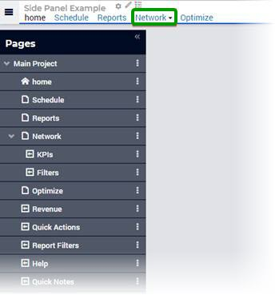

:orphan:

.. belongs in WebUI/CSS

Using Sidepanels with the Old WebUI Theme
=============================================

.. wait for release

Sidepanels were released in AIMMS version 4.64.1. If you are using the previously shared application specific resources (ASR) to retain the old theme of WebUI (AIMMS 4.58 and lower), links to the sidepanel pages will be also displayed in the top navigation menu. 

Adapting ASR for Sidepanels
----------------------------------

As Sidepanels links in the top navigation menu is not desired behavior, add the below code snippet to the *header-override.css* file in your ASR folder to hide these links. You can also place this code in a separate file in that folder. 

.. code-block:: css

	.menu .sidepanel, header .menu .sidepanel li.hasChildren ul li{

                display: none !important;

	}

The resulting page can be seen on the right. 

Sidepanels added as subpages
"""""""""""""""""""""""""""""""

If a sidepanel page is added as a subpage, an arrow will be displayed indicating the presence of subpages to your end users. However, this is not functional and we recommend you to not add sidepanel pages as subpages to avoid this issue. 
 

Related Topics
------------------

* `AIMMS Documentation: Sidepanels <https://manual.aimms.com/webui/page-manager.html#id6>`_