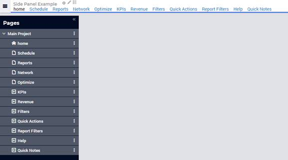
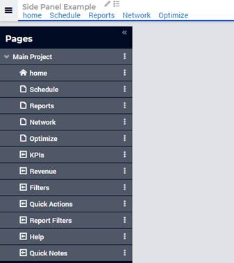

:orphan:

.. belongs in WebUI/CSS

Use Side Panels with Old Menu
====================================

.. wait for release

You can use side panels with the old menu. The side panels added in the page manager will also show in the old menu using the application-specific resource to roll back.

In order to hide these side panels from the old navigation menu, go to the menu ASR folder, open header-override.css (or create a new css file), and add the code below. 

.. code-block:: css

	.menu .sidepanel, header .menu .sidepanel li.hasChildren ul li{

                display: none !important;

	}

After this, the side panel with old style ASR looks like the example below.

 
It is best to avoid adding side panels as child or subpages, or you will see an arrow indicating nested pages where really there are none.

.. image:: images/image003.jpg

Related Topics
---------------

* AIMMS Documentation: Side panels