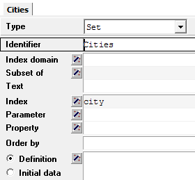

Multiple Indices for a Set
==========================

.. meta::
   :description: multiple indices can be associated with a single set
   :keywords: set, index, alias

This article explains how to use different indices to refer to the elements of a set.

Suppose we have a set ``Cities``, then a parameter ``Distance`` would naturally be defined over 2 dimensions (from and to), both coming from this same set ``Cities``. 

One solution is creating two new sets ``CitiesFrom`` and ``CitiesTo``, both subsets of the set ``Cities``, comprising all elements of the set ``Cities`` and each with its own index.

|

However, an easier approach is to assign multiple indices to the set. 

When you create a new set, you can directly add multiple indices to this set by typing all of them in the index attribute field, separated by commas (e.g. ``city, cityFrom, cityTo``). 

Note that after adding the index ``city`` and clicking :menuselection:`Check, Commit, and Close`, the index attribute is grayed out.

To modify the indices for this set, you can use the index attribute wizard by pressing the magic wand button just left of the input field for the index attribute. The wizard for the index attribute appears:

.. image:: images/Cities-index-attribute-wizard.png 
   :align: center

|
  
Alternatively, you can manually add an index identifier to your model tree for each index you want to add. For these index identifiers, you will have to set the *Range* attribute to the set corresponding to that index, as shown in the image below:

.. image:: images/demo-explicit-index.png
   :align: center

