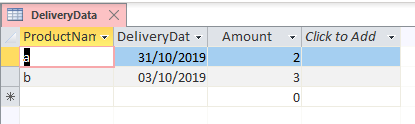
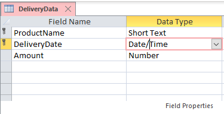
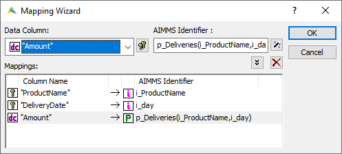
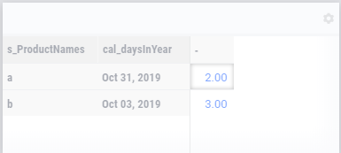

Overview: Calendars in AIMMS
============================

.. meta::
    :description: Representation of time in AIMMS optimization models and linking to real-time.
    :keywords: Calendar, second, minute, hour, day, week, month, year, granularity, localized format, time representation

The word "programming" in Mathematical Programming is about creating a plan, typically a plan to be executed over some period in real-time. 
This makes reference to real-time an essential ingredient for most decision support applications. 
Calendars are used in AIMMS to reference to real-time. In this how-to article we will discuss:

#.  How calendars are constructed flexibly

#.  How calendars relate to the date/time fields in database tables

#.  How current time is mapped to elements in a calendar

#.  How information about calendars can be used to construct meaningful subsets such as the Sundays.

Construction of calendars
-------------------------

A calendar is an AIMMS set, a finite collection of elements. 
The calendar elements, called timeslots, are descriptions of periods of equal length. 
To describe such a calendar, the length of each timeslot, the begin, and end of the calendar need to be known. 
The length is based on the unit of measurement available in the quantity ``SI_Time_Duration``. 
Finally, the presentation of timeslots to users should follow the conventions of those users.
As a running example, let's use:

.. code-block:: aimms
    :linenos:

    DeclarationSection Calendar_Declaration {
        Quantity SI_Time_Duration {
            BaseUnit: s;
            Conversions: {
                century->s : #-># * 3153600000,
                day    ->s : #-># * 86400,
                hour   ->s : #-># * 3600,
                minute ->s : #-># * 60,
                month  ->s : #-># * 2628000,
                year   ->s : #-># * 31536000
            }
            Comment: "Expresses the value for the duration of periods.";
        }
        Parameter p_YearNumber {
            InitialData: 2016;
        }
        StringParameter sp_CalBeg {
            Definition: FormatString("%i-01-01", p_YearNumber);
        }
        StringParameter sp_CalEnd {
            Definition: FormatString("%i-12-31", p_YearNumber);
        }
        StringParameter sp_TimeslotFormat {
            InitialData: "%Am|AllAbbrMonths| %d, %c%y";
        }
        Calendar cal_daysInYear {
            Index: i_day;
            Parameter: ep_day;
            Unit: day;
            BeginDate: sp_CalBeg;
            EndDate: sp_CalEnd;
            TimeslotFormat: sp_TimeslotFormat;
        }
    }

Some remarks on the above:

#.  Lines 2-13. To define the length of a timeslot, we need to use the quantity ``SI_Time_Duration``. 
    In our example, we only use the conversion for ``day``.

#.  Lines 14-16. This example shows all days in a particular year, so the year number is the actual input.

#.  Lines 17-19. The calendar begin date is captured by the string parameter ``sp_CalBeg``. 
    It captures the first day of the year specified by the year number ``p_YearNumber``, so it is easily defined using :any:`FormatString`.

#.  Lines 20-22. The calendar end date is defined similarly via the string parameter ``sp_CalEnd``.

#.  Lines 23-25. The timeslot format specifies how timeslots are formatted. 
    A possible value for this format we use the standard AIMMS format for days; so a timeslot is formatted as ``2019-01-01``.
    Clearly, this may not be the presentation of timeslots your users may be used to. 
    Here we use "%Am|AllAbbrMonths| %d, %c%y", the format custom to people in the USA.
    You can choose the format freely, as long as all timeslots are unique.

#.  Lines 26-33 The calendar itself. Almost fully parametrized, using the definitions explained above, but still a daily calendar. 
    The only part not parametrized is that it is by day, and not by some number of days, or by some unit of measurement. 
    However, to change the granularity of a decision support application, changing it from day to month, or to hours, is quite rare.

:doc:`advanced-language-components/time-based-modeling/calendars` page provides further details on declaring Calendars.

Relating calendars in AIMMS to date/time columns in databases
-------------------------------------------------------------

A key feature of Calendars in AIMMS is the natural mapping to date/time columns in a database.
Consider the following simple database table:

with design view:

Using the AIMMS mapping wizard, we can map the columns in the database table to the identifiers in AIMMS:

Reading the data and then displaying it in the WebUI results in:

As you can see, without any programming on dates, the format of the dates in the WebUI presentation changed.
This is achieved because the calendar timeslots are mapped onto date/time fields in the database.

Using current time
------------------

AIMMS provides two functions to obtain the current time: :any:`CurrentToString` and :any:`CurrentToTimeSlot`.
The difference is that the one is resulting in a string, the other a timeslot. Both are useful for our running example.

Initializing the current year
^^^^^^^^^^^^^^^^^^^^^^^^^^^^^ 

The function :any:`CurrentToString` returns the current date/time formatted according its argument. 
So the current year can be initialized by the following statement:

.. code-block:: aimms

    p_YearNumber := val( CurrentToString("%c%y") );

in the procedure ``MainInitialization``.

Further information about the function :any:`CurrentToString` can be found in AIMMS The Function Reference.

Obtaining the current day as element in Calendar
^^^^^^^^^^^^^^^^^^^^^^^^^^^^^^^^^^^^^^^^^^^^^^^^^^

The function :any:`CurrentToTimeSlot` returns the timeslot in which we are "now" as illustrated in the next statement:

.. code-block:: aimms

    ep_day := CurrentToTimeSlot(Calendar : cal_daysInYear );

Further information about the function :any:`CurrentToTimeSlot` can be found in AIMMS The Function Reference.

Creating subsets of a calendar based on characteristics of the timeslot
------------------------------------------------------------------------

To continue our running example, we want to construct a subset of all weekend days, say ``s_WeekendDays``, of calendar ``cal_daysInYear``.
AIMMS views Saturday as day number 6 and Sunday as day number 7 in a week. Thus we can construct the set ``s_WeekendDays`` as follows:

.. code-block:: aimms

    Set s_WeekendDays {
        SubsetOf: cal_daysInYear;
        Definition: {
            { i_day |
                TimeslotCharacteristic( i_day, 'weekday' ) = 6 or  
                TimeslotCharacteristic( i_day, 'weekday' ) = 7 }
        }
    }

Further information about the function :any:`TimeSlotCharacteristic` can be found in AIMMS The Function Reference.

The running example is contained in: :download:`AIMMS project download <model/CalendarDemo.zip>` 

