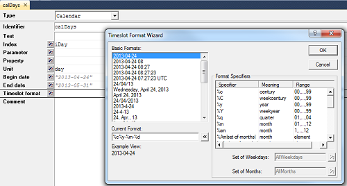

Overview: Calendars in AIMMS
============================

.. meta::
   :description: Representation of time in AIMMS optimization models and linking to real time.
   :keywords: Calendar, second, minute, hour, day, week, month, year, granularity, localized format, time representation

Many models involve some time-based notion. This article explains how using Calendars in AIMMS can make working with time a lot easier.

For example, with a transportation problem the main decision could be how much to transport from each depot to each customer for every day in a given time horizon.

One solution is to create a set ``Days`` with the same number of elements as there are days in the time horizon you are considering. However, this would require you to manually keep track of which of these elements are working days, which years are leap years, and other tedious details. 

Using Calendars to produce your sets is a much better option.

When declaring calendars, provide the unit of your calendar (e.g., hours / days / weeks) and when it starts and stops. Optionally, you can declare an index to be used in the index domain of other identifiers. An example of the declaration of a calendar is shown in the screenshot below. 

Note that the start and end date do not necessarily need to be provided as hard-coded strings (as shown in the image above), but can also be provided via string parameters. The input format for these start and end dates is fixed (i.e. ``YYYY-MM-DD HH:MM:SS``). However, the elements of set produced by the calendar will be formatted according to the timeslot format attribute. You can see the result of this formatting by viewing the data of the calendar identifier.

Calendars work a lot like other types of sets, but with some key advantages:
* You can declare the right number of elements for a given time period based on predefined relationships among weeks, months, years, etc.
* You can use the ``TimeSlotCharacteristic`` procedure to get more specific information for each of the elements.

For example, you can use ``TimeSlotCharacteristic`` to get information about which day of the week or the month a timeslot corresponds to. The first argument for this procedure is a timeslot (i.e. element of a calendar), and the second argument is an element from the set ``TimeSlotCharacteristics`` denoting which particular characteristic you are interested in.

So if you have a calendar that has unit days and you want to find out the day in the week, month, and year, create the following three parameters:

.. code-block:: aimms

 PARAMETER:
   identifier   :  DayInWeek
   index domain :  iDay
   definition   :  TimeslotCharacteristic(
                           Timeslot       : iDay ,
                           Characteristic : 'weekday')

 PARAMETER:
   identifier   :  DayInMonth
   index domain :  iDay
   definition   :  TimeslotCharacteristic(
                           Timeslot       : iDay ,
                           Characteristic : 'monthday')

 PARAMETER:
   identifier   :  DayInYear
   index domain :  iDay
   definition   :  TimeslotCharacteristic(
                           Timeslot       : iDay ,
                           Characteristic : 'yearday')

The data for these three parameters is shown below in a pivot table:

.. image:: images/timeslotcharacteristic-example.png 

As you can see, the 24th of April 2013 is the 114th day of the year, the 24th day of the month, and the third day of the week (i.e. Wednesday). 

Using the characteristic 'weekday' you can easily create a subset of your calendar for all the weekdays (or weekend days). 

For example, the subset of all days in the calendar that represent weekend days (where Monday = 1 and Sunday = 7) can be constructed as follows:

.. code-block:: aimms

	iDay | TimeslotCharacteristic(iDay ,'weekday') >= 6

You can view the data of the predefined set ``TimeSlotCharacteristics`` to see which other characteristics for timeslots are available.

