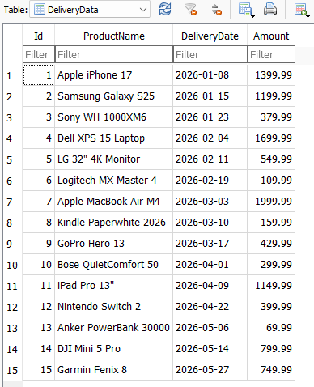
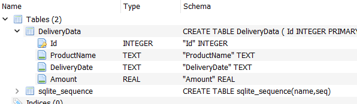
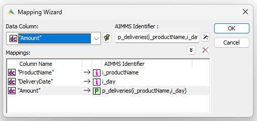
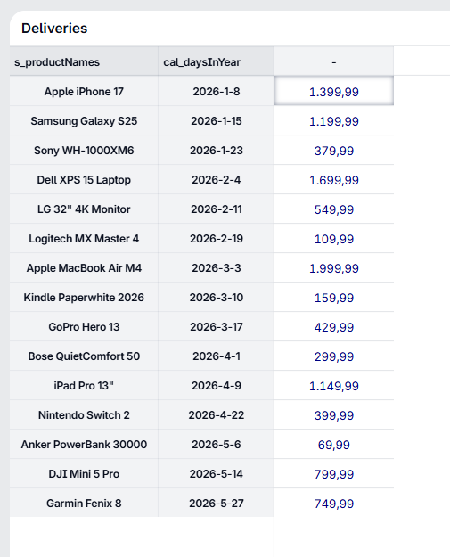

Using Calendars in AIMMS
========================

.. image:: https://img.shields.io/badge/Zip-white?style=for-the-badge&logo=github&labelColor=000081&color=1847c9
   :target: https://github.com/aimms/189-using-calendars-in-aimms/releases/latest/download/189-using-calendars-in-aimms.zip

.. image:: https://img.shields.io/badge/Repository-white?style=for-the-badge&logo=github&labelColor=000081&color=1847c9
   :target: https://github.com/aimms/189-using-calendars-in-aimms

.. image:: https://img.shields.io/badge/AIMMS-26.1-white?style=for-the-badge&labelColor=009B00&color=00D400
.. image:: https://img.shields.io/badge/WebUI-26.4.2.17-white?style=for-the-badge&labelColor=009B00&color=00D400

.. meta::
    :description: Explains how to declare and use calendars in AIMMS for time-based modeling, including database mapping, current time functions, and subset construction.
    :keywords: Calendar, timeslot, SI_Time_Duration, CurrentToTimeSlot, CurrentToString, TimeslotCharacteristic, time-based modeling, database mapping, date format

The word "programming" in Mathematical Programming refers to creating a plan — typically one executed over a real-time period.
This makes real-time references an essential ingredient of most decision support applications.
Calendars are the AIMMS mechanism for working with real time. This article covers:

#.  How calendars are constructed flexibly

#.  How calendars relate to date/time fields in database tables

#.  How the current time is mapped to elements in a calendar

#.  How calendar information can be used to construct meaningful subsets, such as all weekend days

Construction of Calendars
--------------------------

A calendar is an AIMMS set — a finite collection of elements.
The elements of a calendar are called **timeslots**, and each timeslot represents a period of equal length.
To define a calendar, you need to specify the timeslot length, the begin date, and the end date.
The length is expressed using a unit from the quantity ``SI_Time_Duration``.
The format used to present timeslots to users should follow their conventions.

As a running example:

.. code-block:: aimms
    :linenos:

    Section Calendars {
        Quantity SI_Time_Duration {
            BaseUnit: s;
            Conversions: {
                century->s : #-># * 3153600000,
                day    ->s : #-># * 86400,
                hour   ->s : #-># * 3600,
                minute ->s : #-># * 60,
                month  ->s : #-># * 2628000,
                year   ->s : #-># * 31536000
            }
            Comment: "Expresses the value for the duration of periods.";
        }
        Parameter p_def_yearNumber {
            InitialData: 2026;
        }
        StringParameter sp_calBeginDate {
            Definition: FormatString("%i-01-01", p_def_yearNumber);
        }
        StringParameter sp_calEndDate {
            Definition: FormatString("%i-12-31", p_def_yearNumber);
        }
        Calendar cal_daysInYear {
            Index: i_day;
            Parameter: ep_day;
            Unit: day;
            BeginDate: sp_calBeginDate;
            EndDate: sp_calEndDate;
            TimeslotFormat: "%c%y-%sm-%sd";
        }
        DeclarationSection Auxiliar_Sets {
            Set s_weekendDays {
                SubsetOf: cal_daysInYear;
                Definition: {
                    { i_day |
                        TimeslotCharacteristic( i_day, 'weekday' ) = 6 or
                        TimeslotCharacteristic( i_day, 'weekday' ) = 7 }
                }
            }
        }
    }

Some remarks on the declaration above:

#.  Lines 2–11: The quantity ``SI_Time_Duration`` is required to define the timeslot length. In this example, only the ``day`` conversion is used.

#.  Lines 13–15: The example covers all days in a given year, so ``p_def_yearNumber`` is the only input needed.

#.  Lines 16–18: ``sp_calBeginDate`` defines the first day of the specified year using :any:`FormatString`.

#.  Lines 19–21: ``sp_calEndDate`` defines the last day of the year in the same way.

#.  Lines 23–30: The calendar itself, using the ISO date format ``"%c%y-%sm-%sd"`` (e.g. ``2026-01-15``). You can choose any format, as long as all timeslots remain unique.

#.  Lines 31–39: The subset ``s_weekendDays`` is declared inside a ``DeclarationSection`` within the same section, grouping auxiliary sets alongside the calendar.

Relating Calendars to Date/Time Columns in Databases
------------------------------------------------------

A key feature of calendars in AIMMS is the natural mapping to date/time columns in a database.
In this example, the data source is a SQLite database. Consider the following table:

|

with its design view:

|

Using the AIMMS mapping wizard, the database columns can be mapped to AIMMS identifiers:

|

Reading the data and displaying it in the WebUI produces:

|

Using Current Time
------------------

AIMMS provides two functions to obtain the current time: :any:`CurrentToString` and :any:`CurrentToTimeSlot`.
:any:`CurrentToString` returns a string, while :any:`CurrentToTimeSlot` returns a timeslot element. Both are useful in this context.

Initializing the Current Year
^^^^^^^^^^^^^^^^^^^^^^^^^^^^^^

:any:`CurrentToString` returns the current date/time formatted according to its argument.
The current year can be initialized with the following statement, placed in ``MainInitialization``:

.. code-block:: aimms

    p_def_yearNumber := val( CurrentToString("%c%y") );

Further information about :any:`CurrentToString` can be found in the AIMMS Function Reference.

Obtaining the Current Day as a Calendar Element
^^^^^^^^^^^^^^^^^^^^^^^^^^^^^^^^^^^^^^^^^^^^^^^^^

:any:`CurrentToTimeSlot` returns the timeslot corresponding to the current moment. In ``MainExecution``:

.. code-block:: aimms

    ep_day := CurrentToTimeSlot(Calendar : cal_daysInYear );

Further information about :any:`CurrentToTimeSlot` can be found in the AIMMS Function Reference.

Creating Subsets Based on Timeslot Characteristics
---------------------------------------------------

The subset ``s_weekendDays`` is a subset of ``cal_daysInYear`` containing all weekend days.
In AIMMS, Saturday is day 6 and Sunday is day 7 of the week. The subset is defined as follows:

.. code-block:: aimms

    Set s_weekendDays {
        SubsetOf: cal_daysInYear;
        Definition: {
            { i_day |
                TimeslotCharacteristic( i_day, 'weekday' ) = 6 or
                TimeslotCharacteristic( i_day, 'weekday' ) = 7 }
        }
    }

.. seealso::

    * :doc:`advanced-language-components/time-based-modeling/calendars`
    * :any:`TimeSlotCharacteristic`
    * :any:`CurrentToTimeSlot`
