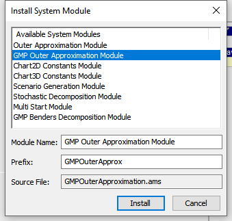

Solve MINLP Problems with AOA
==============================

.. meta::
   :description: AOA is a good method to solve mixed integer nonlinear mathematical programming problems.
   :keywords: AOA, nonlinear, mixed integer, mathematical programming, solving

.. index:: AOA, MINLP, GMP

In addition to BARON and KNITRO, you can also use the AIMMS Outer Approximation Algorithm (AOA) to solve mixed integer nonlinear programming (MINLP) problems in AIMMS. 

.. For solving Mixed Integer Nonlinear Programming (MINLP) problems AIMMS offers, besides the solvers BARON and KNITRO, the AIMMS Outer Approximation algorithm, or AOA for short.

.. There exist two versions of the AOA algorithm in AIMMS. The old version is available as a solver which calls the module OuterApproximation and was developed before GMP functionality was added to AIMMS. 

You can use the AOA algorithm by adding the system module ``GMPOuterApproximation`` to your project. 
This module uses the functions from `the GMP Library <https://documentation.aimms.com/functionreference/algorithmic-capabilities/the-gmp-library/index.html>`_.
You can install this system module via the :menuselection:`Settings` menu as :menuselection:`Settings > Install System Module` and select the :menuselection:`GMP Outer Approximation Module` to be installed. 

|

.. note::

    The deprecated version of AOA is still available as a system module as seen in the above image (first in list). However, we strongly recommend you use the GMP version, reasons detailed in the next section. 
    
    Read more about our `Product Lifecycle on AIMMS Docs <https://documentation.aimms.com/deprecation-table.html>`_.

GMP-AOA is not a solver and cannot be called using the normal ``solve`` statement. Instead you should use:

.. code-block:: aimms
    :linenos:

    ! First we must generate the GMP for our MathProgram.
    myGMP := GMP::Instance::Generate( myMP ) ;

    ! The GMP is passed as argument to the main procedure of GMP-AOA.
    GMPOuterApprox::DoOuterApproximation( myGMP );

See ``MainExecution`` in this :download:`example AIMMS project <downloads/aoaExample.zip>`.

Why GMP-AOA ?
----------------

There are several reasons why you should use GMP-AOA instead of the legacy AOA: 

#. The GMP-AOA algorithm offers more possibilities to customize the algorithm to your needs, for example by using functions from the GMP library.
#. The GMP version can be used in combination with the nonlinear presolver which may reduce the size of the model and tighten the variable bounds which likely help the AOA algorithm to find a better solution or improve its performance. GMP-AOA starts by default by calling the nonlinear presolver.
#. For non-convex problems AOA might sometimes have difficulties in finding a good feasible solution. In that case it might help to combine the AOA with the multi-start algorithm. This is possible with how the GMP-AOA is implemented and has been explained in :doc:`this white paper <../../Articles/366/366-aoa-for-minlp>`. The legacy version of AOA cannot be combined with the nonlinear presolver nor the multi-start algorithm.

.. note::
    
    In the special case that the MINLP problem contains only convex quadratic and/or second-order cone constraints also linear solvers like CPLEX or GUROBI can be used.

Further Reading
-------------------
     
The AOA provided by AIMMS is among the best Mixed Integer Nonlinear programming solvers according to *"A review and comparison of solvers for convex MINLP"*, published in `Optimization and Engineering <https://www.springer.com/journal/11081>`_. 

:download:`Download a copy <downloads/AReviewAndComparisonOfSolversForConvexMINLP.pdf>` or view it `on Springer <https://link.springer.com/article/10.1007/s11081-018-9411-8>`_.

