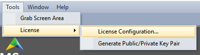
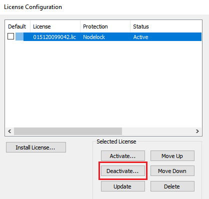
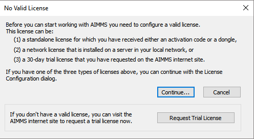
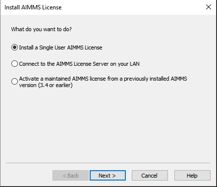
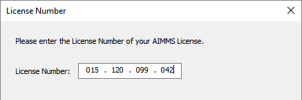
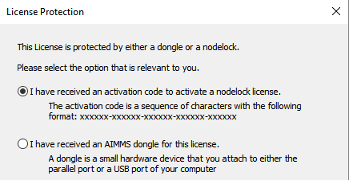
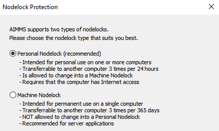
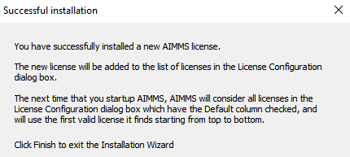

.. |aimmsIcon| image:: images/icons/favicon.png
			:scale: 15 %

.. |SuccessfulDeactivation| image:: images/SuccessfulDeactivation.png

.. |InputActivationCode| image:: images/InputActivationCode.png

				
				
.. This text will not be shown 				
	.. figure:: images/aimms-logo-s-rgb.png
					:scale: 70 %
					:align: center
					:target: https://aimms.com/

Transfer a Developer License to Another Machine
================================================

.. meta::
   :description: How to transfer an AIMMS license for use on a different computer.
   :keywords: license, transfer, move, switch

An AIMMS developer license can only be used on one machine at a time. There may be situations where you need to use AIMMS on a different machine, either temporarily or permanently. This article explains how to transfer an AIMMS license for use on a different computer. [#]_ [#]_

Reach out to our support team at support@aimms.com if you do not have access to the machine on which the AIMMS license is currently installed on, or if you encounter any issues in the below process.

.. [#] *This applies to Personal Nodelock activated licenses as AIMMS Developer Licenses are typically installed through the Personal Nodelock method.*
.. [#] *For Free Academic license users, make sure that the license activation process is done within your university network*

Deactivate on Current Machine
--------------------------------
	
#. In AIMMS, head to Tools –> License -> License Configuration…

   |LicenseConfigurationLocation|

#. Select your developer license and click 'Deactivate...'

   |LicenseDeactivation|

#. Follow the Deactivation wizard and if successful, the following message will be displayed:

   |SuccessfulDeactivation|
	
Install on Second Machine
----------------------------

#. Open AIMMS and if no licenses have already been installed, the prompt for configuring a license will appear. Click 'Continue...'

   |NoValidLicense|

#. Follow the installation steps for 'Install a Single User AIMMS License'

   * Choose the first option for the regular AIMMS Developer License.
   
      |InstallAimmsLicense|
      
   *  Input your license number. If you received a license file from us, you can use the file name which is a 12 digit number.

      |InputLicense|

   *  Choose the activation code option unless an AIMMS dongle was provided for your license.
   
      |LicenseProtection|

   *	 Input your Activation Code.  Choosing to save the activation code within your registry makes it easier to move the license back and forth.
   
      |InputActivationCode|

   *  Choose the Personal Nodelock method if this license was activated as one before. If the license was activated as a Machine Nodelock, you can only choose that option for future activations.
   
      |NodelockProtection|

If successful, you will receive the following message:
   
|SuccessfulActivation|

