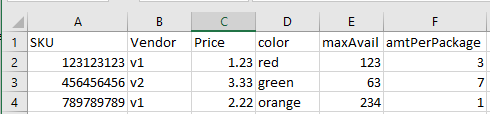
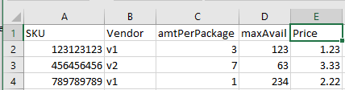
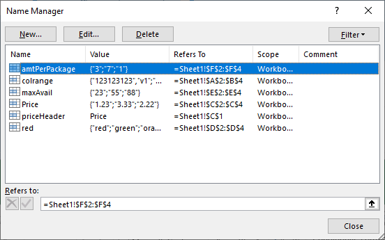

Read Columns of Data from Excel
===================================

.. meta::
   :description: This article compares different methods of reading Excel data to AIMMS.
   :keywords: Excel, AimmsXLLibrary, library, axll, xlsprovider, datalink

AIMMS provides various methods for reading Excel data. 

.. #. A prepackaged module of procedures and functions, using the prefix ``spreadsheet::``.  
 
#. AimmsXLLibrary, a system library of functions and procedures.

#. Datalink with the XLSProvider, two libraries from the AIMMS repository of libraries. 

Let's compare some features of these libraries, and you can decide which method is best for your application.

Example used
---------------

To make this comparison, we'll read from two spreadsheets:

In this practical example, these two spreadsheets contain similar data, but with different order and number of columns.
This may happen when various analysts provide the necessary data in a spreadsheet, but not in the same column order.

The name manager in both sheets covers for the difference in columns: 

The data is read in to the following parameters:

.. code-block:: aimms

    DeclarationSection Potential_Excel_input_data {
        Set s_SKU {
            SubsetOf: Integers;
            Index: i_sku;
        }
        Set s_Vendors {
            Index: i_Vendor;
        }
        Parameter p_price {
            IndexDomain: (i_sku,i_vendor);
        }
        Parameter p_maxavail {
            IndexDomain: (i_sku,i_Vendor);
        }
        Parameter p_amtPerPackage {
            IndexDomain: (i_sku,i_Vendor);
        }
    }

You can download the example from :download:`AIMMS Project Download <ReadingExcelData.zip>` 

.. The ``spreadsheet::`` functions and procedures 
.. ----------------------------------------------

.. The ``spreadsheet::`` module includes these functions and procedures:

.. #. Create and close workbooks

.. #. Helper functions to create ranges

.. #. Support for exchanging data between ranges on an Excel sheet with scalar, one-dimensional and multi-dimensional AIMMS parameters. Note that these ranges can be named ranges.

.. The code to read Excel data using looks as follows:

.. .. code-block:: aimms

..     empty p_price, p_maxavail, p_amtPerPackage ;

..     spreadsheet::RetrieveTable(
..         workbook                :  sp_dataFilename,
..         parameter               :  p_price, 
..         DataRange               :  "Price",     
..         RowsRange               :  "colrange",  
..         sheet                   :  "Sheet1",
..         automaticallyExtendSets :  1 );

..     spreadsheet::RetrieveTable(
..         workbook                :  sp_dataFilename,
..         parameter               :  p_maxAvail, 
..         DataRange               :  "maxAvail",     
..         RowsRange               :  "colrange",  
..         sheet                   :  "Sheet1",
..         automaticallyExtendSets :  1 );

..     spreadsheet::RetrieveTable(
..         workbook                :  sp_dataFilename,
..         parameter               :  p_amtPerPackage, 
..         DataRange               :  "amtPerPackage",     
..         RowsRange               :  "colrange",  
..         sheet                   :  "Sheet1",
..         automaticallyExtendSets :  1 );

..     spreadsheet::CloseWorkBook(sp_dataFilename,0);

.. Note the following:

.. #. The implementation of these functions uses Excel itself, and therefore this module is less suited for application development; it would require the presence of Excel on the client computer or AIMMS PRO Server. 

.. #. This library supports Excel macros.

.. #. In this example, the name manager of Excel provided consistent names in the named ranges. When names are not consistent, the code would become significantly more complicated.

.. #. This library doesn't make any assumptions about the placing of data in columns.

.. #. For more information about these functions, see: `AIMMS The Function Reference <https://documentation.aimms.com/_downloads/AIMMS_func.pdf>`_: Chapter "Spreadsheet Functions".
 

AXLL functions and procedures
---------------------------------

.. The ``AXLL::`` system library includes these functions and procedures:

.. #. Create and close workbooks

.. #. Helper functions to create ranges

.. #. Support for exchanging data between ranges on an Excel sheet with scalar, one-dimensional and multi-dimensional AIMMS parameters. Note that these ranges can be named ranges.

The code to read Excel data using AXLL looks as follows:

.. code-block:: aimms

    empty p_price, p_maxavail, p_amtPerPackage ;
    axll::OpenWorkBook( sp_dataFilename );
    axll::SelectSheet("Sheet1");

    axll::ReadList(
        IdentifierReference    :  p_price, 
        RowHeaderRange         :  "colrange",  
        DataRange              :  "Price",     
        ModeForUnknownElements :  1, 
        MergeWithExistingData  :  0);

    axll::ReadList(
        IdentifierReference    :  p_maxAvail, 
        RowHeaderRange         :  "colrange",  
        DataRange              :  "maxAvail",     
        ModeForUnknownElements :  1, 
        MergeWithExistingData  :  0);

    axll::ReadList(
        IdentifierReference    :  p_amtPerPackage, 
        RowHeaderRange         :  "colrange",  
        DataRange              :  "amtPerPackage",          
        ModeForUnknownElements :  1, 
        MergeWithExistingData  :  0);

    axll::CloseAllWorkBooks();

#. These functions access the workbook directly without the need to use Excel. This makes the library more suited for application development. 

#. This library doesn't support Excel macros.

#. In this example, the name manager of Excel provided consistent names in the named ranges. When names are not consistent, the code would become significantly more complicated.

#. This library does not make any assumptions about the placing of data in columns.

#. For more information about these functions, see
   * :doc:`../85/85-using-axll-library`  
   
.. * :doc:`../122/122-AXLL-Library` .

DataLink with the XLSProvider
------------------------------------------

The XLSProvider uses a simple strategy to understand the structure of the data in an Excel worksheet. The top row with data is assumed to be the header, containing the names of the columns. You have to map these names onto identifier names in the AIMMS model. Then ``DataLink`` can read by making the XLSProvider scan the worksheet row by row and use the mapping to send the data to the appropriate identifiers.

The code to read the Excel data looks as follows:

.. code-block:: aimms

    dl::DataTables += 'Sheet1' ;
    SKUMapping(dl::dt,dl::idn,dl::cn,dl::dn) := data {
       ( 'Sheet1', 's_SKU'           , 1, 1 ) : "SKU",
       ( 'Sheet1', 's_Vendors'       , 2, 2 ) : "Vendor",
       ( 'Sheet1', 'p_price'         , 3, 0 ) : "Price",
       ( 'Sheet1', 'p_maxavail'      , 4, 0 ) : "maxAvail",
       ( 'Sheet1', 'p_amtPerPackage' , 5, 0 ) : "amtPerPackage"
    };

    dl::RemoveDataSourceMapping("SKUData");
    dl::AddDataSourceMapping(
        MapName        :  "SKUData", 
        DataMap        :  SKUMapping, 
        ColDepend      :  dl::DependEmpty, 
        TableAttribute :  dl::TableAttributesEmpty, 
        ColAttribute   :  dl::ColAttributeEmpty);
    sp_readAttribute :=  { 'DataProvider': xlsprovider::DataLink };
    dl::DataRead(
        DataSource     :  sp_dataFilename, 
        MapName        :  "SKUData", 
        ReadAttributes :  sp_readAttribute);

#. This library accesses the workbook directly without the need to use Excel. This makes the library more suited for application development. 

#. This library also doesn't support Excel macros.

#. Data order is abstracted from the column order in the ``datalink`` library, independently of the name manager.

#. This library assumes that the data is presented in columns on the sheet; this library is less suited for data that is scattered on an Excel sheet.

#. See also 
   * :doc:`../csv/read-write-csv` and 
   * `XLSProvider for datalink <https://documentation.aimms.com/datalink/providers.html#xlsprovider>`_

.. include:: /includes/form.def