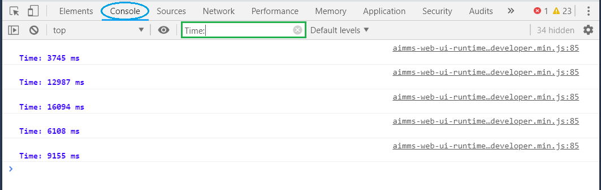

:orphan:

Measuring Page Load time
========================

.. Caution:: Measuring page load time comes with a price; the performance of the WebUI may degrade with a factor of up to four.

#. Create the file ``MainProject/WebUI/resources/experimental-features.conf`` if it doesn't exist.

#. Add the line ``_aimms_only_boomr 1`` to that file.

#. Start app, WebUI.

#. Verify that the time measurement mechanism is in place by opening the page source of the WebUI page. As you may know, you can open the page source of a browser page by right-clicking on that page and selecting "view page source"

    .. code-block:: none

        

    Should contain: ``"_aimms_only_boomr":true``
    
    Close the page source.
    
#. Open the browser inspector. If it is docked in the current window, undock it.

#. Select tab "console", as indicated by the blue oval in the picture below.

#. Optional: you may want to limit output by filtering on ``Time:``, as indicated by the green rectangle in the picture below.

#. Start opening pages and jot down time measurement returned.

.. Caution:: Doing anything on the page, whilst the page load is not completed, will mess up measurements.
             This includes clicking on the page, and navigating to another page.
             
.. When you also want a breakdown per widget add the following line to the file ``MainProject/WebUI/resources/experimental-features.conf``
.. 
.. ``_aimms_only_boomr_env dev``
.. 

