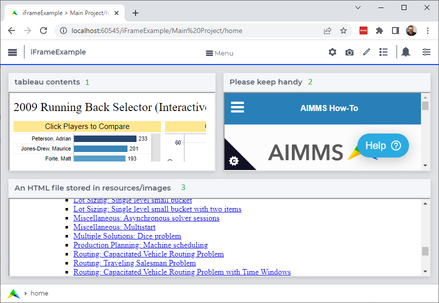

The iFrame widget
============================

The `iframe html element <https://www.w3schools.com/tags/tag_iframe.asp>`_ is famous for its power of embedding other sites.
The iFrame widget has the iframe element as its core; and you can use it in your WebUI to enhance the application experience.

.. note:: 

    #.  Some sites do not permit embedding.

    #.  The iFrame widget is not part of the AIMMS product portfolio.  It is provided in this How-To as is.

Downloads
----------

*   Download the example :download:`AIMMS 4.85 project here <model/iFrameExample.zip>` 

*   Download just the :download:`iFrame javascript extension here <model/iframe-widget.zip>`

You can add the iframe widget to your collection of widgets to choose from by unzipping ``iFrameExample`` 
and adding this to the folder ``./MainProject/WebUI/resources/javascript``.

Example details
----------------

The example app may look as follows upon opening:

#.  Content published on the internet can be shown using the iFrame widget, for instance as follows:

    .. code-block:: html

        "<iframe src=\"https://public.tableau.com/views/CBSSportsFantasyFootball2/RunningBacks?:showVizHome=no&:embed=true\" ></ifame>"

#.  This how-to site:

    .. code-block:: html

        "<iframe src=\"https://how-to.aimms.com\"></ifame>"

#.  When referring to contents in the folder ``./MainProject/WebUI/resources/``, 
    you will need to refer to the folder:

    .. code-block:: aimms 
        :linenos:

        StringParameter sp_localHTMLfile {
            Definition: {
                
                "<iframe src=\"/app-resources" + 
                if bp_usePublishedResources then
                    "/" + pro::ModelName + "/" + pro::ModelVersion + "/"
                else
                        "/"
                endif +
                "/resources/images/539-which-odbc-drivers.html#which-odbc-drivers\"></iframe>"
            }
        }

    where the parameter ``bp_usePublishedResources`` is initialized as follows:

    .. code-block:: aimms 
        :linenos:

        if ProjectDeveloperMode then
            bp_usePublishedResources := 0 ;
        else
            bp_usePublishedResources := 1 ;
        endif ;

    The reason is that the contents are cached on the client device, and the folder adaption provided by the AIMMS WebUI is not part of the iFrame widget.

.. spelling:word-list::

    iframe
    iFrame