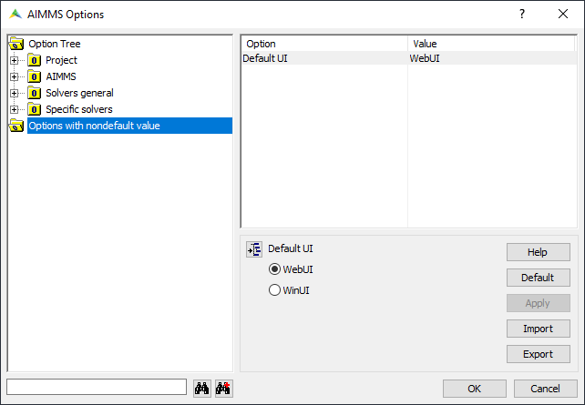

Adjust Engine and Solver Settings
=================================

.. meta::
   :description: Comparing different ways to customize AIMMS engine and solver settings.
   :keywords: 

AIMMS offers many options to customize the behavior of the engine and its solvers. 
This article describes various ways to set these options. 

Saving options
----------------------

When a project is saved, option settings are saved to the file ``MainProject/Settings/Options.txt``.
This is a text file with the format

.. code-block:: none

    <option-name> <value>

Lines starting with an ``*`` are comment.

You can change these settings in a text editor, or an AIMMS dialog as described next.

Project Options dialog
--------------------------

Access the *Project Options* dialog from the AIMMS Menu - *Settings > Project Options*.

Initially it looks like this:

When you select non-default options and, for instance, the *Appearance > Default UI* option, a help dialog appears:

.. image:: images/OptionHelp.PNG

The *Project Options* dialog prevents you from entering invalid values.
It is a valuable tool for options that you frequently change from the default.

OPTION statement
--------------------

The option statement is a traditional way of specifying the values of options. 
An example is:

.. code-block:: aimms

    OPTION MIP_relative_optimality_tolerance := 1e-013;
    
Note that after executing this statement, the option setting may unexpectedly be saved to the file ``MainProject/Settings/Options.txt`` when you save the project.

The OPTION statement is documented in the `AIMMS language reference <https://documentation.aimms.com/_downloads/AIMMS_ref.pdf>`_, section "The OPTION and PROPERTY statements".

``OptionSetValue`` and ``OptionSetString`` procedures
-----------------------------------------------------------

A slightly more modern way of setting option values is using the procedures ``OptionSetValue`` and ``OptionSetString``.
An equivalent to the option statement in the previous section is:

.. code-block:: aimms

    OptionSetValue( "MIP_relative_optimality_tolerance", 1e-013);
    
The advantage of this method over the option statement is that there is more flexibility; both arguments can be any valid expression.
However, as with the option statement, you may unexpectedly save these settings in the file ``MainProject/Settings/Options.txt``.

The procedures operating on options are documented in the `AIMMS function reference <https://documentation.aimms.com/_downloads/AIMMS_func.pdf>`_, Chapter "Option manipulation".

Temporarily change option value
-------------------------------

The ``block where`` statement changes the value of an option temporarily, changes are reverted when the engine encounters the ``endblock`` statement.
Following our example, the syntax is as follows:

.. code-block:: aimms

    block where MIP_relative_optimality_tolerance := 1e-013;
        <statements>
    endblock ;

As the setting is reverted at the ``endblock statement``, you do not have to worry that the setting is saved unexpectedly.

The block statement is documented in the `AIMMS language reference <https://documentation.aimms.com/_downloads/AIMMS_ref.pdf>`_, section "The BLOCK statement".

.. include:: /includes/form.def

 

