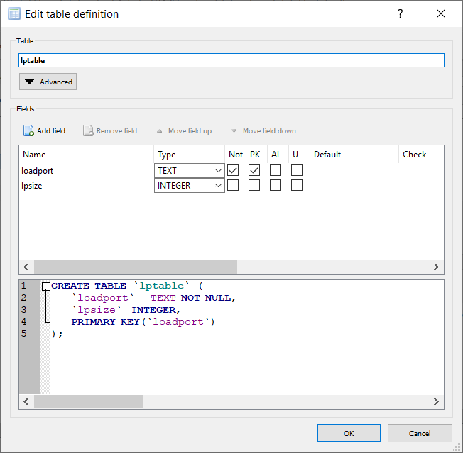
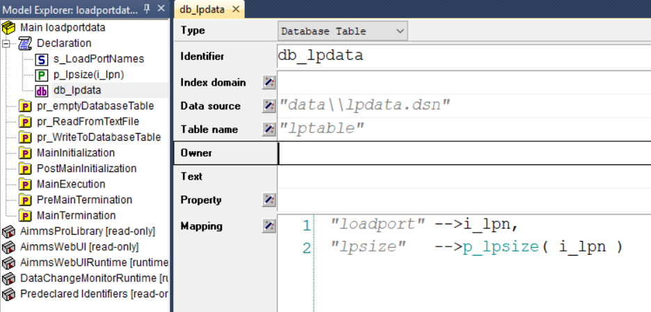
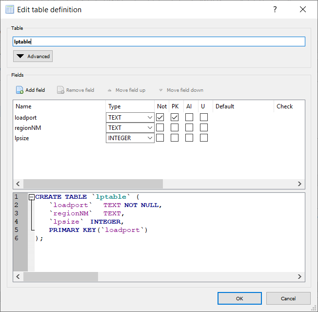
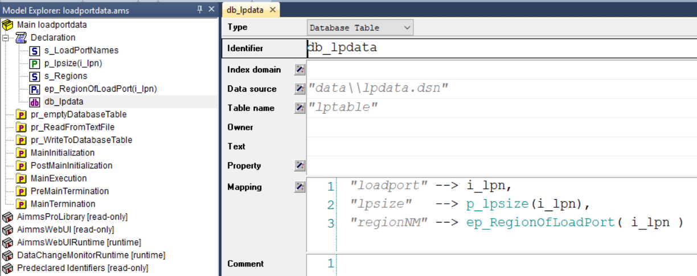
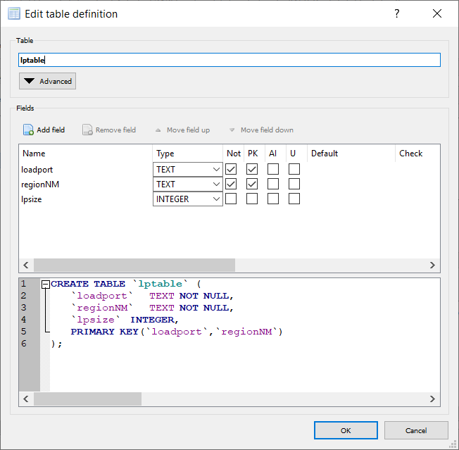

How to cater for columns added to database tables
======================================================

AIMMS uses ODBC to connect to database tables. 
Once a link between AIMMS identifiers and columns in the database table, columns may be added to the database table.
Depending on the role of the added columns, we may need to adapt the model.
In this article, we use an artificial example to illustrate the necessary adaptations in the model to cater for such change in the database table definition.

The basic model and table
--------------------------

The schema of our database looks as above.

This is captured by the AIMMS Database Table as above.

:download:`AIMMS project download <loadportdata - basic.zip>` 

The added column is a derived column
------------------------------------

Now let's add the column "regionNM" to the database table as a derived column. The database schema then looks as follows:

For the sake of efficiency, AIMMS caches the knowledge of the table structure of the tables it is connected to.
When these table structures are changed, the caches need to be updated.  The easiest way to do this, is to close the project and open it again.

The extended structure is then captured in the AIMMS model as follows:

You can adapt the database table ``lpdata`` by using the wizard at the mapping and add the added link.
When the region data is not used in the model, you can even ignore this step.

:download:`AIMMS project download <loadportdata - ExtendedWithDerived.zip>` 

The added column is a key column
--------------------------------

This is more interesting. 
Following our running example, instead of making ``regionNM`` a derived column, 
it's made a key column as shown in the following schema:

Now there are two approaches to handling this in the AIMMS model:

Approach 1: the model selects only data of a single region
^^^^^^^^^^^^^^^^^^^^^^^^^^^^^^^^^^^^^^^^^^^^^^^^^^^^^^^^^^^^

.. code-block:: aimms

    DatabaseTable db_lpdata {
        DataSource: "data\\lpdata.dsn";
        TableName: "lptable";
        Mapping:  "regionNM" --> s_Regions;
    }

The statement 

.. code-block:: aimms

    read from table db_lpdata ; ! this will fill s_Regions      
   
will read all regions. Subsequently, we will select a single region. This can be done via a statement like:

.. code-block:: aimms

    ep_SelectedRegion := first( s_Regions ); ! Just select one region.

But it is more typical to arrange selecting the region of interest via the user interface. 
This is, however, beyond the scope of this article.

For the selected region, the data mapping becomes

.. code-block:: aimms

    DatabaseTable db_lpdataID {
        IndexDomain: i_reg;
        DataSource: "data\\lpdata.dsn";
        TableName: "lptable";
        Mapping: {
            "loadport" --> i_lpn,
            "lpsize"   --> p_lpsize1(i_lpn),
            "regionNM" --> i_reg
        }
    }
    
The actual read statement becomes:

.. code-block:: aimms

    Read from table db_lpdataID(ep_SelectedRegion); ! Read in the data for the selected region.

Approach 2: the model aggregates the data over all regions
^^^^^^^^^^^^^^^^^^^^^^^^^^^^^^^^^^^^^^^^^^^^^^^^^^^^^^^^^^^^

The data mapping becomes:

.. code-block:: aimms

    DatabaseTable db_lpdataAgg {
        DataSource: "data\\lpdata.dsn";
        TableName: "lptable";
        Mapping: {
            "loadport" --> i_lpn,
            "regionNM" --> i_reg,
            "lpsize2"   --> p_lpsize2(i_lpn,i_reg)
        }
    }

And the data is read and aggregated as follows:

.. code-block:: aimms

    read from table db_lpdataAgg ; ! this will fill  p_lpsize2

    p_lpsizeAgg(i_lpn) := sum( i_reg, p_lpsize2(i_lpn, i_reg) ); ! Aggregate over all regions.

:download:`AIMMS project download <loadportdata - ExtendedWithKey.zip>` 

.. include:: /includes/form.def
