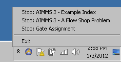

Interrupt Execution During a Single Statement
=============================================

.. meta::
   :description: How to interrupt a long running assignment.
   :keywords: interrupt, long running 

.. note::

    This article was originally posted to the AIMMS Tech Blog.

..       <link>https://berthier.design/aimmsbackuptech/2012/01/03/aborting-execution-of-aimms/</link>
..       <pubDate>Tue, 03 Jan 2012 14:31:26 +0000</pubDate>
..       <dc:creator><![CDATA[]]></dc:creator>
..       <guid isPermaLink="false">http://blog.aimms.com/?p=583</guid>

With AIMMS it is possible to interrupt long running executions with the keyboard shortcut ``CTRL+ Shift + S``. However, this shortcut key only works between two executed statements or two generated constraints, or between solver iterations while running the solve statement.

A more powerful tool to interrupt is the AIMMS Interrupt Tool, which can also interrupt long running statements. 

For example, the assignment

.. code-block:: aimms

   someParameter1(i,j,k,l) := if someParameter2(i,j,k,l) <= 2 then 1 endif ; 

potentially can take a lot of time in case there are billions of combinations possible with the 4 indices. 
The ``CTRL+ Shift + S`` shortcut does not interrupt executing the above assignment statement, because it is a single statement, but the AIMMS Interrupt Tool can be used.

The AIMMS Interrupt Tool is particularly useful if the execution of an assignment statement or evaluation of the definition of a parameter is taking too long and you cannot close AIMMS because you did not yet save your project. 

Another useful case is when you are working on a large project and it is not clear which statement or constraint is taking so much time.

Using the tool
------------------------------
Use the AimmsInterrupt tool like this:

#. Download the `AIMMS Interrupt Tool <https://download.aimms.com/aimms/download/data/AIMMSInterruptTool/AimmsInterrupt.exe>`_.

#. Run ``AimmsInterrupt.exe`` from the Windows Start Menu. An icon appears in the Windows system tray in the toolbar. 

#. Click the tray icon to view a list of all the AIMMS processes on your computer that can be interrupted.

Please keep in mind that after you interrupt execution, you cannot rely on the data of parameter ``someParameter``, because the assignment statement was not finished.

