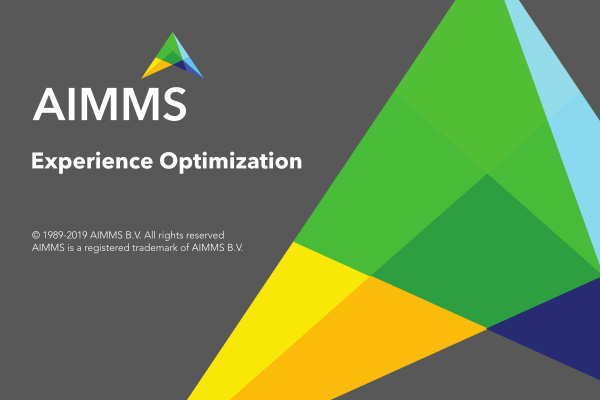

.. warning:: 
   Please note that the documentation you are currently viewing is for an older version of our technology. 
   While it is still functional, we recommend upgrading to our latest and more efficient option to take advantage of all the improvements we've made.
   
Add a Custom Startup Image in WinUI
=============================================================

.. meta::
   :description: Explains how to add a custom startup splash screen to a WinUI AIMMS application by providing a BMP file named after the project file.
   :keywords: splash screen, WinUI, startup image, BMP, custom branding, application deployment, aimms project file, loading screen

             
When you deploy your application, AIMMS uses a standard splash screen at startup as shown below. You have the option to customize this startup image for WinUI apps. 

To use a custom startup image, create a BMP file with the same name as the ``.aimms`` project file, and save it in the project folder.

Please note that you must use the bitmap (BMP) format, as AIMMS will only look for this extension (and not other image file formats).

Example
--------

A custom startup image is used in the :doc:`Gate Assignment example project <../389/389-gate-assignment>`:

The name of the ``.aimms`` file of the gate assignment project is ``Gate Assignment.aimms``. By saving the picture from the example as ``Gate Assignment.bmp`` in the same folder as the ``Gate Assignment.aimms`` file, AIMMS displays the new splash screen. 

