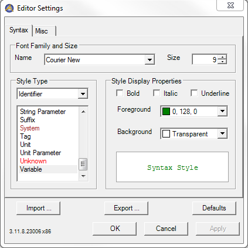

Change Syntax Highlighting and Display Options
==========================================================

.. meta::
   :description: How to customize syntax highlighting colors and other Editor display options used in the AIMMS IDE.
   :keywords: Syntax, highlighting, identifier, color, display, editor, settings

.. note::

    This article was originally posted to the AIMMS Tech Blog.

.. <link>https://berthier.design/aimmsbackuptech/2012/06/18/changing-colors-for-different-identifier-types-in-aimms-ide/</link>
.. <pubDate>Mon, 18 Jun 2012 13:02:10 +0000</pubDate>
.. <guid isPermaLink="false">http://blog.aimms.com/?p=1211</guid>

..  <![CDATA[[caption id="attachment_1428" align="alignright" width="362" caption="Display variables in green"][/caption]In an <a href="http://blog.aimms.com/2012/05/displaying-line-numbers-in-the-editor-of-the-aimms-ide/" title="Displaying line numbers in the editor of the AIMMS IDE">earlier blog article</a> I already showed that you can toggle the display of line numbering in the AIMMS IDE editor by changing one of the IDE editor settings.

AIMMS uses a default syntax highlighting theme to help you quickly interpret a definition visually in the AIMMS Editor. 

You can customize the colors displayed for types of identifiers in the editor. 

For example, in the image below variable Assignments in the Editor are highlighted green. 

.. figure:: images/variables_in_green.png

    Display variables in green

To change these editor settings:

1. Go to *Settings > Editor Settings*. A dialog appears.

2. Select an identifier type on the left, and edit its display settings on the right.

    AIMMS Editor settings

In addition to colors, you can customize styling to display identifier types as bold, italic, or underline.

You can also change the styling of comments, keywords, and other elements using the drop-down: *Style Type > AIMMS*.

AIMMS' in-house Editor settings (used for creating the screen shots for How-To articles and User Support training materials) are available for download in the file below. After downloading, use the *Import* menu to add its contents to your settings.

:download:`AIMMS Editor Settings <images/EditorSettingsCommunity.xml>`.

Related Topics
--------------

* :doc:`../232/232-display-line-numbers`

.. include:: /includes/form.def

