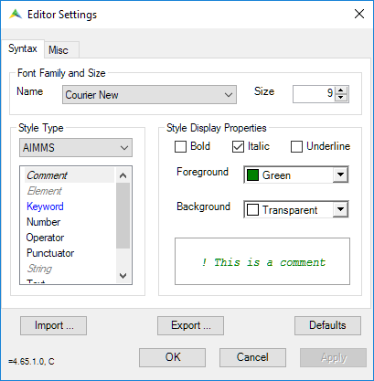

Change Syntax Highlighting and Display Options
==========================================================

.. meta::
   :description: How to customize syntax highlighting colors and other Editor display options used in the AIMMS IDE.
   :keywords: Syntax, highlighting, identifier, color, display, editor, settings

AIMMS uses a default syntax highlighting theme to help you quickly interpret a definition visually in the AIMMS Editor. 

You can customize the colors displayed for types of identifiers in the editor. 

For example, in the image below, the variable ``Assignments`` is highlighted green. 

.. figure:: images/variables_in_green.png

    Display variables in green

To change these editor settings:

1. Go to *Settings > Editor Settings*. A dialog appears.

2. Select an identifier type in the Style Type section on the left, and edit its display settings in the right and top sections.

.. figure:: images/editor-settings-style-identifier.png

    Editor settings for identifiers

In addition to colors, you can customize styling to display identifier types in bold, italic, or underline.

You can also change the styling of comments, keywords, and other elements. In the *Style Type* section select *AIMMS* from the drop-down menu.

    Editor settings for AIMMS elements

You can also import/export your style settings as ``.xml`` to share with others in your organization. Use the *Import* and *Export* buttons in the *Editor Settings* dialog.

AIMMS' in-house Editor settings (as seen in How-To articles and User Support training materials) are available for download in the file below. 

:download:`AIMMS Editor Settings <downloads/EditorSettingsCommunity.xml>`.

Related Topics
--------------

* :doc:`../232/232-display-line-numbers`

