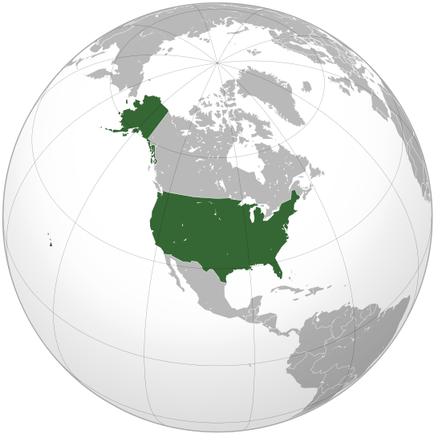
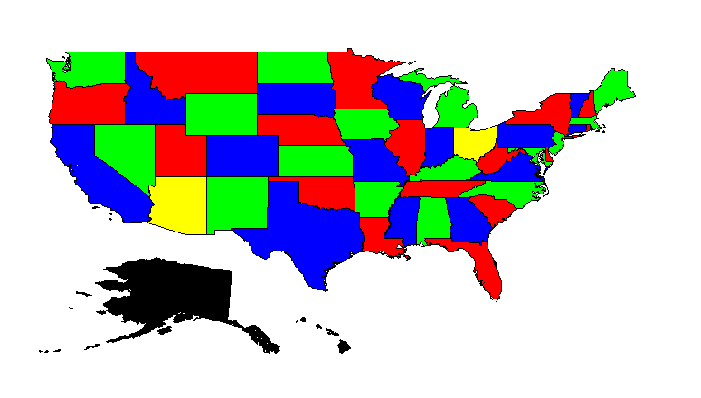

Color a Map with Constraint Programming
==========================================

.. meta::
   :description: Using Constraint Programming in an exercise to color a map of the states of the USA.
   :keywords: Constraint Programming, network, color, map

.. warning::
   This article references outdated technology and is provided for historical purposes only. 
   It is not recommended to use this information as a primary source for current projects or documentation. Please refer to the latest documentation for up-to-date information.
   
Map coloring is a very nice introductory problem to constraint programming. This article describes two aspects of creating a map coloring application: the problem itself, and the presentation of the solution.

    Location United States of America

Given a graph :math:`G=(V,E)` with vertices :math:`V` and edges :math:`E` in between, what is the minimum number of colors needed such that two adjacent vertices, :math:`v1` and :math:`v2`, have different colors? One obvious application of this problem is in the construction of maps with two adjacent regions that can easily be distinguished by their colors. 

The CP Problem
----------------

First, we want to solve instances of this problem. From theory it is known that four colors suffice to solve the problem, and we have a set of 4 colors named ``selectedColors``. The element variable ``stateColor(s)``, with range ``selectedColors``, represents the color of each state. The constraint that two adjacent states have a different color, is modeled directly as:

.. code-block:: aimms

    ElementVariable stateColor {
        IndexDomain: (s);
        Range: SelectedColors;
    }
    Constraint AdjacentStatesHaveDifferentColors {
        IndexDomain: (s1,s2)|s1 < s2 and s2 in AdjacentStates(s1);
        Definition: stateColor(s1) <> stateColor(s2);
    }

That's it; the constraint programming problem is described by one element variable and one constraint.

The Solution Presentation
-------------------------

AIMMS offers an easy way to present the solution: just right-click on the variable and select data. The pivot table presented clearly contains the solution, but at a glance, does not enable one to see whether or not this solution is correct. For instance, Alaska and Hawaii are not presented in the solution because they are not adjacent to another state, and therefore are not part of the problem passed to the solver.

In order to get a solution that can be more easily inspected, we should actually draw the map.

Luckily, the  :doc:`AIMMS GIS Support example<../418/418-gis-support>` already contains a lot of GIS data about the states of the USA in the folder "US States GML Files", which we will use here.

Next, you should create a network object without any nodes or arcs; we are interested in its background. Initially, to view the entire world, the visible area and bounds are set to: left: -180, right: 180, top 90, bottom -90. More appropriate bounds can be set later on. In addition, remove the check mark on equal X and Y scale, otherwise these bounds will continue to be adapted to the actual aspect ratio of the object on screen.

On the :menuselection:`Background` tab of the :menuselection:`Network properties`, select "From GIS source" for background, and specify the GIS data of each state. 
The trick here is to specify each state as a separate layer with its own GIS source, named ``stateSource(s)``, with type "GML" taken from file ``StateGMLFile(s)`` (GIS layers can overlap, but they do not in this example). We can fill the layer with color according to the element variable of the CP problem.

Once this is done, adapt the visible area to your liking.

More information on GIS and network objects can be found in :menuselection:`Help` under :menuselection:`Page manager > Page objects > Network > GIS`.

You can also make the page responsive to screen size. 

#. In Edit mode, go to the :menuselection:`View` tab and select :menuselection:`Resize edit mode`. 

#. Click :menuselection:`New horizontal split line` and place it near the bottom or top of the page.

The model can be downloaded below:

   :download:`State Map Coloring example <model/State-coloring-of-USA.zip>`

To run this example, just press ``F6`` to see the following solution:

    Solution State Coloring of the USA

