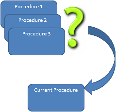

:orphan:

Determine the calling procedure 
=========================================

.. meta::
   :description: How to customize syntax highlighting colors and other Editor display options used in the AIMMS IDE.
   :keywords: Syntax, highlighting, identifier, color, display, editor, settings

.. note::

    This article was originally posted to the AIMMS Tech Blog.
    
.. note::

    This article is obsolete; there is an intrinsic function, named CallerNode, to capture this functionality.

..  <![CDATA[[caption id="attachment_1411" align="alignleft" width="239" caption="Determine calling procedure"][/caption]For something we were working on, we had to find a way to determine which procedure was calling the current procedure. 

    Determine calling procedure

For something we were working on, we had to find a way to determine which procedure was calling the current procedure. 

One very trivial way would be to introduce an additional argument for
the procedure in which the calling procedure must provide its name. The
main disadvantage of this approach is that each procedure must always
provide this additional input argument. Furthermore, it is also not very
robust as there is nothing preventing a procedure to provide the name of
a different procedure as the input argument instead of its own.

Therefore, we needed another approach that can determine which procedure
did the call to the current procedure.

Instead of relying on an additional input argument, we made use of an
approach that uses the error handling introduced in AIMMS 3.10. With the
functions provided for the error handling, you can obtain the call stack
that lead to the current error. So the basic steps for obtaining
information about which procedure called the current procedure are:

#. Raise an error

#. Use error handling functions to query the call stack of this raised error,

#. Mark the error as handled so that AIMMS discards it

In AIMMS, this can be done by introducing a new procedure with the code
below. Note that ``CallingProcedure`` must be an element parameter in the
predefined set :any:`AllProcedures` and that ``err`` must be an element parameter
in the predefined set :any:`errh::PendingErrors`.

.. code-block:: aimms
    :linenos:

    !This element parameter will hold the calling procedure
    CallingProcedure := '' ; 

    !Within a block statement, raise an error and use a block-local
    !error handler to query the details of the error
    block

        raise error "Artificial error to detect procedure name" ; 

    onerror err do

        ! To get the name of the procedure that actually called 
        ! the current procedure, we must get the second node in the stacktrace.
        ! This information can be obtained via the errh::Node function

        CallingProcedure := errh::Node( err, 2) ;

        !Now mark the error as handled so that AIMMS will discard it
        !for further processing

        errh::MarkAsHandled(err,1) ;

        !Ensure that the predefined string parameter CurrentErrorMessage 
        !is emptied.

        CurrentErrorMessage := "";

    endblock ;

