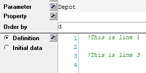

Display Line Numbers in the Editor
======================================================

.. meta::
   :description: Changing editor settings to display line numbers in the AIMMS IDE.
   :keywords: Editor, settings, line numbers, goto line

.. note::

    This article was originally posted to the AIMMS Tech Blog.

.. <link>https://berthier.design/aimmsbackuptech/2012/05/08/displaying-line-numbers-in-the-editor-of-the-aimms-ide/</link>
.. <pubDate>Tue, 08 May 2012 15:18:27 +0000</pubDate>
.. <guid isPermaLink="false">http://blog.aimms.com/?p=1209</guid>

By default, line numbers are hidden in the Editor in the AIMMS IDE. However, you can enable line numbers in settings. 

This is useful when sharing information about your model, so you can point to specific lines in a procedure or a definition. 

To enable the display of line numbers in the Editor settings:

#. Go to *Settings > Editor Settings*. 
#. In the dialog that appears, select the *Misc* tab.
#. Change the value for the setting ``LineNumberMargin`` to ``True``.

.. figure:: images/editor-settings-misc-line-numbers.png

    AIMMS IDE Editor settings

AIMMS will display line numbers for all attributes that can consist of multiple lines, as shown in the image below:

    Line numbers displayed in multiple line attribute

You can jump to a specific line number with the keyboard shortcut ``Ctrl + G`` (or from the menu *Edit > Goto Line*). This will open the dialog below:

.. figure:: images/go-to-line.png

    Jump to specific line number by pressing Ctrl + G

Note that the *Goto Line* function works regardless of whether the line numbers are displayed or not.

Related Topics
--------------

See also :doc:`../225/225-change-syntax-highlighting-colors`

