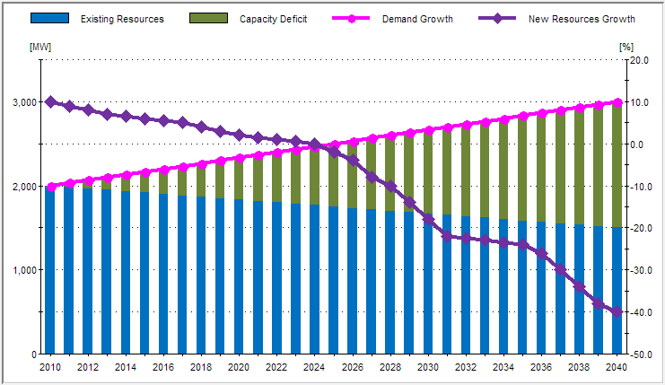
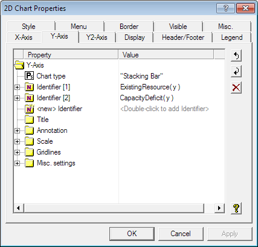
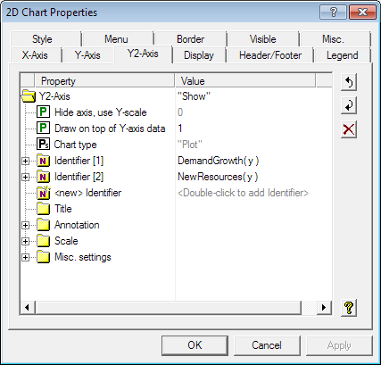

:orphan:

Display Multiple Identifiers in a 2D Chart
=================================================

.. todo:: Find or create missing example model (keeping as orphan until that time).

.. meta::
   :description: Displaying multiple identifiers in a single chart.
   :keywords: WinUI, AIMMS, Chart, Multiple identifiers.

.. note::

    This article was originally posted to the AIMMS Tech Blog.

               
A 2D Chart not only makes it possible to display your AIMMS data in various two-dimensional chart types, such as a plot chart, a bar chart, a pie chart, etc, it also allows displaying multiple identifiers with different measurements and different chart types in the same chart, like the following.

In this chart, "Existing Resources" and "Capacity Deficit" are in MW and displayed as stacking bars; "Demand Growth" and "New Resources Growth" are in percentage and displayed as plot curves. In order to set this chart up, you only need to specify the Y-Axis and Y2-Axis properties in the 2D chart properties dialog as shown below.

specifying details:

The appearance of each identifier, for example, colors, width, labels, etc. can be modified to the desired look in the properties dialog.  For the details, you may check the attached 2D Chart example. 

download: here?

