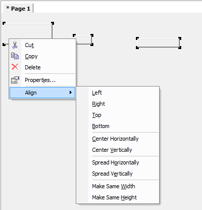

Align Objects in WinUI
=====================================

.. meta::
   :description: Taking care of alignment in your user interface.
   :keywords: User Interface, Windows, alignment, align, winui

.. note::

    This article was originally posted to the AIMMS Tech Blog.

.. <link>https://berthier.design/aimmsbackuptech/2013/01/25/easily-align-multiple-objects-on-page/</link>
.. <pubDate>Fri, 25 Jan 2013 13:56:23 +0000</pubDate>
.. <guid isPermaLink="false">http://blog.aimms.com/?p=2560</guid>

When creating a WinUI page for your AIMMS project you typically want to nicely align the page objects.

For example, the different buttons you have on one page should all be the same size. Furthermore, if you have multiple buttons, you might also want to have them evenly spaced horizontally.

Of course, you could manually determine the pixels where each object should be placed, and use the position/size details in the status bar for the selected page object in developer mode. But this is a bit tedious.

Fortunately, there is a better way. 

In WinUI (in Edit mode):

#. Select multiple objects on a page
#. Right-click any where in the selection
#. Hover over *Align* in the context menu, and select an option from the submenu as shown below:

    Not aligned objects

.. figure:: images/objects-aligned.png
    :align: center

    Nicely aligned objects

For example, to align buttons to the top of the page, you would select *Align > Top* from the context menu. AIMMS will move all objects to the same level as the top-most object.

To match sizing of the objects, select the *Make same width* and *Make same height* options. All selected objects will be resized to the largest width and height.

To evenly space the buttons, select *Spread horizontally* (or *Spread vertically*). AIMMS will try to keep the same amount of spacing between adjacent objects. 

