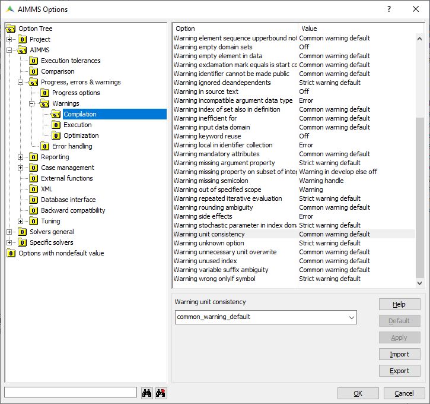
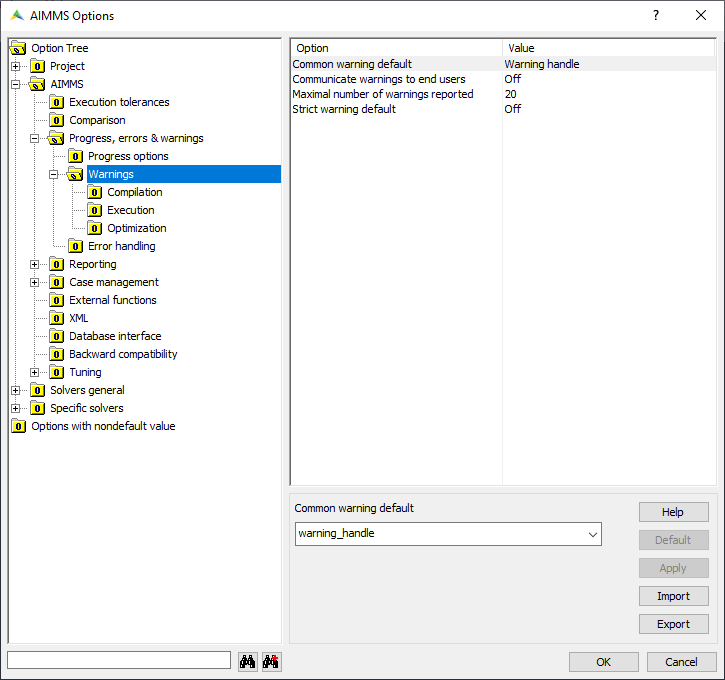
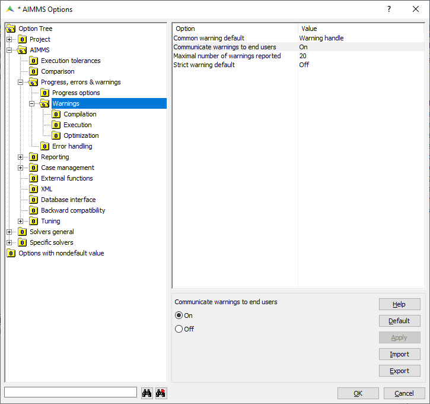

Customize Settings for Errors and Warnings
===========================================

.. meta::
   :description: Managing various error settings.
   :keywords: Error handling, option settings 
   

This article explains how you can control errors and warnings within AIMMS. We'll include some useful tips to create better models.

Errors versus warnings
------------------------
In AIMMS, the difference between errors and warnings is summed up:

* Errors indicate that something is not correct.

* Warnings indicate that something might not be completely correct. 

An error states what is wrong, and in most cases it is hard to argue that
the issue raised could be right otherwise. For instance, if you get the
error ``The identifier "solv" has not been declared``, you know that you
should either create the identifier ``solv`` or change ``solv`` into
``solve``. However, you will never be able to prove that it was intended
to be used as ``solv``.

On the other hand, a warning such as ``Warning: The parameter
"InitialValue" is not initialized (default values are used)`` is not
entirely black and white. This data could still be calculated in the
model, or maybe you intentionally skipped the reading of this data for
now. In those cases, the warning can be ignored and no action is needed.
Of course, it is also possible that you forgot to map this identifier to
a column in your database. In that case, it is nice that AIMMS tells you
that you missed something, because then you can fix it.

Option values
--------------

You may find all related warning options in the Project options (Settings → Project Options...)

AIMMS has options that allow you to control almost every warning in
AIMMS. These options have the following possible values:

#. ``Off``

#. ``Warning Collect``

#. ``Common Warning Default``

#. ``Warning Handle``

#. ``Strict Warning Default``

#. ``Error``

If you set this value to ``off``, AIMMS will ignore this error/warning. The
values ``Error``, ``Warning Collect``, and ``Warning Handle`` can be used to
indicate that AIMMS should give an error or warning directly, either to
the global or first error handler. The values ``Common Warning Default``
and ``Strict Warning Default`` specify the behavior indirectly. These
latter ones are used to indicate that AIMMS should behave according to
the options ``Common Warning Default`` and ``Strict Warning Default``.

The idea behind ``Common Warning Default`` and ``Strict Warning Default`` is
that it allows you to turn on or off a lot of options at the same time.
The default value of ``Common Warning Default`` is ``Warning Handle``,
meaning that all options that are set to follow this option will
initially give a warning (or send to the nearest error handler). The
option ``Strict Warning Default`` is initially set to off, meaning that
all warnings that are set to follow this option will be ignored.

Best practices
----------------------

Some warnings emerge when you just started to develop or extend your
model. They might be the result of a work in progress. However, AIMMS will still throw a bunch
of errors at you. You first reaction might be to set the value of the
associated option to ``off``, so that you won’t be bothered by this again.
However, you will not see these warnings
again in the future, when they might actually be useful.

We recommend that you set this option to ``Strict Warning Default`` or, if
you have a lot of different warnings, that you set the option ``Common
Warning Default`` to ``off``. You can now continue to develop your model,
without so many warnings.

As a second step, you may set the
options ``Common Warning Default`` and ``Strict Warning Default`` to
``Warning Collect/Warning Handle`` occasionally, especially when you are
about to share your developments with the end-user. This gives you the
opportunity to do a more thorough examination of your model.

After you set these options, you need to run a few typical instances of
your model and examine all warnings to make sure they don’t indicate an
actual problem. Once you have done that, and perhaps fixed any pending
errors, you can set the options back or leave them as warnings, in case
they are all fixed. In any case, you know that you have not missed any
important warnings.

Deployment mode
---------------

AIMMS will not generate warnings when running the model in deployment
mode by default. The reason is that in most cases, the end-user
cannot do anything to fix them.  You can override this behavior by setting the option ``Communicate warnings to end users`` to ``on``.

.. tip::
    
    You may refer to our online training about error handling `following this link <https://aimms.getlearnworlds.com/course/error-handling>`__.
    
Related Topics
--------------

* :doc:`../191/191-handle-errors-and-warnings`.
* For a full description of the AIMMS Error Handling functionality, please see :doc:`procedural-language-components/execution-statements/index` and :doc:`system-interaction/error-handling-functions/index`.
