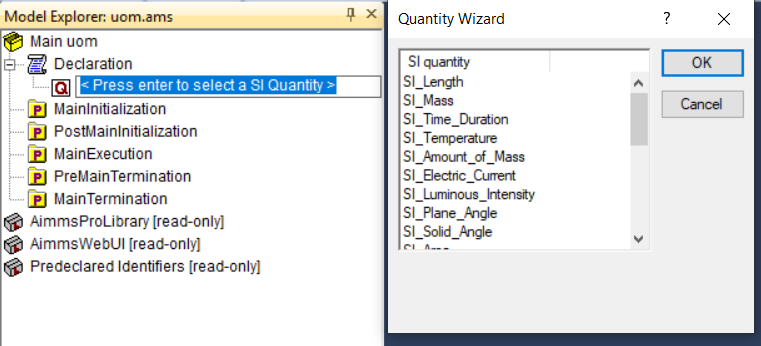
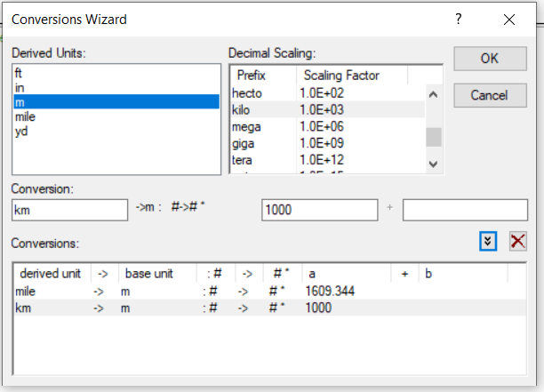
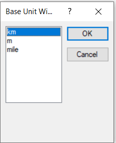
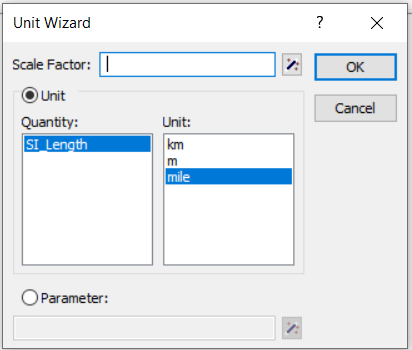
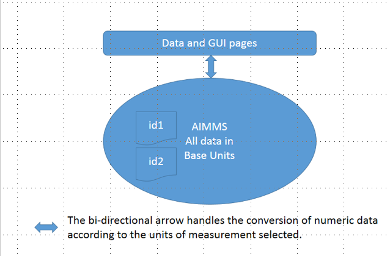
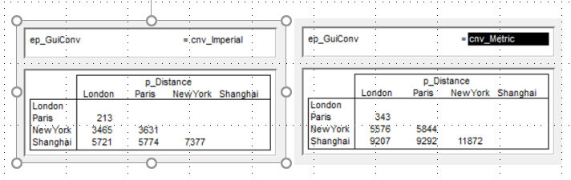
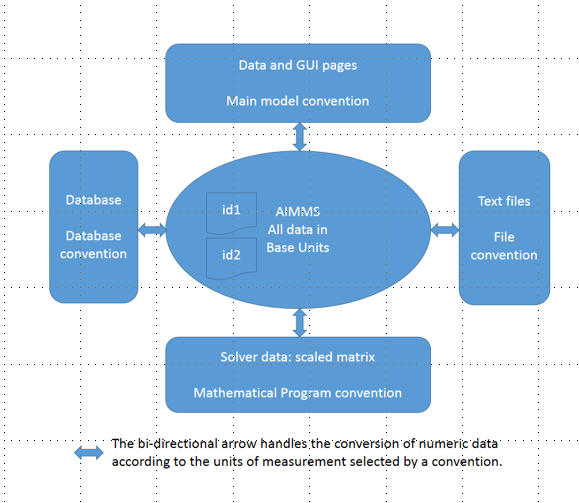

Localize Units of Measurement per User
========================================

.. meta::
   :description: Having units of measurement enables displaying data according to convention of end user
   :keywords: Units of measurement, Imperial, Metric, scaling, displaying numbers

Optimization applications deal with numeric data. We find it easier to interpret when represented by
familiar units of measurement.

However, there is a risk of serious errors resulting from incorrect unit assumptions. Remember the Mars spacecraft NASA engineers lost due to this problem?

How to choose units
How to make the unit clear for applications that have an international audience
How to adapt the units depending on the user

One solution is to add code to an application in order to
convert a value measured in, say, miles to a value measured in kilometers. But this can cause loss of accuracy, is prone to errors, and can become difficult to maintain. 

AIMMS automates the
task of adopting the numeric values to the units preferred by the user.

An AIMMS application can easily localize its interaction with numeric
data. This is achieved by selecting the units and conversion factors
relevant to the application. In addition, the units need to be linked to
identifiers and finally, localization is obtained by selecting the
preferred convention per user.

The general procedure is as follows:

#. Select the relevant units and conversions for your application

#. Link the units to the numeric identifiers communicated

#. Name collections of units that can be selected

#. Select the relevant collection name per user

#. Make unit information visible and selectable in the GUI

Let's explore these steps with an example.

1. Select units and conversions
^^^^^^^^^^^^^^^^^^^^^^^^^^^^^^^^^^^^^^^^^^^^^^^^^^^^^^^^^^^^^^^^^^^^^^

When you insert an identifier of type Quantity, you will get a wizard 
with several pre-declared quantities. Select the quantity ``SI_Length``.

    declaring a quantity

Step 1a. Introduce conversions. Open the attributes of the quantity
``SI_Length`` and press the wizard button next to the conversions
attribute. You will then be guided through the selection of additional
units for length measurement. Let's add ``km`` by selecting unit ``m`` and the
factor 1000 abbreviated by ``k``:

    
    Add conversion to km

You can also add miles in a similar way. But let's assume that
kilometers are more in line with the amounts we are using, as opposed to
``m``. Select ``km`` as a base unit via the wizard at the base unit attribute of
SI_Length:

    Select base unit 

A dialog will then ask whether you want to save the data. AIMMS stores
all numeric data internally with respect to base units. In this example
we do not have data yet, so we need to select no. The resulting quantity
will look as follows:

.. code-block:: aimms
    :linenos:
    
    Quantity SI_Length {
        BaseUnit: km;
        Conversions: {
            mile->km : #-># * 1.609344,
            m   ->km : #-># / 1000
        }
        Comment: "Expresses the value of a distance.";
    }

The relevant quantities, base units and conversions between units only
need to be selected once for the entire application. The units in common
use today are available in the conversion wizard. This makes it easy to
select the relevant units for your application via point-and-click.

2. Link units to numeric identifiers
^^^^^^^^^^^^^^^^^^^^^^^^^^^^^^^^^^^^^^^^^^^^^^^^^^^^^^^^^^^^^^^^^^

To illustrate unit conversions within AIMMS, I will use sample distance
data in miles. After declaring the identifier ``p_DistanceTable(i,j)``, we
select the unit ``mile`` via the wizard at the unit attribute:

    Unit attribute wizard 

Specifying the sample data in the initial data, this identifier then becomes:

.. code-block:: aimms
    :linenos:

    Parameter p_Distance {
        IndexDomain: (i,j);
        Unit: mile;
        InitialData: {
            data table
                     London     Paris  NewYork
                 !  -------   -------  -------
            Paris       213
            NewYork    3465      3631
            Shanghai   5721      5774     7377
        }
        Comment: {
            "Assumed symmetric; only lower half needed"
        }
    }

What is the meaning of what we just created? AIMMS stores all numeric
data according to the base units selected for the quantities, in this
running example that is ``km``. In our example, the initial data of
``p_DistanceTable``, is in ``miles``. This leads to the following action flow for
converting numeric data according to units:

    Conversion of numeric data controlled by Units of Measurement  

This action flow indicates that all data in AIMMS is stored according to
the base units specified for each quantity, and that whenever AIMMS
communicates numeric data it will convert that data according to the
selected units. So, you may wonder, how can you adapt the units selected
by AIMMS during data interaction in the GUI?

3. Name collections of units
^^^^^^^^^^^^^^^^^^^^^^^^^^^^^^^^^^^^^^^^^^^^^^^^^^^^^^^^^^^^

In AIMMS, a convention is a collection of units that is used when AIMMS
communicates numeric data. In our running example, we add the
conventions:

 

#. ``conv_English``: with English units, in the running example only mile for distance. 

#.  ``conv_SI``: with SI units, in the running example only km for distance. 

We create these conventions by creating identifiers of type Convention.
Then, you need to select the relevant unit via the wizard button in the
per quantity attribute. In our example, the conventions look as follows:

.. code-block:: aimms
    :linenos:

    Convention cnv_Imperial {
        PerQuantity: SI_Length : mile;
    }
    Convention cnv_Metric {
        PerQuantity: SI_Length : km;
    }

4. Select relevant collection per user
^^^^^^^^^^^^^^^^^^^^^^^^^^^^^^^^^^^^^^^^^^^^^^^^^^^^^^^^

After this, we need a selection mechanism to choose a particular
convention. This is achieved by entering an element parameter into the
predeclared set AllConventions. In our running example, we create
``ep_guiConv``. Once we have this element parameter, we can link the data in
the GUI to this element parameter via the convention attribute of the
main model:

.. code-block:: aimms
    :linenos:
    
    Model Main_uom {
        Convention: ep_GuiConv;
    }

There are various ways to set ``ep_guiConv`` per user. For instance, during
login or as a parameter that can be set at runtime. Please note that the
convention attribute will only appear when there are conventions
declared inside the model. Now it's time to test if we can use the
supplied information on a data page. 

5. Make unit information visible
^^^^^^^^^^^^^^^^^^^^^^^^^^^^^^^^^^^^^^^^^^^^^^^^^^^^^^^^^^^^^^^^^^

Create a new page and create two objects: 

#. a scalar object with contents ``ep_guiConv`` and 

#. a table with contents ``p_DistanceTable``. 

Open the properties of the table, select the
units tab and click on ``Show in Title`` in the ``display`` area. Then, by
selecting the convention via ``ep_guiConv``, you'll get either the left or
right picture below:

    Selecting the current model convention

That is all there is to obtain localized interaction on numeric data.

A final note on the action flow

AIMMS' interaction on numeric data can also go via text input files and
via databases. There is also interaction with solvers. In all of these
communication channels, the selection of units can be controlled via
conventions. This extends the basic action flow presented above to the
following:

    Conversion of numeric data controlled by Units of Measurement and Conventions

The arrows presented at the end of step 2 are bi-directional, indicating
that the unit conversion is both for input and for output. The action
flow also shows that the convention attribute can be used in databases
and files, taking into account that the data in that database or file is
specified using its own collection of units. Furthermore, a convention
can be used with mathematical programs. By specifying a convention and
using units for the variables and constraints, AIMMS will scale the
matrix accordingly.

Example download
-------------------

The AIMMS project used to construct this running example is available
here.  
:download:`AIMMS project download <uom.zip>` 

Further information
---------------------

- Units can not only be used to convert from one unit to another but also to check for unit consistency. Further information about the use of units in AIMMS can be found in :doc:`advanced-language-components/units-of-measurement/index`. 
- `Unit of measurement training <https://academy.aimms.com/course/view.php?id=9>`_ on the `AIMMS Academy <https://academy.aimms.com/>`_

